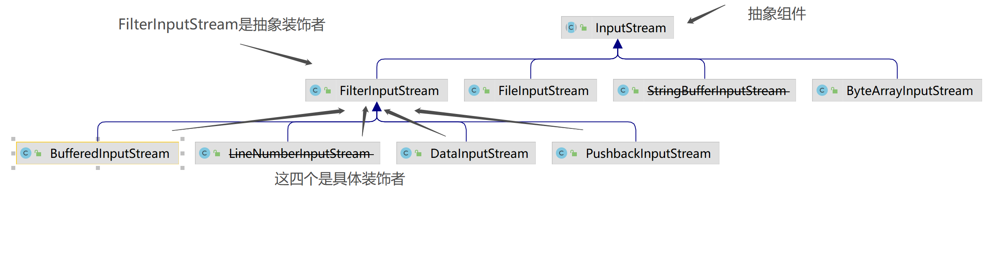

# 1 设计模式

## 1.1 使用设计模式的目的

> 1. 提高代码的可重复利用
> 2. 提高代码的可读性
> 3. 保障代码的可靠性

## 1.2 设计模式的六大原则

> 1. 单一职责原则：类或者接口要实现职责单一
> 2. 里氏替换原则：使用子类来替换父类，做出通用的编程
> 3. 依赖倒置原则：面向接口编程
> 4. 接口隔离原则：接口的设计需要精简单一
> 5. 迪米特法则：降低依赖之间耦合
> 6. 开闭原则：对扩展开放，对修改关闭

## 1.3 单例模式---singleton

单例模式（Singleton Pattern）是 Java 中最常见的设计模式之一。这种类型的设计模式属于创建型模式，它提供了一 种创建对象的最佳方式。

单例模式：涉及到一个单一的类，该类负责创建自己的对象，同时确保只有一个对象被创建。该类还提供一种访问他的唯一对象的方式，其他类可以直接访问该方法获取该对象实例而不需要实例化该类的对象。

单例模式的特点：
> 1. 单例类只能有一个实例。
> 2. 单例类必须自己创建自己的唯一实例。
> 3. 单例类必须给所有其他对象提供这一实例。

单例模式的优点：
> 1. 由于单例模式在内存中只有一个实例，减少了内存开支，特别是一个对象需要频繁地创建、销毁时，而且创建或销毁时性能又无法优化，单例模式的优势就非常明显。
> 2. 由于单例模式只生成一个实例，所以减少了系统的性能开销，当一个对象的产生需要比较多的资源时，如读取配置、产生其他依赖对象时，则可以通过在应用启动时直接产生一个单例对象，然后用永久驻留内存的方式来解决（在Java
     EE中采用单例模式时需要注意JVM垃圾回收机制）。
> 3. 单例模式可以避免对资源的多重占用，例如一个写文件动作，由于只有一个实例存在内存中，避免对同一个资源文件的同时写操作。
> 4. 单例模式可以在系统设置全局的访问点，优化和共享资源访问，例如可以设计一个单例类，负责所有数据表的映射处理。

单例模式的缺点：
> 1.
单例模式一般没有接口，扩展很困难，若要扩展，除了修改代码基本上没有第二种途径可以实现。单例模式为什么不能增加接口呢？因为接口对单例模式是没有任何意义的，它要求“自行实例化”，并且提供单一实例、接口或抽象类是不可能被实例化的。当然，在特殊情况下，单例模式可以实现接口、被继承等，需要在系统开发中根据环境判断。
> 2. 单例模式对测试是不利的。在并行开发环境中，如果单例模式没有完成，是不能进行测试的，没有接口也不能使用mock的方式虚拟一个对象。
> 3. 单例模式与单一职责原则有冲突。一个类应该只实现一个逻辑，而不关心它是否是单例的，是不是要单例取决于环境，单例模式把“要单例”和业务逻辑融合在一个类中。

单例模式的真实使用场景：
在一个系统中，要求一个类有且仅有一个对象，如果出现多个对象就会出现“不良反应”，可以采用单例模式，具体的场景如下：
> 1. 要求生成唯一序列号的环境；
> 2. 在整个项目中需要一个共享访问点或共享数据，例如一个Web页面上的计数器，可以不用把每次刷新都记录到数据库中，使用单例模式保持计数器的值，并确保是线程安全的；
> 3. 创建一个对象需要消耗的资源过多，如要访问IO和数据库等资源；
> 4. 需要定义大量的静态常量和静态方法（如工具类）的环境，可以采用单例模式（当然，也可以直接声明为static的方式）。

实现步骤：
> 1. 整个应用只有一个自己的实例
> 2. 只能自己创建自己
> 3. 需要提供一个方法让外界访问自己

单例模式通用类图：

### 1.3.1 饿汉式

> 创建一个单例对象 HungrySingleModel , HungrySingleModel 类有它的私有构造函数和本身的一个静态实例。
> HungrySingleModel 类提供了一个静态方法，供外界获取它的静态实例。 SingletonTest 我们的演示类使用 HungrySingleModel 类来获取对象。

```java
public class HungrySingleModel {
    //整个应用只有一个自己的实例---初始化时候创建，不管会不会使用，此方法会浪费内存
    private static HungrySingleModel instance = new HungrySingleModel();

    //只能自己创建自己
    private HungrySingleModel() {
    }

    //需要提供一个方法让外界访问自己
    public static HungrySingleModel getInstance() {
        return instance;
    }
}
```

### 1.3.2 懒汉式

> 1. 延迟加载创建，也就是用到对象的时候，才会创建
> 2. 线程安全问题需要手动处理(不添加同步方法，线程不安全，添加了同步方法，效率低)
> 3. 实现容易

```java
public class LazySingleModel {
    //整个应用只有一个自己的实例---判断对象是否存在，没有在创建对象（此方法不是线程安全的）
    private static LazySingleModel instance;//不直接实例化

    //只能自己创建自己
    private LazySingleModel() {
    }

    //需要提供一个方法让外界访问自己
    public static LazySingleModel getInstance() {
        //instance为空的时候才创建，在多线程的情况下这里是线程不安全的
        if (instance == null) {
            instance = new LazySingleModel();
        }
        return instance;
    }
}
```

### 1.3.3 双重检验锁

> 这种方式采用双锁机制，安全且在多线程情况下能保持高性能。
>
> 如果有A，B两个线程，第一次判断null,如果A和B为null,这样A和B就是并发场景。A获取锁进入下一个判断为null就会创建实例,释放锁。B获取锁进来，如果没有第二次判断为null，则B还会创建实例。

```java
public class DoubleTestSingleModel {
    //整个应用只有自己一个实例
    private volatile DoubleTestSingleModel instance;

    //只能自己创建自己
    private DoubleTestSingleModel() {
    }

    //提供一个外界能访问的方法
    public DoubleTestSingleModel getInstance() {
        if (instance == null) {
            //如果instance为空则创建对象
            synchronized (DoubleTestSingleModel.class) {
                if (instance == null) {
                    this.instance = new DoubleTestSingleModel();
                }
            }
        }
        return instance;
    }
}
```

### 1.3.4 单例模式的拓展

需求：如果一个类可以产生多个对象，对象的数量不受限制，则是非常容易实现的，直接使用new关键字就可以了，如果只需要一个对象，使用单例模式就可以了，但是如果要求一个类只能产生两三个对象呢？

> 这种需要产生固定数量对象的模式就叫做有上限的多例模式，它是单例模式的一种扩
> 展，采用有上限的多例模式，我们可以在设计时决定在内存中有多少个实例，方便系统进行
> 扩展，修正单例可能存在的性能问题，提供系统的响应速度。例如读取文件，我们可以在系
> 统启动时完成初始化工作，在内存中启动固定数量的reader实例，然后在需要读取文件时就
> 可以快速响应

## 1.4 工厂模式---factory

定义：
> 工厂模式（Factory Pattern）是 Java 中最常用的设计模式之一。这种类型的设计模式属于创建型模式，它提供了一种
> 创建对象的最佳方式。它负责实现创建所有实例的内部逻辑。工厂类的创建产品类的方法可以被外界直接调用，创建所需的
> 产品对象

优点：
> 1. 一个调用者想创建一个对象，只要知道其名称就可以了。
> 2. 屏蔽产品的具体实现，调用者只关心产品的接口。
> 3. 降低了耦合度

单例模式通用类图：


在工厂方法模式中，抽象产品类Product负责定义产品的共性，实现对事物最抽象的定
义；Creator为抽象创建类，也就是抽象工厂，具体如何创建产品类是由具体的实现工厂
ConcreteCreator完成的。工厂方法模式的变种较多，我们来看一个比较实用的通用源码

抽象产品类

```java
public abstract class Product {
    //产品类的公共方法
    public void method1() {
        //业务逻辑处理
    }

    //抽象方法
    public abstract void method2();
}
```

具体的产品类可以有多个，都继承于抽象产品类。

具体产品类：

```java
public class ConcreteProduct1 extends Product {
    public void method2() {
        //业务逻辑处理
    }
}

public class ConcreteProduct2 extends Product {
    public void method2() {
        //业务逻辑处理
    }
}
```

抽象工厂类负责定义产品对象的产生。

抽象工厂类：

```java
public abstract class Creator {
    /*

     * 创建一个产品对象，其输入参数类型可以自行设置
     * 通常为String、Enum、Class等，当然也可以为空
     */
    public abstract <T extends Product> T createProduct(Class<T> c);
}
```

具体如何产生一个产品的对象，是由具体的工厂类实现的。

具体工厂类：

```java
public class ConcreteCreator extends Creator {
    public <T extends Product> T createProduct(Class<T> c) {
        Product product = null;
        try {
            product = (Product) Class.forName(c.getName()).newInstance();
        } catch (Exception e) {
            //异常处理
        }
        return (T) product;
    }
}
```

场景类：

```java
public class Client {
    public static void main(String[] args) {
        Creator creator = new ConcreteCreator();
        Product product = creator.createProduct(ConcreteProduct1.class);
        /*

         * 继续业务处理
         */
    }
}
```

说明：
> 工厂模式的思想主要为：多个类似的子类继承同一个父类，对其父类中的变量进行操作；
> 工厂类负责判断、控制哪个子类被执行，而工厂类调用子类完成后，返回的结果是该子类的父类，该父类中的变量已经被操作过了，访问该父类，得到我们想要的结果。

## 1.5 抽象工厂模式

定义：
> 为创建一组相关或相互依赖的对象提供一个接口，而且无须指定它们的具体类

优点：
> 1. 封装性，每个产品的实现类不是高层模块要关心的，它要关心的是什么？是接口，是抽象，它不关心对象是如何创建出来，这由谁负责呢？工厂类，只要知道工厂类是谁，我就能创建出一个需要的对象，省时省力，优秀设计就应该如此。
> 2. 产品族内的约束为非公开状态。例如生产男女比例的问题上，猜想女娲娘娘肯定有自己的打算，不能让女盛男衰，否则女性的优点不就体现不出来了吗？那在抽象工厂模式，就应该有这样的一个约束：每生产1个女性，就同时生产出1.2个男性，这样的生产过程对调用工厂类的高层模块来说是透明的，它不需要知道这个约束，我就是要一个黄色女性产品就可以了，具体的产品族内的约束是在工厂内实现的

使用场景：
> 抽象工厂模式的使用场景定义非常简单：一个对象族（或是一组没有任何关系的对象）
都有相同的约束，则可以使用抽象工厂模式。什么意思呢？例如一个文本编辑器和一个图片处理器，都是软件实体，但是*
nix下的文本编辑器和Windows下的文本编辑器虽然功能和界面都相同，但是代码实现是不同的，图片处理器也有类似情况。也就是具有了共同的约束条
件：操作系统类型。于是我们可以使用抽象工厂模式，产生不同操作系统下的编辑器和图片处理器。

抽象工厂模式的通用类图：

抽象产品类

```java
public abstract class AbstractProductA {
    //每个产品共有的方法
    public void shareMethod() {
    }

    //每个产品相同方法，不同实现
    public abstract void doSomething();
}
```

产品实现类

```java
public class ProductA1 extends AbstractProductA {
    public void doSomething() {
        System.out.println("产品A1的实现方法");
    }
}

public class ProductA2 extends AbstractProductA {
    public void doSomething() {
        System.out.println("产品A2的实现方法");
    }
}
```

抽象工厂类：

```java
public abstract class AbstractCreator {
    //创建A产品家族
    public abstract AbstractProductA createProductA();

    //创建B产品家族
    public abstract AbstractProductB createProductB();
}
```

产品实现类：

```java
public class Creator1 extends AbstractCreator {
    //只生产产品等级为1的A产品
    public AbstractProductA createProductA() {
        return new ProductA1();
    }

    //只生产产品等级为1的B产品
    public AbstractProductB createProductB() {
        return new ProductB1();
    }
}

public class Creator2 extends AbstractCreator {
    //只生产产品等级为2的A产品
    public AbstractProductA createProductA() {
        return new ProductA2();
    }

    //只生产产品等级为2的B产品
    public AbstractProductB createProductB() {
        return new ProductB2();
    }
}
```

场景类：

```java
public class Client {
    public static void main(String[] args) {
        //定义出两个工厂
        AbstractCreator creator1 = new Creator1();
        AbstractCreator creator2 = new Creator2();
        //产生A1对象
        AbstractProductA a1 = creator1.createProductA();
        //产生A2对象
        AbstractProductA a2 = creator2.createProductA();
        //产生B1对象
        AbstractProductB b1 = creator1.createProductB();
        //产生B2对象
        AbstractProductB b2 = creator2.createProductB();
        /*
         * 然后在这里就可以为所欲为了...
         */
    }
}
```

## 1.6 观测者模式---observer

定义：
> 对象之间存在一对多或者一对一依赖，当一个状态改变，依赖他的对象会收到他的消息并自动更新
>
> MQ其实就属于一种观察者模式，发布者发布信息，订阅者获取信息，订阅了就能收到信息，没订阅就收不到信息。

优点：
> 1. 观察者和被观察者是抽象耦合的
> 2. 建立一套独立的触发机制

缺点：
> 1. 如果一个被观察者对象有很多的直接和间接的观察者的话，将所有的观察者都通知到会花费很多时间
> 2. 如果在观察者和观察目标之间有循环依赖的话，观察目标会触发它们之间进行循环调用，可能导致系统崩溃

观察者模式的使用场景
> 1. 关联行为场景。需要注意的是，关联行为是可拆分的，而不是“组合”关系。
> 2. 事件多级触发场景。
> 3. 跨系统的消息交换场景，如消息队列的处理机制。

观察者模式通用类图：
我们先来解释一下观察者模式的几个角色名称：
> 1. Subject被观察者：定义被观察者必须实现的职责，它必须能够动态地增加、取消观察者。它一般是抽象类 或者是实现类，仅仅完成作为被观察者必须实现的职责：管理观察者并通知观察者。
> 2. Observer观察者：观察者接收到消息后，即进行update（更新方法）操作，对接收到的信息进行处理。
> 3. ConcreteSubject具体的被观察者定义被观察者自己的业务逻辑，同时定义对哪些事件进行通知。
> 4. ConcreteObserver具体的观察者每个观察在接收到消息后的处理反应是不同，各个观察者有自己的处理逻辑。

被观察者：

```java
public abstract class Subject {
    //定义一个观察者数组
    private Vector<Observer> obsVector = new Vector<Observer>();

    //增加一个观察者
    public void addObserver(Observer o) {
        this.obsVector.add(o);
    }

    //删除一个观察者
    public void delObserver(Observer o) {
        this.obsVector.remove(o);
    }

    //通知所有观察者
    public void notifyObservers() {
        for (Observer o : this.obsVector) {
            o.update();
        }
    }
}
```

被观察者的职责非常简单，就是定义谁能够观察，谁不能观察，程序中使用ArrayList和
Vector没有太大的差别，ArrayList是线程异步，不安全；Vector是线程同步，安全——就这点
区别。

具体被观察者：

```java
public class ConcreteSubject extends Subject {
    //具体的业务
    public void doSomething() {
        /*
         * do something
         */
        super.notifyObservers();
    }
}

```

观察者:

```java
public interface Observer {
    //更新方法
    public void update();
}
```

观察者一般是一个接口，每一个实现该接口的实现类都是具体观察者

具体观察者：

```java
public class ConcreteObserver implements Observer {
    //实现更新方法
    public void update() {
        System.out.println("接收到信息，并进行处理！");
    }
}
```

## 1.7 策略模式--strategy

策略模式，指的是定义一系列算法，将每一个算法封装起来，并让它们可以相互替换。策略模式让算法独立于使用它的客户而变化。

说明：
> 策略模式只适用管理一组同类型的算法，并且这些算法是完全互斥的情况。
> 也就是说任何时候，多个策略中只有一个可以生效的那一种。如满减中的满28减18与满58减38之间；普通会员折扣与超级会员折扣之间等。

缺点：
> 1. 客户端必须知道所有的策略类，并自行决定使用哪一个策略类。这就意味着客户端必须理解这些算法的区别，以便适时选择恰当的算法类。换言之，策略模式只适用于客户端知道算法或行为的情况。
> 2. 由于策略模式把每个具体的策略实现都单独封装成为类，如果备选的策略很多的话，那么对象的数目就会很可观。

## 1.8 代理模式--proxy

定义：
> 给目标对象提供一个代理对象，并由代理对象控制对目标对象的引用；

目的：
> 1. 通过引入代理对象的方式来间接访问目标对象，防止直接访问目标对象给系统带来的不必要复杂性；
> 2. 通过代理对象对原有的业务增强；
     举例：明星 ---经纪人<-------用户

代理模式有静态代理和动态代理两种实现方式。

### 1.8.1 静态代理

这种代理方式需要代理对象和目标对象实现一样的接口。

> 优点：可以在不修改目标对象的前提下扩展目标对象的功能。
> 缺点：冗余。由于代理对象要实现与目标对象一致的接口，会产生过多的代理类。 不易维护。一旦接口增加方法，目标对象与代理对象都要进行修改

staticProxy/IUserDao.java

```java
package com.struggle.design.staticProxy;

public interface IUserDao {
    void save();
}
```

staticproxy/UserDao.java

```java
package com.struggle.design.staticProxy;

//目标对象
public class UserDao implements IUserDao {
    @Override
    public void save() {
        System.out.println("保存数据");
    }
}
```

staticProxy/UserDaoProxy.java

```java
package com.struggle.design.staticProxy;

//代理对象
public class UserDaoProxy implements IUserDao {
    private IUserDao target;//null 目标对象

    public UserDaoProxy(IUserDao target) {
        this.target = target;
    }

    @Override
    public void save() {
        System.out.println("开启事务");
        target.save();
        System.out.println("提交事务");
    }
}
```

staticProxy/App.java

```java
package com.struggle.design.staticProxy;

public class App {
    public static void main(String[] args) {
        IUserDao target = new UserDao(); //多态目标对象
        IUserDao proxy = new UserDaoProxy(target);//代理对象
        //target.save();
        proxy.save();
    }
}
```

### 1.7.2 动态代理

动态代理利用了JDK API，动态地在内存中构建代理对象，从而实现对目标对象的代理功能。 动态代理又被称为JDK代理或接口代理。

dynamicProxy/IUserDao.java

```java
package com.open.design.dynamicProxy;

// 接口
public interface IUserDao {
    void save();
}
```

dynamicProxy/UserDao.java

```java
package com.open.design.dynamicProxy;

//目标对象
public class UserDao implements IUserDao {
    @Override
    public void save() {
        System.out.println("-----已经保存数据！！！------");
    }
}
```

dynamicProxy/ProxyFactory.java

```java
package com.open.design.dynamicProxy;

import java.lang.reflect.InvocationHandler;
import java.lang.reflect.Method;
import java.lang.reflect.Proxy;

/**
 * 给所有的 dao 创建代理对象【动态代理】
 * 代理对象，不需要实现接口
 *
 */
public class ProxyFactory {
    private Object target; //目标对象

    public ProxyFactory(Object target) {
        this.target = target;
    }

    //返回一个代理对象
    public Object getProxyInstance() {
        return Proxy.newProxyInstance(
                //指定当前目标对象是那个类
                target.getClass().getClassLoader(), //userDao
                //userDao 接口是那个
                target.getClass().getInterfaces(), //IUserDao
                //找目标对象中的那个方法去调用
                new InvocationHandler() {
                    //proxy 目标对象
                    //method 调用方法
                    //args 参数
                    @Override
                    public Object invoke(Object proxy, Method method,
                                         Object[] args) throws Throwable {
                        System.out.println("开启事务");
                        Object returnValue = method.invoke(target, args);//执
                        行目标对象中的方法
                        System.out.println("提交事务");
                        return returnValue;
                    }
                });
    }
}
```

dynamicProxy/App.java

```java
package com.open.design.dynamicProxy;

public class App {
    public static void main(String[] args) {
        IUserDao target = new UserDao();//目标对象
        System.out.println(target.getClass());
        //代理对象
        IUserDao proxy = (IUserDao) new
                ProxyFactory(target).getProxyInstance();
        proxy.save();
    }
}
```

### 1.7.3 静态代理与动态代理的区别

> 1. 静态代理在编译时就已经实现，编译完成后代理类是一个实际的class 文件
> 2. 动态代理是在运行时动态生成的，即编译完成后没有实际的 class 文件，而是在运行时动态
     生成类字节码，并加载到 JVM 中 。

注意：动态代理对象不需要实现接口，但是要求目标对象必须实现接口，否则不能使用动态代理。

JDK 中生成代理对象主要涉及两个类：
> 1. 第一个类为 java.lang.reflect.Proxy，通过静态方法newProxyInstance 生成代理对象，
> 2. 第二个为java.lang.reflect.InvocationHandler 接口，通过invoke方法对业务进行增强

## 1.8 适配器模式--adapter

定义：
> 将一个类的接口转换成客户希望的另外一个接口，使得原本由于接口不兼容而不能一起工作的那些类能一起工作。

优点：
> 1. 可以让任何两个没有关联的类一起运行。
>  2. 提高了类的复用。
>  3. 灵活性好。

缺点：
> 过多地使用适配器，会让系统非常零乱，不易整体进行把握。比如，明明看到调用的是 byA接口，其实内部被适配成了 B接口的
> 实现，一个系统如果太多出现这种情况，无异于一场灾难

案例：
> 1. 背景：小成买了一个进口的电视机
> 2. 冲突：进口电视机要求电压（110V）与国内插头标准输出电压（220V）不兼容
> 3. 解决方案：设置一个适配器将插头输出的220V转变成110V
> 4. 步骤1： 创建Target接口（期待得到的插头）：能输出110V

代码实现：

步骤1： 创建Target接口（期待得到的插头）：能输出110V

adapter/Target.java

```java
package com.open.design.adapter;

public interface Target {
    //将 220V 转换输出 110V
    public void Convert_110v();
}
```

步骤2： 创建源类（原有的插头） ；

adapter/PowerPort220V.java

```java
package com.open.design.adapter;

public class PowerPort220V {
    //原有插头只能输出 220V
    public void Output_220v() {
    }
}
```

步骤3：创建适配器类（Adapter）

adapter/Adapter220V.java

```java
package com.open.design.adapter;

public class Adapter220V extends PowerPort220V implements Target {
    //期待的插头要求调用 Convert_110v()，但原有插头没有,因此适配器补充上这个方法名
    //但实际上 Convert_110v()只是调用原有插头的 Output_220v()方法的内容
    //所以适配器只是将 Output_220v()作了一层封装，封装成 Target 可以调用的Convert_110v()而已

    @Override
    public void Convert_110v() {
        System.out.println("适配器将 220V 转为 110V");
        this.Output_220v();
    }
}
```

步骤4：测试

adapter/ImportedTV.java

```java
package com.open.design.adapter;

//通过 Adapter 类从而调用所需要的方法
public class ImportedTV {
    public static void main(String[] args) {
        Target mAdapter220V = new Adapter220V();
        ImportedTV mImportedMachine = new ImportedTV();
        //用户拿着进口机器插上适配器（调用 Convert_110v()方法）
        //再将适配器插上原有插头（Convert_110v()方法内部调用 Output_220v()方法输出 220 V）
        //适配器只是个外壳，对外提供 110V，但本质还是 220V 进行供电
        mAdapter220V.Convert_110v();
        mImportedMachine.Work();
    }

    public void Work() {
        System.out.println("TV 正常运行");
    }
}
```
## 1.8 装饰者模式--decorate

定义：
> 装饰者模式可以动态地给对象添加一些额外的属性或行为。

优点：
> 相比于使用继承，装饰者模式更加灵活

案例：
> JDK中InputStream家族就使用了经典的装饰者模式
> 