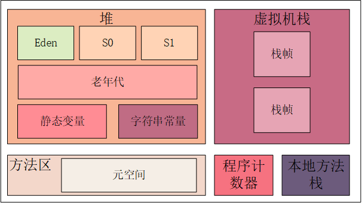

## JAVA内存区域

## 线程共享的
### 堆
存放对象实例，几乎所有的对象实例以及数组都在这里分配内存。
> 1.新生代：（Eden 区、两个 Survivor 区 S0 和 S1 ）对象在Eden区出生，之后在S0和S1区，每转换一次长一岁
> 
> 2.老年代：大对象和年龄达到15岁的对象

#### 字符串常量池
字符串常量池 是 JVM 为了提升性能和减少内存消耗针对字符串（String 类）专门开辟的一块区域，主要目的是为了避免字符串的重复创建。

> JDK1.7 之前，字符串常量池存放在永久代。JDK1.7 字符串常量池和静态变量从永久代移动了 Java 堆中。
> 
> ?移到堆区有什么好处？
### 方法区
方法区属于是 JVM 运行时数据区域的一块**逻辑区域**

方法区会存储已被虚拟机加载的 类信息、字段信息、方法信息、常量、静态变量、即时编译器编译后的代码缓存等数据。
JDK1.8时元空间完全替代永久代，元空间使用的是直接内存。

## 线程私有
### 程序计数器
程序计数器记录着当前代码执行的行数。
> 1.字节码解释器通过改变程序计数器来依次读取指令
> 2.在多线程的情况下，程序计数器用于记录当前线程执行的位置

### 栈
所有的 Java 方法调用都是通过栈来实现。

方法调用的数据需要通过栈进行传递，每一次方法调用都会有一个对应的栈帧被压入栈中，每一个方法调用结束后，都会有一个栈帧被弹出。

### 本地方法栈
虚拟机使用到的 Native 方法服务。
