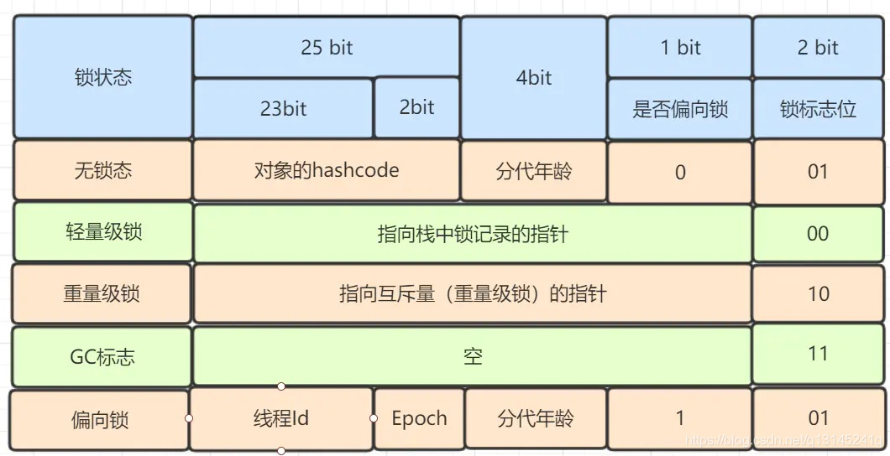
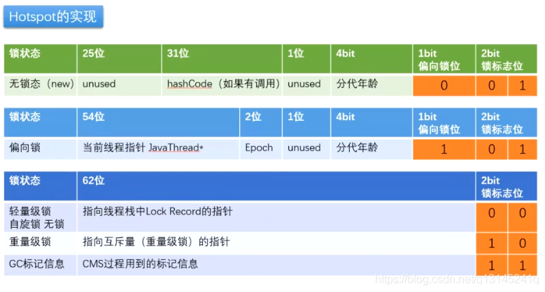

# 1 synchronized的三种应用方式

> synchronized关键字最主要有以下3种应用方式，下面分别介绍
>* **修饰实例方法**，作用于当前实例加锁，进入同步代码前要获得当前实例的锁
>* **修饰静态方法**，作用于当前类对象加锁，进入同步代码前要获得当前类对象的锁
>* **修饰代码块**，指定加锁对象，对给定对象加锁，进入同步代码库前要获得给定对象的锁。

## 1.1 synchronized作用于实例方法

> * 把synchronized加在实例方法上，锁住的是this对象
> * 使用同一个对象的不同方法进行共享资源的操作使用这种方式
> * 所谓的实例对象锁就是用synchronized修饰实例对象中的实例方法

```java
class Test {
    public synchronized void add() {

    }
}

//等价于
class Test {
    public void add() {
        synchronized (this) {

        }
    }
}
```

```java
public class AccountingSync implements Runnable {
    //共享资源(临界资源)
    static int i = 0;

    /**
     * synchronized 修饰实例方法
     * 非静态,访问时锁不一样不会发生互斥
     */
    public synchronized void increase() {
        i++;
    }

    @Override
    public void run() {
        for (int j = 0; j < 1000000; j++) {
            increase();
        }
    }

    public static void main(String[] args) throws InterruptedException {
        test1();
        AccountingSync.i = 0;
        test2();
    }

    private static void test1() throws InterruptedException {
        AccountingSync instance = new AccountingSync();
        Thread t1 = new Thread(instance);
        Thread t2 = new Thread(instance);
        t1.start();
        t2.start();
        t1.join();
        t2.join();
        System.out.println(i);//2000000
    }

    private static void test2() throws InterruptedException {
        //new新实例
        Thread t1 = new Thread(new AccountingSync());
        //new新实例
        Thread t2 = new Thread(new AccountingSync());
        t1.start();
        t2.start();
        //join用于让当前执行线程[main]等待join线程执行结束。
        //其实现原理是不停检查join线程是否存活，如果join线程存活则让当前线程永远等待。
        t1.join();
        t2.join();
        System.out.println(i);//不一定是2000000
    }
}
```

## 1.2 synchronized作用于静态方法

> * 把synchronized加在静态方法上，锁住的是类对象
> * 使用不同对象的方法进行共享资源的操作使用这种方式

```java
class Test {
    public synchronized static void add() {

    }
}

//等价于
class Test {
    public static void add() {
        synchronized (Test.class) {

        }
    }
}
```

```java
public class AccountingSyncClass implements Runnable {
    //共享资源(临界资源)
    static int i = 0;

    /**
     * 作用于静态方法,锁是当前class对象,也就是 AccountingSync 类对应的class对象
     */
    public static synchronized void increase() {
        i++;
    }

    @Override
    public void run() {
        for (int j = 0; j < 1000000; j++) {
            increase();
        }
    }

    public static void main(String[] args) throws InterruptedException {
        test1();
        AccountingSyncClass.i = 0;
        test2();
    }

    private static void test1() throws InterruptedException {
        AccountingSyncClass instance = new AccountingSyncClass();
        Thread t1 = new Thread(instance);
        Thread t2 = new Thread(instance);
        t1.start();
        t2.start();
        t1.join();
        t2.join();
        System.out.println(i);//2000000
    }

    private static void test2() throws InterruptedException {
        //new新实例
        Thread t1 = new Thread(new AccountingSyncClass());
        //new新实例
        Thread t2 = new Thread(new AccountingSyncClass());
        t1.start();
        t2.start();
        //join用于让当前执行线程[main]等待join线程执行结束。
        //其实现原理是不停检查join线程是否存活，如果join线程存活则让当前线程永远等待。
        t1.join();
        t2.join();
        System.out.println(i);//2000000
    }
}
```

## 1.3 synchronized同步代码块

> 在某些情况下，我们编写的方法体可能比较大，同时存在一些比较耗时的操作，而需要同步的代码又只有一小部分，如果直接对整个方法进行同步操作，可能会得不偿失，此时我们可以使用同步代码块的方式对需要同步的代码进行包裹，这样就无需对整个方法进行同步操作了，同步代码块的使用示例如下：

```java
public class AccountingSync implements Runnable {
    static AccountingSync instance = new AccountingSync();
    static int i = 0;

    @Override
    public void run() {
        //省略其他耗时操作....
        //使用同步代码块对变量i进行同步操作,锁对象为instance
        synchronized (instance) {
            for (int j = 0; j < 1000000; j++) {
                i++;
            }
        }
    }

    public static void main(String[] args) throws InterruptedException {
        Thread t1 = new Thread(instance);
        Thread t2 = new Thread(instance);
        t1.start();
        t2.start();
        t1.join();
        t2.join();
        System.out.println(i);//2000000
    }
}
```

> 从代码看出，将synchronized作用于一个给定的实例对象instance，即当前实例对象就是锁对象，每次当线程进入synchronized包裹的代码块时就会要求当前线程持有instance实例对象锁，如果当前有其他线程正持有该对象锁，那么新到的线程就必须等待，这样也就保证了每次只有一个线程执行i++;操作。当然除了instance作为对象外，我们还可以使用this对象(代表当前实例)或者当前类的class对象作为锁，如下代码：

```text
//this,当前实例对象锁
synchronized(this){
    for(int j=0;j<1000000;j++){
        i++;
    }
}

//class对象锁
synchronized(AccountingSync.class){
    for(int j=0;j<1000000;j++){
        i++;
    }
}
```

# 2. Java虚拟机对synchronized的优化

> 锁的状态总共有四种，无锁状态、偏向锁、轻量级锁和重量级锁。随着锁的竞争，锁可以从偏向锁升级到轻量级锁，再升级的重量级锁，但是锁的升级是单向的，也就是说只能从低到高升级，不会出现锁的降级。
>
>一般而言，synchronized使用的锁对象是存储在Java对象头里的，其主要结构是由Mark Word 和 Class Metadata Address 组成，其结构说明如下表：

| 虚拟机位数 | 头对象结构 | 说明 |
| :-----| :---- | :---- |
| 32/64bit | Mark Word | 存储对象的hashCode、锁信息或分代年龄或GC标志等信息 |
| 32/64bit | Class Metadata Address | 类型指针指向对象的类元数据，JVM通过这个指针确定该对象是哪个类的实例。 |

> 其中Mark Word在默认情况下存储着对象的HashCode、分代年龄、锁标记位等以下是32位JVM的Mark Word默认存储结构

| 锁状态| 25bit    | 4bit    | 1bit是否是偏向锁| 2bit 锁标志位 |
| :-----: | :----: | :----: | :----: | :----: |
| 无锁状态| 对象HashCode    | 对象分代年龄|  0 | 01|

32位对象头中的markword布局：



64位对象头中的markword布局：



## 2.1 偏向锁

> 过研究发现，在大多数情况下，锁不仅不存在多线程竞争，而且总是由同一线程多次获得，因此为了减少同一线程获取锁(会涉及到一些CAS操作,耗时)的代价而引入偏向锁。
>
> 偏向锁的核心思想是，如果一个线程获得了锁，那么锁就进入偏向模式，此时Mark Word 的结构也变为偏向锁结构，当这个线程再次请求锁时，无需再做任何同步操作，即获取锁的过程，这样就省去了大量有关锁申请的操作，从而也就提供程序的性能。
>
> 所以，对于没有锁竞争的场合，偏向锁有很好的优化效果，毕竟极有可能连续多次是同一个线程申请相同的锁。但是对于锁竞争比较激烈的场合，偏向锁就失效了，因为这样场合极有可能每次申请锁的线程都是不相同的，因此这种场合下不应该使用偏向锁，否则会得不偿失，需要注意的是，偏向锁失败后，并不会立即膨胀为重量级锁，而是先升级为轻量级锁。

## 2.2 轻量级锁

> 倘若偏向锁失败，虚拟机并不会立即升级为重量级锁，它还会尝试使用一种称为轻量级锁的优化手段(1.6之后加入的)，此时Mark Word 的结构也变为轻量级锁的结构。
>
>轻量级锁能够提升程序性能的依据是“对绝大部分的锁，在整个同步周期内都不存在竞争”，注意这是经验数据。需要了解的是，轻量级锁所适应的场景是线程交替执行同步块的场合，如果存在同一时间访问同一锁的场合，就会导致轻量级锁膨胀为重量级锁。

## 2.3 自旋锁

> 轻量级锁失败后，虚拟机为了避免线程真实地在操作系统层面挂起，还会进行一项称为自旋锁的优化手段。这是基于在大多数情况下，线程持有锁的时间都不会太长，如果直接挂起操作系统层面的线程可能会得不偿失，毕竟操作系统实现线程之间的切换时需要从用户态转换到核心态，这个状态之间的转换需要相对比较长的时间，时间成本相对较高。
>
>因此自旋锁会假设在不久将来，当前的线程可以获得锁，因此虚拟机会让当前想要获取锁的线程做几个空循环(这也是称为自旋的原因)，一般不会太久，可能是50个循环或100循环，在经过若干次循环后，如果得到锁，就顺利进入临界区。如果还不能获得锁，那就会将线程在操作系统层面挂起，这就是自旋锁的优化方式，这种方式确实也是可以提升效率的。最后没办法也就只能升级为重量级锁了。

## 2.4 锁消除

> 消除锁是虚拟机另外一种锁的优化，这种优化更彻底，Java虚拟机在JIT编译时(可以简单理解为当某段代码即将第一次被执行时进行编译，又称即时编译)，通过对运行上下文的扫描，去除不可能存在共享资源竞争的锁，通过这种方式消除没有必要的锁，可以节省毫无意义的请求锁时间，如下StringBuffer的append是一个同步方法，但是在add方法中的StringBuffer属于一个局部变量，并且不会被其他线程所使用，因此StringBuffer不可能存在共享资源竞争的情景，JVM会自动将其锁消除。

```java
/**
 * 消除StringBuffer同步锁
 */
public class StringBufferRemoveSync {

    public void add(String str1, String str2) {
        //StringBuffer是线程安全,由于sb只会在append方法中使用,不可能被其他线程引用
        //因此sb属于不可能共享的资源,JVM会自动消除内部的锁
        StringBuffer sb = new StringBuffer();
        sb.append(str1).append(str2);
    }

    public static void main(String[] args) {
        StringBufferRemoveSync rmsync = new StringBufferRemoveSync();
        for (int i = 0; i < 10000000; i++) {
            rmsync.add("abc", "123");
        }
    }
}

```

# 3. synchronized的可重入性

> 从互斥锁的设计上来说，当一个线程试图操作一个由其他线程持有的对象锁的临界资源时，将会处于阻塞状态，但当一个线程再次请求自己持有对象锁的临界资源时，这种情况属于重入锁，请求将会成功，在java中synchronized是基于原子性的内部锁机制，是可重入的，因此在一个线程调用synchronized方法的同时在其方法体内部调用该对象另一个synchronized方法，也就是说一个线程得到一个对象锁后再次请求该对象锁，是允许的，这就是synchronized的可重入性。如下：

```java
public class AccountingSync implements Runnable {
    static AccountingSync instance = new AccountingSync();
    static int i = 0;
    static int j = 0;

    @Override
    public void run() {
        for (int j = 0; j < 1000000; j++) {

            //this,当前实例对象锁
            synchronized (this) {
                i++;
                increase();//synchronized的可重入性
            }
        }
    }

    public synchronized void increase() {
        j++;
    }

    public static void main(String[] args) throws InterruptedException {
        Thread t1 = new Thread(instance);
        Thread t2 = new Thread(instance);
        t1.start();
        t2.start();
        t1.join();
        t2.join();
        System.out.println(i);
        System.out.println(j);
    }
}
```
> 正如代码所演示的，在获取当前实例对象锁后进入synchronized代码块执行同步代码，并在代码块中调用了当前实例对象的另外一个synchronized方法，再次请求当前实例锁时，将被允许，进而执行方法体代码，这就是重入锁最直接的体现，需要特别注意另外一种情况，当子类继承父类时，子类也是可以通过可重入锁调用父类的同步方法。注意由于synchronized是基于monitor实现的，因此每次重入，monitor中的计数器仍会加1。


# 1 乐观锁CAS

# 2 悲观锁synchronized、vector、hashtable

# 3 自旋锁CAS

# 4 可重入锁synchronized、Reentrantlock、Lock

# 5 读写锁ReentrantReadWriteLock，CopyOnWriteArrayList、CopyOnWriteArraySet

# 6 公平锁Reentrantlock(true)

# 7 非公平锁synchronized、reentrantlock(false)

# 8 共享锁ReentrantReadWriteLock中读锁

# 9 独占锁synchronized、vector、hashtable、ReentrantReadWriteLock中写锁

# 10 重量级锁synchronized

# 11 轻量级锁锁优化技术

# 12 偏向锁锁优化技术

# 13 分段锁concurrentHashMap

# 14 互斥锁synchronized

# 15 同步锁synchronized

# 16 死锁相互请求对方的资源

# 17 锁粗化锁优化技术

# 18 锁消除锁优化技术