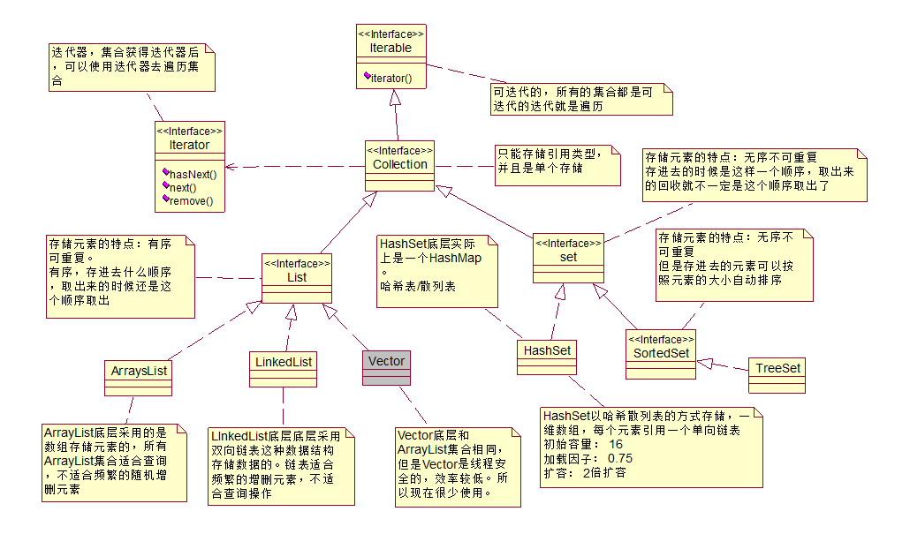
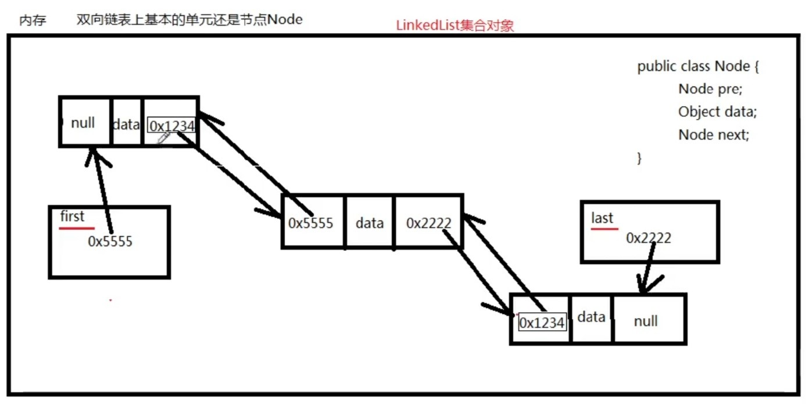
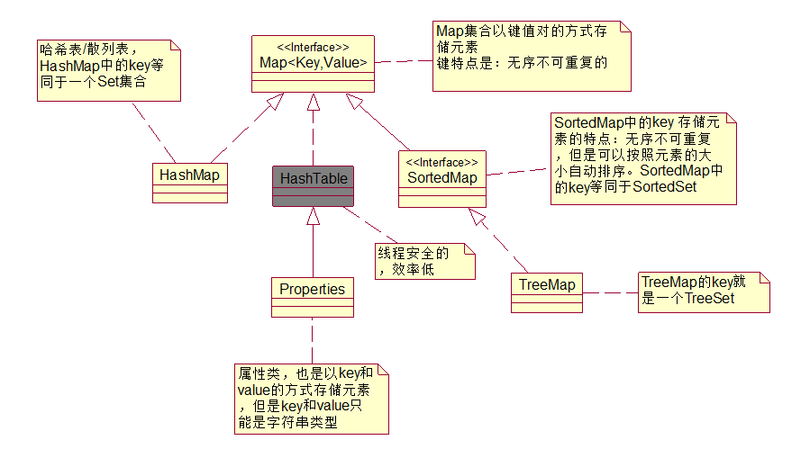
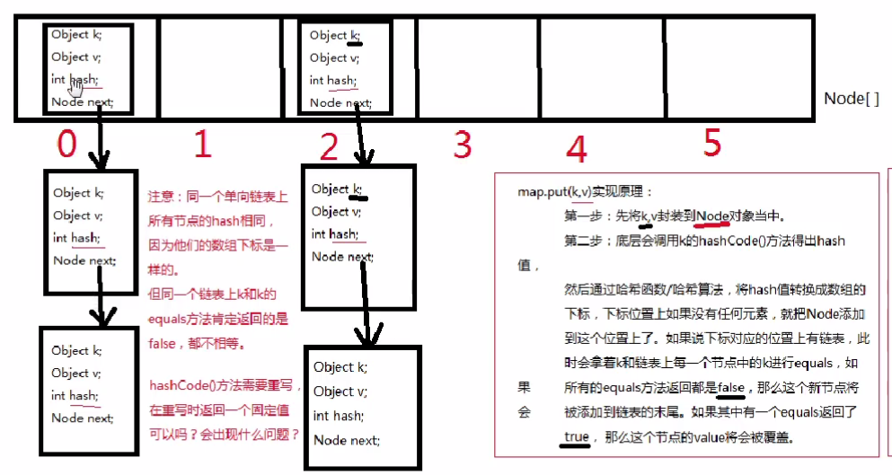

# 1. Connection:



```java
/*
 * Collection中常用方法
 * -----------------------
 * 增：  add(Object o);
 * 查：	 contains;
 * 删除：  remove(Object o);
 * ----------------------------------------------------------
 * size():  返回集合中元素个数。
 * clear(): 清空集合。
 * isEmpty() :判断集合是否为空
 * iterator() ：返回集合中的元素上进行迭代的迭代器。
 */

/*
 * 对集合中元素的  查：contains()
 *                      删除 ：remove(Object o)
 * --------------------------------------------------------------------------------------------
 * 8种包装类和String重写Object中equals方法，按内容比较是否相等。
 */
```

## 1.1.List:

### 1.1.1 ArrayList

```java
/*
 * ArrayList实现List接口
 * ArrayList 存储元素的方式为数组的方式 ：
 *  当集合中的元素存储一定数量,对集合进行扩容
 *  ---------------------
 *  ArrayList :初始容量 10个， length*1.5倍扩容
 *
 *  ArrayList的特点 ： 遍历速度快，查找的速度快。缺点：随机添加和删除慢。
 *  应用： 项目存储大量数据，在页面上显示。
 */
```

### 1.1.2 LinkedList

```java
/*
 * LinkedList:实现了List接口：
 * LinkedList 存储格式 为："链表的格式"  ==>双向链表的存储方式
 * 特点： 遍历的速度慢，随机添加和删除速度快。
 * --------------------------------------
 * 新增：对表头和表尾操作的方法
 * 增：addFirst(Object o) ;  addLast(Object o);
 * 删：removeFirst(),removeLast()
 * 查：getFirst() ,getLast()
 *
 */
```



### 1.1.3 List接口中特有的方法

```java
/*
 * List接口中特有的方法： 有序的，元素有下标。
 * ---------------------------------
 * 增： add(int index, Object o) ：在index处添加新元素  index范围 : [0,size]
 * 查： get(int index) : 返回index处的元素
 * 删除：remove(int index): 删除指定index处的元素
 * 改：set(int index,Object o)
 *
 * 注意：防止下标越界
 */

public class Test {
    public static void main(String[] args) {
        List list = new ArrayList();
        list.add("abc");  //直接添加到集合的结尾处。
        list.add(0, "ABC");//[ABC, abc]
        list.add(3, 123); //java.lang.IndexOutOfBoundsException   list.size()=2;
    }
}
```

## 1.2 Set

```java
/*
 * Set:集合接口继承自Collection接口： 无序，不可重复
 * ----------------
 * 无序：读取顺序与存入顺序不相同
 */
```

## 1.2.1 HashSet

```java
/*
 * 在HashSet中去除重复项：
 * 调用方法
 * 1、调用hashCode() 比较两个对象的此值是否相等，如果不相等 ，则不重复
 * 2、如果相等,调用equals()方法,如果true则为重复项，false不重复。
 * --------------------------
 * 在HashSet中存放自定义类的数据时，为了去除重复项，在类中重写hashCode()和equals()
 */
/*
 * HashSet:以哈希散列表的方式存储，一维数组，每个元素引用一个单向链表。
 * 初始容量： 16
 * 加载因子： 0.75
 * 扩容： 2倍扩容。
 */


//<>:泛型，集合指定泛型，规定集合中存储的元素的类型。当添加类型不一致时，出现编译错误。
/*
 * 避免多个不同类型之间转型时出现ClassCastException异常。
 * E: element
 */
```

## 1.2.1 TreeSet

```java
/* TreeSet的存储方式 ：二叉树的方式存储
 * TreeSet：无序(读取的顺序与存入不一致)，不可重复。值排序(升序)。
 * SortedSet:按元素的自然排序规则排序
 * ------------------------------------
 * TreeSet如何去除重复项？
      String和8种包装类中都指定自然排序方法：实现java.lang.Comparable接口，重写compareTo方法
 * TreeSet如何对元素排序？
 */

/*
 * TreeSet中存放元素，默认按自然排序的方式去除重复项，并进行排序的
 * String和8种包装类中都指定自然排序方法：实现java.lang.Comparable接口，重写compareTo方法
 * 自定义的类放入TreeSet时，也实现实现java.lang.Comparable接口，重写compareTo方法
 */

/**
 * TreeSet:以二叉树的方式存储
 * 存储时，左小右大
 * 读取时使用中序读取： 左-》中-》右
 *
 */
```

# 2. Map:



```java
/*
 * Map集合中常用的方法：
 * -------------------------
 * 增：put(K key, V value);
 * 删除：V remove(K key): 按key删除key-value ，返回value值
 *
 * 改：put(K key, V value)  :如果key已存在，则把value更改最新的Value;
 *
 * 查：boolean containsKey(Object key)
 * 	 boolean containsValue(Object o)
 * 	 V　get(K key) :根据key查找对应的value
 *
 * -------------------------
 * isEmpty()
 * size()
 * clear()
 * -----------------------------
 * Map集合中的元素如何遍历？
 * 1、按key遍历    keySet():返回所有key的集合 --》Set
 * 2、按value遍历 ： values() :返回所有的value的集合 -->Collection
 * 3、按key-value的映射遍历： entrySet() -->所有key-value映射关系的集合==》Set :值类的：Map.Entry
 */
```

### 2.1 HashMap

```java
/**
 * HashMap:哈希散列表的方式存储。
 * @author Administrator
 * --------------------
 * HashMap，HashSet选择哪个集合？
 * 1、如果仅考虑元素是否重复。 使用：HashSet
 * 2、如果 key-value 使用HashMap
 * --------------------
 */

/*
 * 查看源代码：HashSet中存储元素时，按HashMap的方式存储。
 * 元素作为HashMap中的key存储。
 * HashSet中的元素是不可重复的。
 * 去除的重复方式为：元素重写hashCode()和equals()方法。
 * 问:HashMap中,key不可重复的，key如何去除重复？
 *  调用key元素的hashCode()和equals()方法。
 */
```
```html
key.hashCode()方法返回哈希值，哈希值经过哈希算法转换成数组下标 
注：如果一个类的equals方法重写了，那么hashCode()方法必须重写 
    equals方法返回的如果是true，hashCode()返回的值必须一样 
    放在hashMap集合key中的元素，以及放在hashSet集合中的元素，需要同时重写hashCode()和equals()方法。

对于哈希表数据结构来说：
如果o1和o2的哈希值相同，一定是放在同一个单向链表上，
如果o1和o2的hash值不同，但由于哈希算法执行结束之后转换的数组下标可能相同，此时会发生“哈希碰撞”

hashMap:数组加链表组成
jdk8后，转树阀值为8，当哈希表单向链表中元素超过8个，单向链表数据结构会变成转红黑树数据结构，
转链表阀值为6，当红黑树上节点数量小于6时，会重新把红黑树转成单向链表数据结构。
最小树化容量阀值：64，当哈希表中容量 > 该值时，单向链表数据结构会变成转红黑树数据结构
这种方式也是为了提高检索效率，二叉树的检索效率会再次缩小检索范围，提高效率。
链表长度大于8的时候会调用treeifyBin()方法转化为红黑树，但在treeifyBin方法中有一个判断，
只有当数组长度大于64时，才会进行树化，否则只是resize扩容。
因为链表过长而数组过短，容易发生hash碰撞，这时候树化其实是治标不治本的，因为引起链表过长的根本原因是数组过短。
执行树化前，会先检查数组长度，如果长度小于64，则对数组进行扩容，而不是进行树形化。
当链表长度超过8,但数组长度不足64时，treeifyBin（）内部实际上调用的是扩容方法，
```
