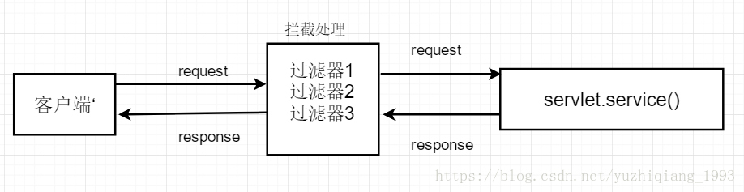
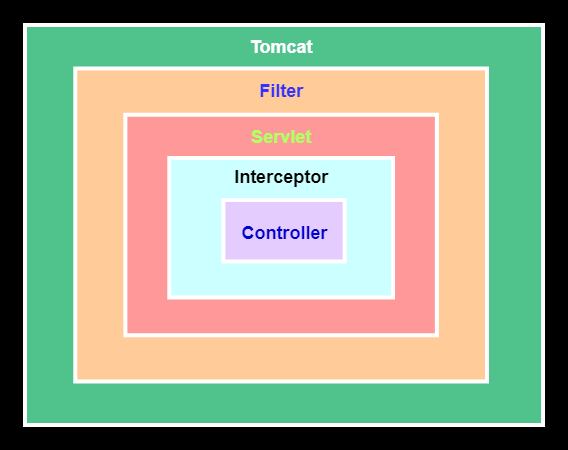

# 1 过滤器和拦截器

## 1.1 过滤器 (Filter)

> 过滤器的配置比较简单，直接实现Filter 接口即可，也可以通过@WebFilter注解实现对特定URL拦截
> 

```java
/**
 * @WebFilter 需要在启动类上开启@ServletComponentScan注解
 * 加上@Component 注解或@Configuration 注解后 会初始化两次，并且第二次的initParams参数获取不到，为null
 * 注：/* 匹配所有， /** 都匹配不上 ？？？
 **/
@WebFilter(filterName = "CharsetFilter"
//        ,urlPatterns = "/*"/*通配符（*）表示对所有的web资源进行拦截*/
        , urlPatterns = "/filterTest/*"
        , initParams = {
        @WebInitParam(name = "charset", value = "utf-8")}/*这里可以放一些初始化的参数*/
)
public class CharsetFilter implements Filter {
    private String filterName;
    private String charset;

    @Override
    public void init(FilterConfig filterConfig) throws ServletException {
        /*初始化方法  接收一个FilterConfig类型的参数 该参数是对Filter的一些配置*/
        filterName = filterConfig.getFilterName();
        System.out.print("************************ 过滤器 " + filterName + " 初始化 ************************ ");
        charset = filterConfig.getInitParameter("charset");
        System.out.println("字符集编码：" + charset);
    }

    @Override
    public void doFilter(ServletRequest request, ServletResponse response, FilterChain chain) throws IOException, ServletException {
        /*过滤方法 主要是对request和response进行一些处理，然后交给下一个过滤器或Servlet处理*/
        System.out.println("************************ " + filterName + " 处理中 ************************");
        request.setCharacterEncoding(charset);
        response.setCharacterEncoding(charset);
        chain.doFilter(request, response);
    }

    @Override
    public void destroy() {
        /*销毁时调用*/
        System.out.println("************************ " + filterName + " 销毁 ************************");
//        Filter.super.destroy();
    }
}
```

> **init() ：** 该方法在容器启动初始化过滤器时被调用，它在 Filter 的整个生命周期只会被调用一次。
>
> **注意：** 这个方法必须执行成功，否则过滤器会不起作用。

> **doFilter() ：** 容器中的每一次请求都会调用该方法
>
> **FilterChain** 用来调用下一个过滤器 Filter

> **destroy()：** 当容器销毁过滤器实例时调用该方法，一般在方法中销毁或关闭资源，在过滤器 Filter 的整个生命周期也只会被调用一次

## 1.2 拦截器 (Interceptor)

> 拦截器它是链式调用，一个应用中可以同时存在多个拦截器Interceptor， 一个请求也可以触发多个拦截器 ，而每个拦截器的调用会依据它的声明顺序依次执行。
>
> 首先编写一个简单的拦截器处理类，请求的拦截是通过HandlerInterceptor 来实现，看到HandlerInterceptor 接口中也定义了三个方法。

```java

@Component
public class MyInterceptor implements HandlerInterceptor {

    @Override
    public boolean preHandle(HttpServletRequest request, HttpServletResponse response, Object handler) throws Exception {
        System.out.println("Interceptor 前置");
        return true;
    }

    @Override
    public void postHandle(HttpServletRequest request, HttpServletResponse response, Object handler, ModelAndView modelAndView) throws Exception {
        System.out.println("Interceptor 处理中");
    }

    @Override
    public void afterCompletion(HttpServletRequest request, HttpServletResponse response, Object handler, Exception ex) throws Exception {
        System.out.println("Interceptor 后置");
    }
}
```

> **preHandle()：** 这个方法将在请求处理之前进行调用。
>
> **注意：** 如果该方法的返回值为false ，将视为当前请求结束，不仅自身的拦截器会失效，还会导致其他的拦截器也不再执行。

> **postHandle()：** 只有在 preHandle() 方法返回值为true 时才会执行。会在Controller 中的方法调用之后，DispatcherServlet 返回渲染视图之前被调用。
>
>有意思的是：postHandle() 方法被调用的顺序跟 preHandle() 是相反的，先声明的拦截器 preHandle() 方法先执行，而postHandle()方法反而会后执行。

> **afterCompletion()：** 只有在 preHandle() 方法返回值为true 时才会执行。在整个请求结束之后， DispatcherServlet 渲染了对应的视图之后执行。

> 将自定义好的拦截器处理类进行注册，并通过addPathPatterns、excludePathPatterns等属性设置需要拦截或需要排除的 URL。

```java

@Configuration
public class MyMvcConfig implements WebMvcConfigurer {
    public void addInterceptors(InterceptorRegistry registry) {
        registry.addInterceptor(new MyInterceptor()).addPathPatterns("/filterTest/**");
    }
}
``` 

# 2 过滤器和拦截器的不同点

> 过滤器 和 拦截器 均体现了AOP的编程思想，都可以实现诸如日志记录、登录鉴权等功能，但二者的不同点也是比较多的。

## 2.1 实现原理不同

> 过滤器和拦截器底层实现方式大不相同，**过滤器** 是基于函数回调的，**拦截器** 则是基于Java的反射机制（动态代理）实现的。

## 2.2 使用范围不同

> **过滤器(Filter)** 实现的是 javax.servlet.Filter 接口，而这个接口是在Servlet规范中定义的，也就是说过滤器Filter 的使用要依赖于Tomcat等容器，导致它只能在web程序中使用。
>
> **拦截器(Interceptor)** 它是一个Spring组件，并由Spring容器管理，并不依赖Tomcat等容器，是可以单独使用的。不仅能应用在web程序中，也可以用于Application、Swing等程序中。

## 2.3 触发时机不同


> **过滤器Filter** 是在请求进入容器后，但在进入servlet之前进行预处理，请求结束是在servlet处理完以后。
>
>**拦截器 Interceptor** 是在请求进入servlet后，在进入Controller之前进行预处理的，Controller 中渲染了对应的视图之后请求结束。

## 2.4 拦截的请求范围不同

> **过滤器** 几乎可以对所有进入容器的请求起作用
>
> **拦截器** 只会对Controller中请求或访问static目录下的资源请求起作用

## 2.5 注入Bean情况不同

> 拦截器加载的时间点在springcontext之前，而Bean又是由spring进行管理
>
> 解决方案：我们在注册拦截器之前，先将Interceptor 手动进行注入。
>
> **注意：** 在registry.addInterceptor()注册的是getMyInterceptor() 实例

```java

@Configuration
public class BeanTestConfig implements WebMvcConfigurer {

    public void addInterceptors(InterceptorRegistry registry) {
        //拦截器加载的时间点在springContext之前，此时filterService为null
        registry.addInterceptor(new BeanTestInterceptor()).addPathPatterns("/filterTest/testB");
        registry.addInterceptor(getInterceptor()).addPathPatterns("/filterTest/testC");//getInterceptor()

    }

    @Bean
    public BeanTestInterceptor getInterceptor() {
        return new BeanTestInterceptor();//注入了 BeanTestInterceptor
    }
}
``` 

## 2.6 控制执行顺序不同

> 过滤器用@Order注解控制执行顺序，通过@Order控制过滤器的级别，值越小级别越高越先执行。
>
> 拦截器默认的执行顺序，就是它的注册顺序，也可以通过Order手动设置控制，值越小越先执行。
>
> 先声明的拦截器 preHandle() 方法先执行，而postHandle()和afterCompletion()方法反而会后执行 
```java
@Configuration
public class MyMvcConfig implements WebMvcConfigurer {
    public void addInterceptors(InterceptorRegistry registry) {
        registry.addInterceptor(new MyInterceptor2()).addPathPatterns("/filterTest/**").order(2);
        registry.addInterceptor(new MyInterceptor1()).addPathPatterns("/filterTest/**").order(1);
        registry.addInterceptor(new MyInterceptor()).addPathPatterns("/filterTest/**").order(3);
    }
}
``` 
```text
************************ Interceptor1 前置 ************************
************************ Interceptor2 前置 ************************
************************ Interceptor 前置 ************************
************************ Interceptor 处理中 ************************
************************ Interceptor2 处理中 ************************
************************ Interceptor1 处理中 ************************
************************ Interceptor 后置 ************************
************************ Interceptor2 后置 ************************
************************ Interceptor1 后置 ************************
```