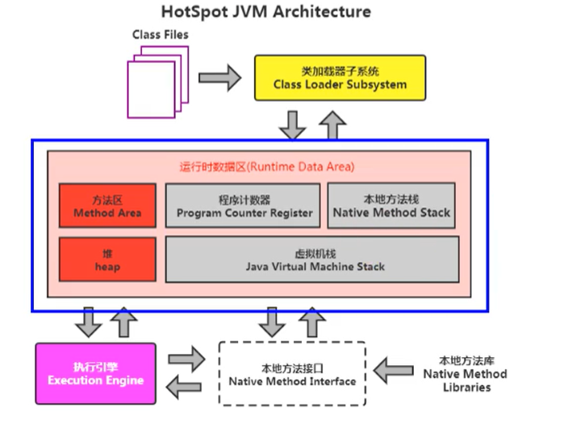
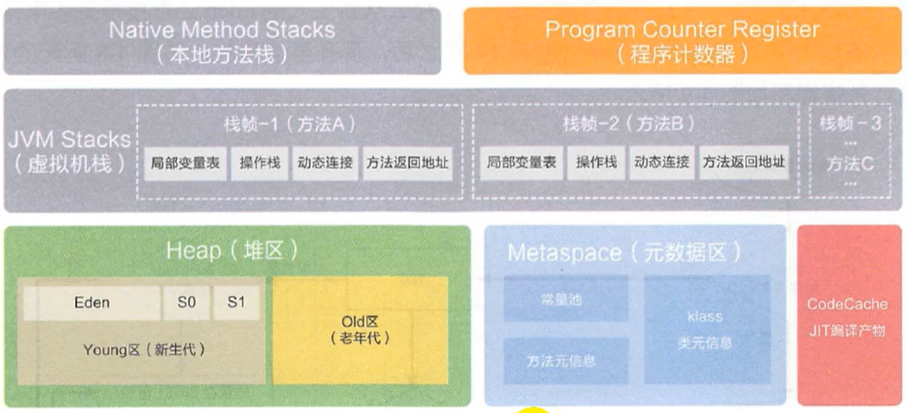
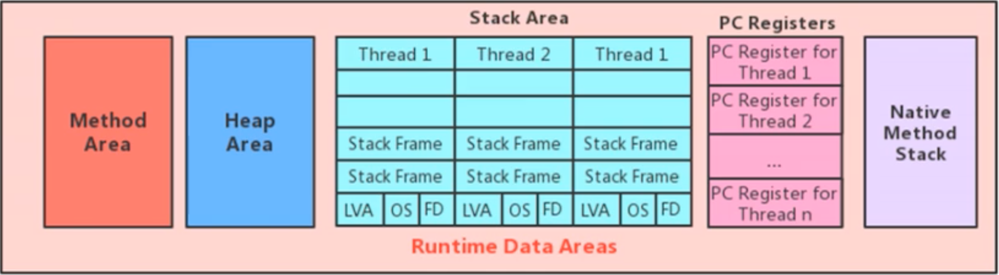
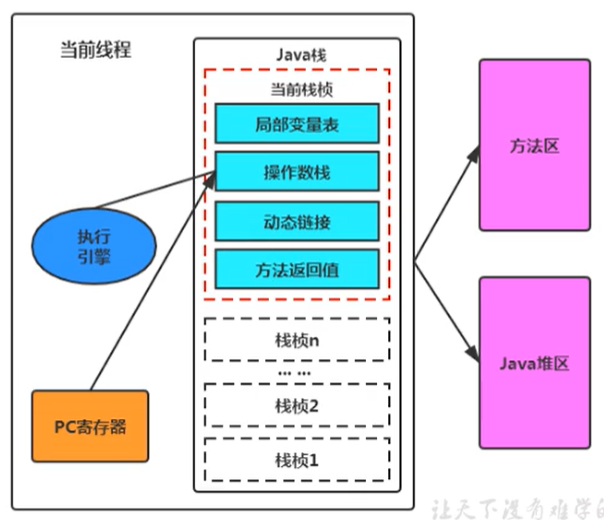
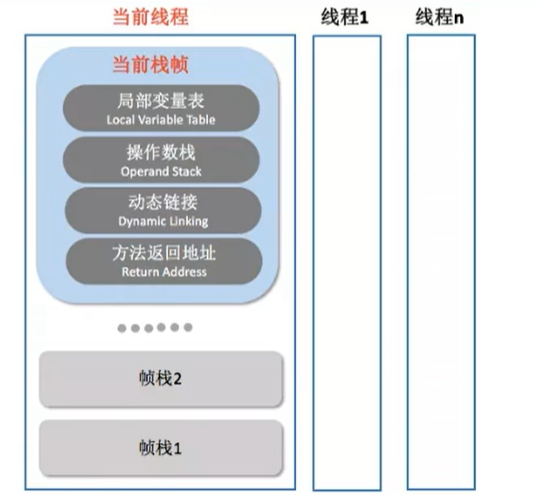

## 1.HotSpot JVM结构


> **线程独有：** 包括程序计数器、栈、本地方法栈
>
>**线程间共享：** 堆、堆外内存（永久代或元空间、代码缓存）

> `每个JVM只有一个Runtime实例`，即为运行时环境。
>
> java.lang.Runtime 使用的是懒汉式单例模式创建对象。

```java
public class Runtime {
    private static Runtime currentRuntime = new Runtime();

    public static Runtime getRuntime() {
        return currentRuntime;
    }
}
``` 

## 2.运行时数据区的完整图



|JDK版本|    方法区实现|    变化 |
|  :----:  | :----:  |----  |
|jdk1.6|    永久代|    字符串常量池、运行时常量池、静态变量都是在永久代中|
|jdk1.7|    永久代|    字符串常量池和静态变量被移动到了堆当中，运行时常量池还是在永久代中|
|jdk1.8|    元空间|    字符串常量池和静态变量仍然在堆当中；运行时常量池、类型信息、常量、字段、方法被移动都了元空间中|

## 3.运行时数据区


> **Stack Area：** 栈区是一个线程一个栈。
>
> **PC Registers：** PC寄存器用来存储指向下一条指令的地址，也就是即将要执行的指令代码。由执行引擎读取下一条指令，并执行该指令。

### 3.1 栈区



> 每个线程在创建时都会创建一个虚拟机栈，其内部保存一个个的栈帧（Stack Frame），对应着一次次的Java方法调用。

* 栈是线程私有的
* 一个方法对应一个栈帧的入栈和出栈

### 面试题

> 使用 PC寄存器 存储字节码指令地址有什么用呢？
>
>或者问 为什么使用 PC寄存器 来记录当前线程的执行地址呢？

+ 因为线程是一个个的顺序执行流，CPU需要不停的切换各个线程，这时候切换回来以后，就得知道接着从哪开始继续执行
+ JVM的字节码解释器就需要通过改变PC寄存器的值来明确下一条应该执行什么样的字节码指令