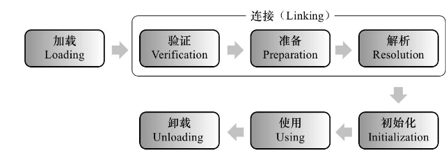

> 一个类型从被加载到虚拟机内存中开始，到卸载出内存为止，它的整个生命周期将会经历加载 （Loading）、验证（Verification）、准备（Preparation）、解析（Resolution）、初始化 （Initialization）、使用（Using）和卸载（Unloading）七个阶段，其中验证、准备、解析三个部分统称 为连接（Linking）。这七个阶段的发生顺序下图所示。


> 加载、验证、准备、初始化和卸载这五个阶段的顺序是确定的，类型的加载过程必须按 照这种顺序按部就班地开始，而解析阶段则不一定：它在某些情况下可以在初始化阶段之后再开始， 这是为了支持Java语言的运行时绑定特性（也称为动态绑定或晚期绑定）。请注意，这里笔者写的是 按部就班地“开始”，而不是按部就班地“进行”或按部就班地“完成”，强调这点是因为这些阶段通常都 是互相交叉地混合进行的，会在一个阶段执行的过程中调用、激活另一个阶段。

# 1. 类加载的过程

> Java虚拟机中类加载的全过程，即加载、验证、准备、解析和初始化这五个阶段。

## 1.1 加载

> 在加载阶段，Java虚拟机需要完成以下三件事情：
> 1. 通过一个类的全限定名来获取定义此类的二进制字节流。
> 2. 将这个字节流所代表的静态存储结构转化为方法区的运行时数据结构。
> 3. 在内存中生成一个代表这个类的java.lang.Class对象，作为方法区这个类的各种数据的访问入口。

## 1.2 连接

### 1.2.1 验证

> 验证是连接阶段的第一步，这一阶段的目的是确保Class文件的字节流中包含的信息符合《Java虚 拟机规范》的全部约束要求，保证这些信息被当作代码运行后不会危害虚拟机自身的安全。
> 1. 文件格式验证
> 2. 元数据验证
> 3. 字节码验证
> 4. 符号引用验证

### 1.2.2 准备

> 准备阶段是正式为类中定义的变量（即静态变量，被static修饰的变量）分配内存并设置类变量初 始值的阶段，从概念上讲，这些变量所使用的内存都应当在方法区中进行分配，但必须注意到方法区 本身是一个逻辑上的区域，在JDK 7及之前，HotSpot使用永久代来实现方法区时，实现是完全符合这 种逻辑概念的；而在JDK 8及之后，类变量则会随着Class对象一起存放在Java堆中，这时候“类变量在 方法区”就完全是一种对逻辑概念的表述了。
>
>关于准备阶段，还有两个容易产生混淆的概念需要着重强调，首先是这时候进行内存分配的 仅包括类变量，而不包括实例变量，实例变量将会在对象实例化时随着对象一起分配在Java堆中。

### 1.2.3 解析

> 解析阶段是Java虚拟机将常量池内的符号引用替换为直接引用的过程
>
> 解析动作主要针对类或接口、字段、类方法、接口方法、方法类型、方法句柄和调用点限定符这7 类符号引用进行，分别对应于常量池的CONSTANT_Class_info、CONSTANT_Fieldref_info、 CONSTANT_Methodref_info、CONSTANT_InterfaceMethodref_info、 CONSTANT_MethodType_info、CONSTANT_MethodHandle_info、CONSTANT_Dyna-mic_info和 CONSTANT_InvokeDynamic_info 8种常量类型。

## 1.3 初始化
```text
init是 (instance) 实例构造器，对非静态变量解析和初始化。
而clinit是 (class) 类构造器对静态变量、静态代码块进行初始化。
```

> 类的初始化阶段是类加载过程的最后一个步骤，之前介绍的几个类加载的动作里，除了在加载阶 段用户应用程序可以通过自定义类加载器的方式局部参与外，其余动作都完全由Java虚拟机来主导控 制。直到初始化阶段，Java虚拟机才真正开始执行类中编写的Java程序代码，将主导权移交给应用程 序。
>
> 进行准备阶段时，变量已经赋过一次系统要求的初始零值，而在初始化阶段，则会根据程序员通 过程序编码制定的主观计划去初始化类变量和其他资源。我们也可以从另外一种更直接的形式来表 达：初始化阶段就是执行类构造器\<clinit>()方法的过程。
>
> \<clinit>()并不是程序员在Java代码中直接编写的方法，它是Javac编译器的自动生成物。
>
> \<clinit>()方法是由编译器自动收集类中的所有类变量的赋值动作和静态语句块（static{}块）中的 语句合并产生的，编译器收集的顺序是由语句在源文件中出现的顺序决定的，静态语句块中只能访问 到定义在静态语句块之前的变量，定义在它之后的变量，在前面的静态语句块可以赋值，但是不能访问。

```java
public class Test {
    static {
        i = 0; // 给变量赋值可以正常编译通过
        System.out.print(i); // 这句编译器会提示“非法向前引用”
    }

    static int i = 1;
}
```

> \<clinit>()方法与类的构造函数（即在虚拟机视角中的实例构造器<init>()方法）不同，它不需要显 式地调用父类构造器，Java虚拟机会保证在子类的<clinit>()方法执行前，父类的<clinit>()方法已经执行 完毕。因此在Java虚拟机中第一个被执行的<clinit>()方法的类型肯定是java.lang.Object。
> 由于父类的\<clinit>()方法先执行，也就意味着父类中定义的静态语句块要优先于子类的变量赋值操作。

```java
class SubParent {
    public static int A = 1;

    static {
        System.out.println(A);//1. A = 1
        A = 2;//2. 重新赋值
    }
}

public class Sub extends SubParent {
    public static int B = A;//3. B = A = 2

    public static void main(String[] args) {
        System.out.println(Sub.B);//字段B的值将会是2而不是1
    }
}
```

> \<clinit>()方法对于类或接口来说并不是必需的，如果一个类中没有静态语句块，也没有对变量的 赋值操作，那么编译器可以不为这个类生成<clinit>()方法。
>
> 接口中不能使用静态语句块，但仍然有变量初始化的赋值操作，因此接口与类一样都会生成
<clinit>()方法。但接口与类不同的是，执行接口的<clinit>()方法不需要先执行父接口的<clinit>()方法， 因为只有当父接口中定义的变量被使用时，父接口才会被初始化。此外，接口的实现类在初始化时也 一样不会执行接口的<clinit>()方法。
>
> Java虚拟机必须保证一个类的<clinit>()方法在多线程环境中被正确地加锁同步，如果多个线程同 时去初始化一个类，那么只会有其中一个线程去执行这个类的<clinit>()方法，其他线程都需要阻塞等 待，直到活动线程执行完毕<clinit>()方法。如果在一个类的<clinit>()方法中有耗时很长的操作，那就 可能造成多个进程阻塞，在实际应用中这种阻塞往往是很隐蔽的。

```java
class DeadLoopClass {
    static {
        // 如果不加上这个if语句，编译器将提示"Initializer does not complete normally"并拒绝编译
        if (true) {
            System.out.println(Thread.currentThread() + "init DeadLoopClass");
            while (true) {
            }
        }
    }
}

public class DeedLoopClassTest {
    public static void main(String[] args) {
        Runnable script = new Runnable() {
            public void run() {
                System.out.println(Thread.currentThread() + "start");
                DeadLoopClass dlc = new DeadLoopClass();
                System.out.println(Thread.currentThread() + " run over");
            }
        };
        Thread thread1 = new Thread(script);
        Thread thread2 = new Thread(script);
        thread1.start();
        thread2.start();
    }
}
/**
 运行结果如下，一条线程在死循环以模拟长时间操作，另外一条线程在阻塞等待
 Thread[Thread-0,5,main]start
 Thread[Thread-1,5,main]start
 Thread[Thread-0,5,main]init DeadLoopClass
 */
```

> **注意**，其他线程虽然会被阻塞，但如果执行＜clinit＞()方法的那条线程退出＜clinit＞()方法 后，其他线程唤醒后则不会再次进入＜clinit＞()方法。同一个类加载器下，一个类型只会被初始化一 次。

# 一个DEMO

```java
public class Test {
    //走到此处说明Test.class 已经完成了加载、验证、准备
    // 1.new字节码指令触发了类型的初始化<init>，此时c为0，不是100
    static Test test = new Test();
    // 2.new字节码指令触发了类型的初始化<init>，此时c为0，不是100
    static Test test2 = new Test();
    // 3.<clinit>
    public static int c = 100;

    public static void getTest() {
        System.out.println("-----------" + c);
    }

    public Test() {
        System.out.println("构造器：" + c);
    }

    {
        System.out.println("构造代码块：" + c);
    }

    static {
        System.out.println("静态代码块：" + c);
    }

    public static void main(String[] args) {
        Test.getTest();
    }
}
```
```text
执行结果：
    构造代码块：0
    构造器：0
    构造代码块：0
    构造器：0
    静态代码块：100
    -----------100
```
```html
 <clinit> 的字节码指令
 0 new #14 <com/demo/D0719/Test>  <!--new一个Test-->
 3 dup
 4 invokespecial #15 <com/demo/D0719/Test.<init> : ()V>  <!--执行Test.<init>-->
 7 putstatic #16 <com/demo/D0719/Test.test : Lcom/demo/D0719/Test;>
10 new #14 <com/demo/D0719/Test>  <!--new一个Test-->
13 dup
14 invokespecial #15 <com/demo/D0719/Test.<init> : ()V>  <!--执行Test.<init>-->
17 putstatic #17 <com/demo/D0719/Test.test2 : Lcom/demo/D0719/Test;>
20 bipush 100  <!--常量100压入栈中-->
22 putstatic #6 <com/demo/D0719/Test.c : I>  <!--给c赋值-->
25 getstatic #1 <java/lang/System.out : Ljava/io/PrintStream;>  <!--获取打印流-->
28 new #2 <java/lang/StringBuilder>  <!-- new一个StringBuilder -->
31 dup
32 invokespecial #3 <java/lang/StringBuilder.<init> : ()V> <!--StringBuilder.<init>-->
35 ldc #18 <静态代码块：> 
37 invokevirtual #5 <java/lang/StringBuilder.append : (Ljava/lang/String;)Ljava/lang/StringBuilder;>  <!--append("静态代码块：")-->
40 getstatic #6 <com/demo/D0719/Test.c : I>
43 invokevirtual #7 <java/lang/StringBuilder.append : (I)Ljava/lang/StringBuilder;> <!--append(c)-->
46 invokevirtual #8 <java/lang/StringBuilder.toString : ()Ljava/lang/String;> <!--StringBuilder.toString-->
49 invokevirtual #9 <java/io/PrintStream.println : (Ljava/lang/String;)V> <!--打印-->
52 return
            
<init> 的字节码指令
 0 aload_0
 1 invokespecial #10 <java/lang/Object.<init> : ()V>
<!-- 4 getstatic #1 <java/lang/System.out : Ljava/io/PrintStream;>-->
<!-- 7 new #2 <java/lang/StringBuilder>-->
<!--10 dup-->
<!--11 invokespecial #3 <java/lang/StringBuilder.<init> : ()V>-->
<!--14 ldc #11 <构造代码块：>-->
<!--16 invokevirtual #5 <java/lang/StringBuilder.append : (Ljava/lang/String;)Ljava/lang/StringBuilder;>-->
<!--19 getstatic #6 <com/demo/D0719/Test.c : I>-->
<!--22 invokevirtual #7 <java/lang/StringBuilder.append : (I)Ljava/lang/StringBuilder;>-->
<!--25 invokevirtual #8 <java/lang/StringBuilder.toString : ()Ljava/lang/String;>-->
<!--28 invokevirtual #9 <java/io/PrintStream.println : (Ljava/lang/String;)V>-->
        以上表示：System.out.println("构造代码块：" + c);
<!--31 getstatic #1 <java/lang/System.out : Ljava/io/PrintStream;>-->
<!--34 new #2 <java/lang/StringBuilder>-->
<!--37 dup-->
<!--38 invokespecial #3 <java/lang/StringBuilder.<init> : ()V>-->
<!--41 ldc #12 <构造器：>-->
<!--43 invokevirtual #5 <java/lang/StringBuilder.append : (Ljava/lang/String;)Ljava/lang/StringBuilder;>-->
<!--46 getstatic #6 <com/demo/D0719/Test.c : I>-->
<!--49 invokevirtual #7 <java/lang/StringBuilder.append : (I)Ljava/lang/StringBuilder;>-->
<!--52 invokevirtual #8 <java/lang/StringBuilder.toString : ()Ljava/lang/String;>-->
<!--55 invokevirtual #9 <java/io/PrintStream.println : (Ljava/lang/String;)V>-->
        以上表示：System.out.println("构造器：" + c);
58 return                
```