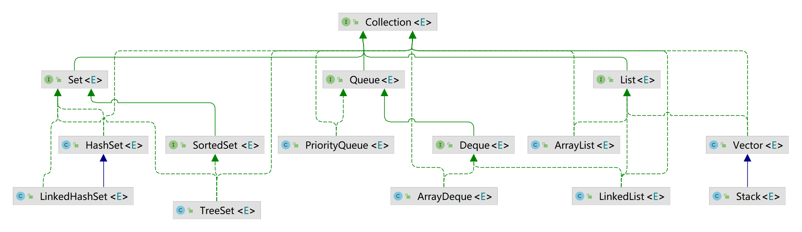
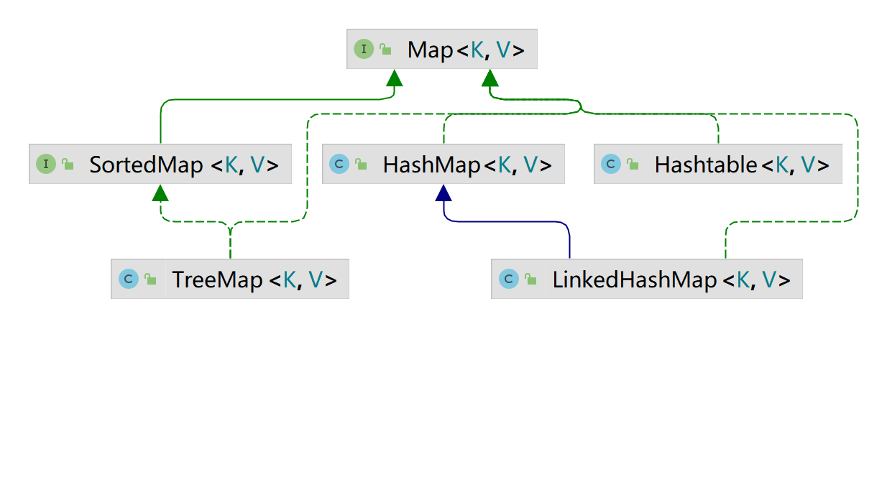

# 集合
集合也称数据容器，主要分俩大支线。
* Collection：用于存放单一元素。
* Map：用于存放键值对。

## 1. List
List 存储的元素是有序的，可以存放重复的元素。

### 1.1 ArrayList

* ArrayList 底层由**Object数组**实现，支持高效的随机元素访问；
* **插入和删除元素的时间复杂度受元素位置的影响**。从尾部插入和删除元素会比较快捷，从中间插入和删除元素会比较低效。
* **ArrayList容量能动态增长**，每次扩容之后容量都会变为原来的 1.5 倍左右。因此当元素非常庞大的时候，效率会比较低。

### 1.2 LinkedList

* LinkedList 底层由**双向链表**实现，不支持随机存取，只能从一端开始查找；
* 在头尾插入或者删除元素不受元素位置的影响，因为只需要改变前一个节点和后一个节点的引用即可，不像 ArrayList 那样需要复制和移动数组元素；
* 因为每个元素都存储了前一个和后一个节点的引用，所以每一个元素都需要消耗比 ArrayList 更多的空间。

**注：需要用到 LinkedList 的场景几乎都可以使用 ArrayList 来代替**

### 1.3 Vector 
* Vector 底层由**Object数组**实现
* 线程安全的

#### Stack
* Stack是Vector的子类，实现了先进后出的功能。
* Stack 执行效率比较，使用双端队列 ArrayDeque 替代。

## 2. Set
Set 存取的元素是无序的，不可以存放重复的元素。

### 2.1 HashSet
HashSet 底层由HashMap实现。

### 2.2 LinkedHashSet
LinkedHashSet 的底层是链表和哈希表实现，元素的插入和取出顺序满足先进先出（FIFO）。

### 2.3 TreeSet 
TreeSet 底层是由红黑树实现的，元素是有序的。支持对元素自定义排序。

## 3. Queue
Queue 是队列，通常遵循先进先出（FIFO）的原则。

### 3.1 ArrayDeque
ArrayDeque 是一基于数组实现的双端队列。

### 3.2 LinkedList
LinkedList 也实现了Deque 接口，可以作为队列使用。

**ArrayDeque 与 LinkedList 的区别**
* ArrayDeque 是基于可变长的数组和双指针来实现，而 LinkedList 则通过链表来实现。
* ArrayDeque 不支持存储 NULL 数据，但 LinkedList 支持。
* ArrayDeque 插入时存在扩容。 LinkedList每次插入数据时均需要申请新的堆空间。

**_从性能的角度上，选用 ArrayDeque 来实现队列要比 LinkedList 更好。_**

### 3.3 PriorityQueue
PriorityQueue 是一种优先级队列，它的出队顺序与元素的优先级有关。

元素可以实现 Comparable 接口或者 Comparator 接口来确定优先级。
