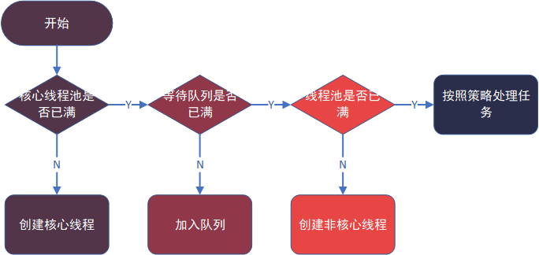

## 进程
进程是程序的一次执行过程，是系统运行程序的基本单位。

## 线程
线程是一个比进程更小的执行单位，也被称为轻量级进程。

## 线程的生命周期
Java 线程在运行的生命周期中的指定时刻只可能处于下面 6 种不同状态的其中一个状态
### 1.NEW
初始状态，线程被构建，但是还没有调用start()方法。
### 2.RUNNABLE
运行状态，java线程将操作系统中的就绪和运行俩种状态称为“运行中”
### 3.BLOCKED
阻塞状态，表示线程阻塞与锁
### 4.WAITING
等待状态，表示线程进入等待状态，进入该状态表示当前线程需要等待其他线程做出一些特定动作
### 5.TIME_WAITING
超时等待状态，该状态不同于WAITING，它是可以在指定时间自行返回的
### 6.TERMINATED
终止状态，表示当前线程已经执行完毕

## 线程池
线程池提供了一种限制和管理资源的方式。
### 线程池的好处
> 1.**降低资源消耗**,通过复用线程降低线程创建和销毁造成的消耗。
> 
> 2.**控制并发的数量**,并发数量过多，可能会导致资源消耗过多。
> 
> 3.**提高线程的可管理性**,使用线程池可以进行统一的分配，调优和监控。

### Executor框架
**Executor是Java线程池顶层接口。** Executor 框架不仅包括了线程池的管理，还提供了线程工厂、队列以及拒绝策略等，Executor 框架让并发编程变得更加简单。

#### 对比自己new线程：
>1.线程更容易管理。
> 
> 2.效率更好。
> 
> 3.有助于避免 this 逃逸问题。

#### Executor 框架结构(主要由三大部分组成)

1.任务(Runnable /Callable)

2.任务的执行(Executor)

3.异步计算的结果(Future)

### 核心类 ThreadPoolExecutor
ThreadPoolExecutor类提供了4个构造函数，设计到7个参数。其中前3个比较重要。

> 1.corePoolSize : 线程数定义了最小可以同时运行的线程数量。(核心线程数最大值)
> 
> 2.maximumPoolSize : 当队列中存放的任务达到队列容量的时候，当前可以同时运行的线程数量变为最大线程数。
> 
> 3.workQueue: 阻塞队列，维护着等待执行的Runnable任务对象。（当新任务来的时候会先判断当前运行的线程数量是否达到核心线程数，如果达到的话，新任务就会被存放在队列中。）
 
    3.1:LinkedBlockingQueue:链式阻塞队列，底层数据结构是链表，默认大小是Integer.MAX_VALUE，也可以指定大小。
  
    3.2:ArrayBlockingQueue:数组阻塞队列，底层数据结构是数组，需要指定队列的大小。
 
    3.3:SynchronousQueue:同步队列，内部容量为0，每个put操作必须等待一个take操作，反之亦然。
 
    3.4:DelayQueue:延迟队列，该队列中的元素只有当其指定的延迟时间到了，才能够从队列中获取到该元素 。
>  
> 4.keepAliveTime:非核心线程闲置超时时长。
> 
> 5.unit：keepAliveTime 参数的时间单位，是一个枚举。
> 
> 6.threadFactory:创建线程的工厂,如果不指定，会新建一个默认的线程工厂。
> 
> 7.handler:拒绝处理策略，线程数量大于最大线程数就会采用拒绝处理策略。共四种：

    7.1：ThreadPoolExecutor.AbortPolicy：默认拒绝处理策略，丢弃任务并抛出RejectedExecutionException异常。

    7.2：ThreadPoolExecutor.DiscardPolicy：丢弃新来的任务，但是不抛出异常。

    7.3：ThreadPoolExecutor.DiscardOldestPolicy：丢弃队列头部（最旧的）的任务，然后重新尝试执行程序（如果再次失败，重复此过程）。

    7.4：ThreadPoolExecutor.CallerRunsPolicy：由调用线程处理该任务。

### 线程池创建线程流程
此流程可以使用ThreadPoolTest调整参数进行测试；

### 四种常见线程池
#### 1.newFixedThreadPool
       public static ExecutorService newFixedThreadPool(int nThreads) {
            return new ThreadPoolExecutor(nThreads, nThreads,
                                          0L, TimeUnit.MILLISECONDS,
                                          new LinkedBlockingQueue<Runnable>());
       }
核心线程数量和总线程数量相等，都是传入的参数nThreads，所以只能创建核心线程。线程不会被回收。

#### 2.newCachedThreadPool
        public static ExecutorService newCachedThreadPool() {
            return new ThreadPoolExecutor(0, Integer.MAX_VALUE,
                                          60L, TimeUnit.SECONDS,
                                          new SynchronousQueue<Runnable>());
        }
当需要执行很多短时间的任务时，CacheThreadPool的线程复用率比较高， 会显著的提高性能。线程60s后会回收。

#### 3.newSingleThreadExecutor
        public static ExecutorService newSingleThreadExecutor() {
            return new FinalizableDelegatedExecutorService
                (new ThreadPoolExecutor(1, 1,
                                        0L, TimeUnit.MILLISECONDS,
                                        new LinkedBlockingQueue<Runnable>()));
        }
有且仅有一个核心线程，不会创建非核心线程。所有任务按照先来先执行的顺序执行

#### 3.newScheduledThreadPool
        public static ScheduledExecutorService newScheduledThreadPool(int corePoolSize) {
            return new ScheduledThreadPoolExecutor(corePoolSize);
        }   

        public ScheduledThreadPoolExecutor(int corePoolSize) {
            super(corePoolSize, Integer.MAX_VALUE, 0, NANOSECONDS,
                  new DelayedWorkQueue());
        }
创建一个定长线程池，支持定时及周期性任务执行。 