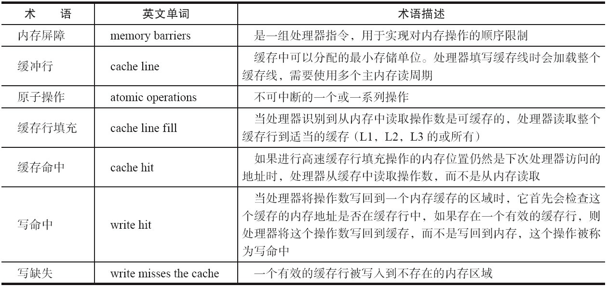

# 1.并发编程的问题
 
## 1.1 多线程一定快吗
>**不一定**
>
> 线程有创建和上下文切换的开销
>  
## 1.2 上下文切换
>即使是单核处理器也支持多线程执行代码，CPU通过给每个线程分配CPU时间片来实现
这个机制。
> 
> 时间片是CPU分配给各个线程的时间，因为时间片非常短，所以CPU通过不停地切
换线程执行，让我们感觉多个线程是同时执行的，时间片一般是几十毫秒（ms）。
> 
> CPU通过时间片分配算法来循环执行任务，当前任务执行一个时间片后会切换到下一个
任务。但是，在切换前会保存上一个任务的状态，以便下次切换回这个任务时，可以再加载这
个任务的状态。
> 
> > 所以任务从保存到再加载的过程就是一次**上下文切换**。 

## 1.3 如何减少上下文切换
>**无锁并发编程、CAS算法、使用最少线程和使用协程**
### 1.3.1 无锁并发编程
>**无锁并发编程。** 多线程竞争锁时，会引起上下文切换，所以多线程处理数据时，可以用一
些办法来避免使用锁，如将数据的ID按照Hash算法取模分段，不同的线程处理不同段的数据。
### 1.3.2 CAS算法 
>**CAS算法。** Java的Atomic包使用CAS算法来更新数据，而不需要加锁。
### 1.3.3 使用最少线程 
>**使用最少线程。** 避免创建不需要的线程，比如任务很少，但是创建了很多线程来处理，这
样会造成大量线程都处于等待状态。
### 1.3.4 使用协程 
>**协程。** 在单线程里实现多任务的调度，并在单线程里维持多个任务间的切换。

# 2. Java并发机制的底层实现原理
>Java代码在编译后会变成Java字节码，字节码被类加载器加载到JVM里，JVM执行字节
码，最终需要转化为汇编指令在CPU上执行，Java中所使用的并发机制依赖于JVM的实现和
CPU的指令。

## 2.1 volatile的应用
>在多线程并发编程中synchronized和volatile都扮演着重要的角色，volatile是轻量级的synchronized，
> 它在多处理器开发中保证了共享变量的“可见性”。
> 
> 可见性的意思是当一个线程修改一个共享变量时，另外一个线程能读到这个修改的值。
> 
>如果volatile变量修饰符使用恰当的话，它比synchronized的使用和执行成本更低，因为它不会引起线程上下文的切换和调度。

## 2.1.1 CPU的术语定义
