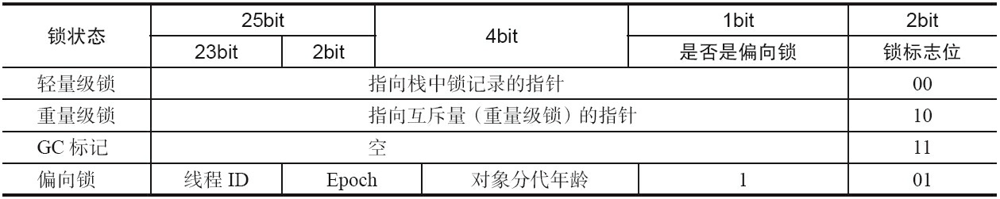
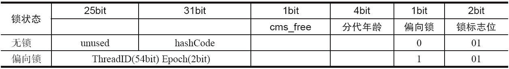
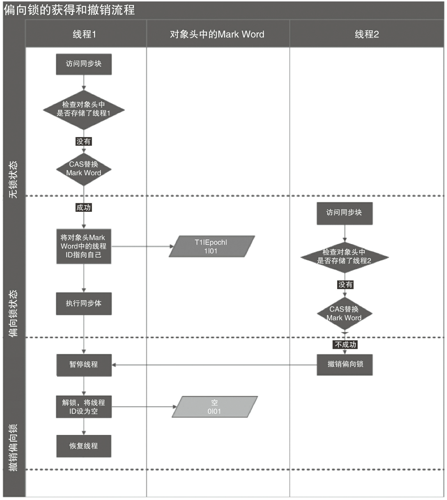
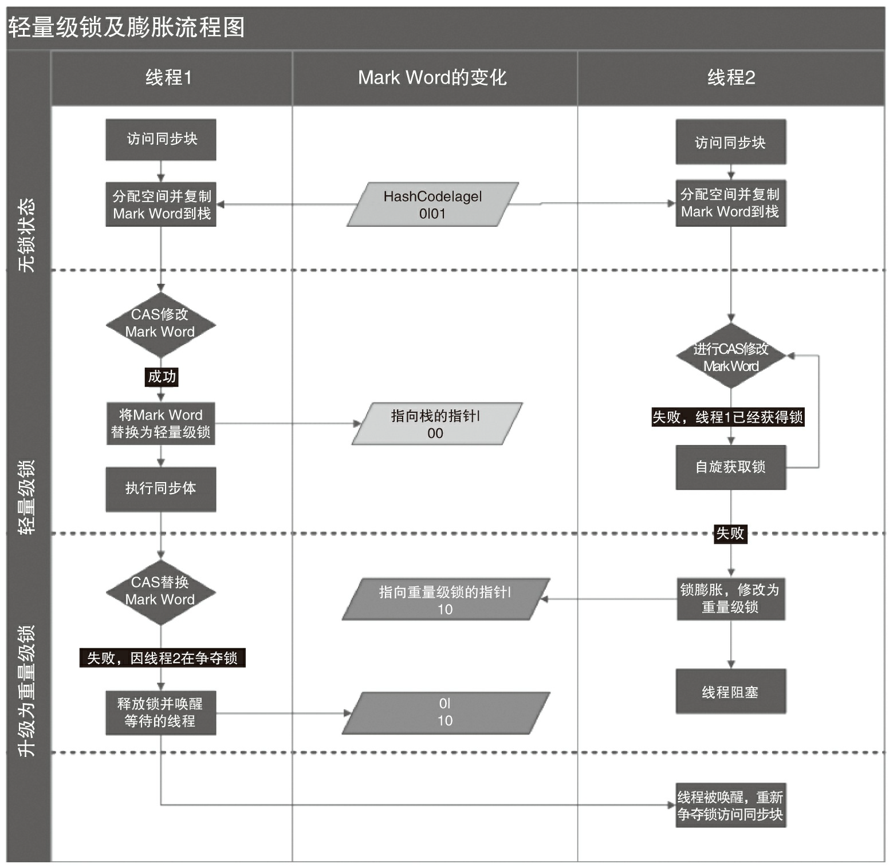

# 1.并发编程的问题
 
## 1.1 多线程一定快吗
>**不一定**
>
> 线程有创建和上下文切换的开销
>  
## 1.2 上下文切换
>即使是单核处理器也支持多线程执行代码，CPU通过给每个线程分配CPU时间片来实现
这个机制。
> 
> 时间片是CPU分配给各个线程的时间，因为时间片非常短，所以CPU通过不停地切
换线程执行，让我们感觉多个线程是同时执行的，时间片一般是几十毫秒（ms）。
> 
> CPU通过时间片分配算法来循环执行任务，当前任务执行一个时间片后会切换到下一个
任务。但是，在切换前会保存上一个任务的状态，以便下次切换回这个任务时，可以再加载这
个任务的状态。
> 
> > 所以任务从保存到再加载的过程就是一次**上下文切换**。 

## 1.3 如何减少上下文切换
>**无锁并发编程、CAS算法、使用最少线程和使用协程**
### 1.3.1 无锁并发编程
>**无锁并发编程。** 多线程竞争锁时，会引起上下文切换，所以多线程处理数据时，可以用一
些办法来避免使用锁，如将数据的ID按照Hash算法取模分段，不同的线程处理不同段的数据。
### 1.3.2 CAS算法 
>**CAS算法。** Java的Atomic包使用CAS算法来更新数据，而不需要加锁。
### 1.3.3 使用最少线程 
>**使用最少线程。** 避免创建不需要的线程，比如任务很少，但是创建了很多线程来处理，这
样会造成大量线程都处于等待状态。
### 1.3.4 使用协程 
>**协程。** 在单线程里实现多任务的调度，并在单线程里维持多个任务间的切换。

# 2. Java并发机制的底层实现原理
>Java代码在编译后会变成Java字节码，字节码被类加载器加载到JVM里，JVM执行字节
码，最终需要转化为汇编指令在CPU上执行，Java中所使用的并发机制依赖于JVM的实现和
CPU的指令。

## 2.1 volatile的应用
>在多线程并发编程中synchronized和volatile都扮演着重要的角色，volatile是轻量级的synchronized，
> 它在多处理器开发中保证了共享变量的“可见性”。
> 
> 可见性的意思是当一个线程修改一个共享变量时，另外一个线程能读到这个修改的值。
> 
>如果volatile变量修饰符使用恰当的话，它比synchronized的使用和执行成本更低，因为它不会引起线程上下文的切换和调度。

### 2.1.1 CPU的术语定义

### 2.1.2 volatile是如何保证可见性的？
>有volatile变量修饰的共享变量进行写操作的时候会多出第二行汇编代码，带有LOCK前缀的指令。
>  
> 如果对声明了volatile的变量进行写操作，JVM就会向处理器发送一条Lock前缀的指令。
>
>**Lock前缀的指令在多核处理器下会引发了两件事情:**
>1) 将当前处理器缓存行（变量所在缓存行）的数据写回到系统内存。
>2) 这个写回内存的操作会使在其他CPU里缓存了该内存地址的数据无效。

>**注：** 为了提高处理速度，处理器不直接和内存进行通信，而是先将系统内存的数据读到内部缓存（L1，L2或其他）后再进行操作，但操作完不知道何时会写到内存。
 
## 2.2 synchronized的实现原理与应用
>利Java中的每一个对象都可以作为锁，用synchronized实现同步，具体表现为以下3种形式。
> 
> 对于普通同步方法，锁是当前实例对象。
> 
> 对于静态同步方法，锁是当前类的Class对象。
> 
> 对于同步方法块，锁是Synchonized括号里配置的对象。 

> 从JVM规范中可以看到Synchonized在JVM里的实现原理
> 
> JVM基于进入和退出Monitor对象来实现方法同步和代码块同步，但两者的实现细节不一样。
> 
> **代码块同步**是使用monitorenter和monitorexit指令实现的，而方法同步是使用另外一种方式实现的，细节在JVM规范里并没有详细说明。
>  
> 但是，**方法的同步**同样可以使用这两个指令来实现。
>  
> monitorenter指令是在编译后插入到同步代码块的开始位置，而monitorexit是插入到方法结束处和异常处，JVM要保证每个monitorenter必须有对应的monitorexit与之配对。
>  
> 任何对象都有一个monitor与之关联，当且一个monitor被持有后，它将处于锁定状态。线程执行到monitorenter
指令时，将会尝试获取对象所对应的monitor的所有权，即尝试获得对象的锁。 

### 2.2.1 Java对象头
>**synchronized用的锁是存在Java对象头里的。**
>  
> 如果对象是**数组类型**，则虚拟机用3个字宽（Word）存储对象头
>  
> 如果对象是**非数组类型**，则用2字宽存储对象头。

>  在32位虚拟机中，1字宽等于4字节，即32bit。
 

> Java对象头里的Mark Word里默认存储**对象的HashCode、分代年龄和锁标记位**。32位JVM的Mark Word的默认存储结构如下：
> 

>在运行期间，Mark Word里存储的数据会随着锁标志位的变化而变化。Mark Word可能变化为存储以下4种数据
>  

>在64位虚拟机下，Mark Word是64bit大小的，其存储结构如下：
>  

### 2.2.2 锁的升级与对比
>Java SE 1.6为了减少获得锁和释放锁带来的性能消耗，引入了“偏向锁”和“轻量级锁”。
>  
> 在Java SE 1.6中，锁一共有4种状态，级别从低到高依次是：**无锁状态、偏向锁状态、轻量级锁状态和重量级锁状态**，这几个状态会随着竞争情况逐渐升级。
> 
> 锁可以升级但不能降级，意味着偏向锁升级成轻量级锁后不能降级成偏向锁。这种锁升级却不能降级的策略，目的是为了提高获得锁和释放锁的效率。
#### 2.2.2.1 偏向锁 
>HotSpot的作者经过研究发现，大多数情况下，锁不仅不存在多线程竞争，而且总是由同
一线程多次获得，为了让线程获得锁的代价更低而引入了偏向锁。当一个线程访问同步块并
获取锁时，会在对象头和栈帧中的锁记录里存储锁偏向的线程ID，以后该线程在进入和退出
同步块时不需要进行CAS操作来加锁和解锁，只需简单地测试一下对象头的Mark Word里是否
存储着指向当前线程的偏向锁。如果测试成功，表示线程已经获得了锁。如果测试失败，则需
要再测试一下Mark Word中偏向锁的标识是否设置成1（表示当前是偏向锁）：如果没有设置，则
使用CAS竞争锁；如果设置了，则尝试使用CAS将对象头的偏向锁指向当前线程。
 
**（1）偏向锁的撤销**>
>偏向锁使用了一种等到竞争出现才释放锁的机制，所以当其他线程尝试竞争偏向锁时，
持有偏向锁的线程才会释放锁。偏向锁的撤销，需要等待全局安全点（在这个时间点上没有正
在执行的字节码）。它会首先暂停拥有偏向锁的线程，然后检查持有偏向锁的线程是否活着，
如果线程不处于活动状态，则将对象头设置成无锁状态；如果线程仍然活着，拥有偏向锁的栈
会被执行，遍历偏向对象的锁记录，栈中的锁记录和对象头的Mark Word要么重新偏向于其他
线程，要么恢复到无锁或者标记对象不适合作为偏向锁，最后唤醒暂停的线程。图2-1中的线
程1演示了偏向锁初始化的流程，线程2演示了偏向锁撤销的流程。
 

**（2）关闭偏向锁**
>偏向锁在Java 6和Java 7里是默认启用的，但是它在应用程序启动几秒钟之后才激活，如
有必要可以使用JVM参数来关闭延迟：-XX:BiasedLockingStartupDelay=0。如果你确定应用程
序里所有的锁通常情况下处于竞争状态，可以通过JVM参数关闭偏向锁：-XX:-
UseBiasedLocking=false，那么程序默认会进入轻量级锁状态。 
#### 2.2.2.2 轻量级锁 
**（1）轻量级锁加锁**
>线程在执行同步块之前，JVM会先在当前线程的栈桢中创建用于存储锁记录的空间，并
将对象头中的Mark Word复制到锁记录中，官方称为Displaced Mark Word。然后线程尝试使用
CAS将对象头中的Mark Word替换为指向锁记录的指针。如果成功，当前线程获得锁，如果失
败，表示其他线程竞争锁，当前线程便尝试使用自旋来获取锁。

**（2）轻量级锁解锁**
>轻量级解锁时，会使用原子的CAS操作将Displaced Mark Word替换回到对象头，如果成
功，则表示没有竞争发生。如果失败，表示当前锁存在竞争，锁就会膨胀成重量级锁。图2-2是
两个线程同时争夺锁，导致锁膨胀的流程图。
> 
> 
> 因为自旋会消耗CPU，为了避免无用的自旋（比如获得锁的线程被阻塞住了），一旦锁升级
成重量级锁，就不会再恢复到轻量级锁状态。当锁处于这个状态下，其他线程试图获取锁时，
都会被阻塞住，当持有锁的线程释放锁之后会唤醒这些线程，被唤醒的线程就会进行新一轮
的夺锁之争。