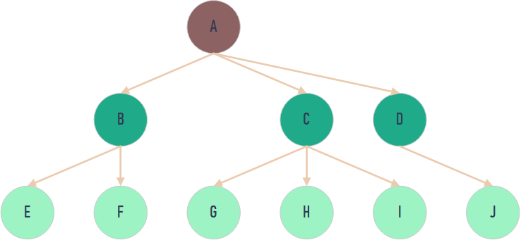
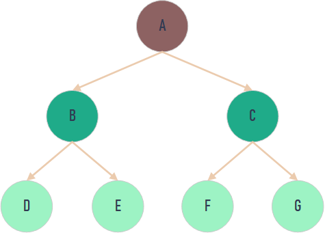
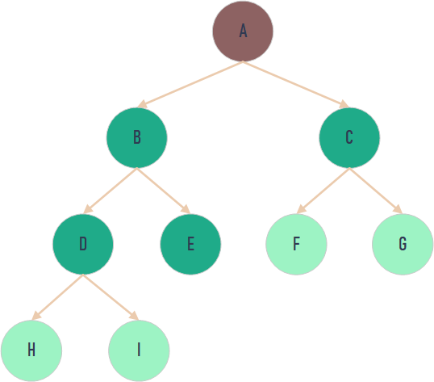
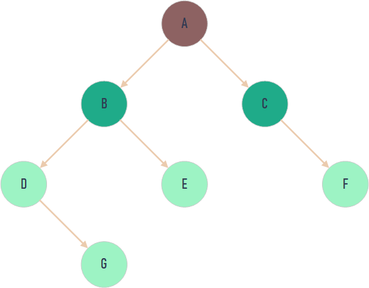
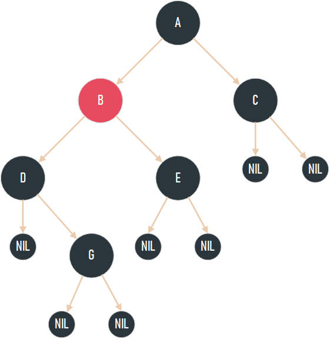

# 数据结构
数据结构是一种具有一定逻辑关系，在计算机中应用某种存储结构，并且封装了相应操作的数据元素集合。

#### 数据结构的作用
物理结构：在内存中，确定数据的集中存放或者是分散存放。
逻辑结构：确定数据之间的关系。“一对一”关系、“一对多”关系和“多对多”关系。

## 线性表
### 1.数组
数组由相同类型的元素组成，并且是使用一块连续的内存来存储。
我们利用元素的索引可以计算出该元素对应的存储地址。
**提供随机访问 并且容量有限。**

### 2.链表
链表是一种线性表，但是并不会按线性的顺序存储数据，使用的不是连续的内存空间来存储数据。
但链表相比于数组会占用更多的空间。
使用链表结构可以克服数组需要预先知道数据大小的缺点。

#### 分类
* 单链表：单链表只有一个方向，尾结点通常指向 null。
* 双向链表：包含两个指针，一个 prev 指向前一个节点，一个 next 指向后一个节点。
* 循环链表：一种特殊的单链表，尾结点指向链表的头结点。
* 双向循环链表：最后一个节点的 next 指向 head，而 head 的 prev 指向最后一个节点，构成一个环。

### 3.栈
栈 (stack)只允许在有序的线性数据集合的一端（称为栈顶 top）进行加入数据（push）和移除数据（pop）。
按照**后进先出**运作。

_栈常用一维数组或链表来实现，用数组实现的栈叫作**顺序栈** ，用链表实现的栈叫作**链式栈** 。_

### 4.队列
队列是先进先出的线性表。队列只允许在后端进行插入操作也就是入队，在前端进行删除操作也就是出队。

_常用链表或者数组来实现，用数组实现的队列叫作**顺序队列** ，用链表实现的队列叫作**链式队列**_
#### 分类
* 单队列：每次添加元素时，都是添加到队尾。
  * 顺序队列：数组实现的队列
  * 链式队列：链表实现的队列
* 循环队列：结尾指针指向下标为0的位置。
## 哈希表

## 树
树是由n（n≥0）个结点构成的有限集合。当n=0时，称该树为空树。

特点：
* 一棵树中的任意两个结点有且仅有唯一的一条路径连通。
* 一棵树如果有 n 个结点，那么它一定恰好有 n-1 条边。
* 一棵树不包含回路。
### 二叉树
二叉树是每个结点最多只有俩颗不相交的树构成的结构。

结点的度：一个结点拥有子树的个数，就称为该结点的度（Degree）
层次：从根开始定义起，根为第1层，根的子节点为第2层，以此类推；
树的高度/深度 ：结点层次的最大值，称为这棵树的深度或高度。

#### 满二叉树
一个二叉树每一层的结点数都达到最大值，则称这个二叉树为满二叉树。

#### 完全二叉树
一个二叉树除最后一层其余层都是满的，且最后一层的结点依次从左到右分布，则称这个二叉树为完全二叉树。

#### 平衡二叉树
它的左右两个子树的高度差的绝对值不超过1，并且左右两个子树都是一棵平衡二叉树。

### 红黑树
红黑树是为了在进行插入和删除操作时通过特定操作保持二叉查找树的平衡，从而获得较高的查找性能。

特点：
1. 每个节点非红即黑；
2. 根节点总是黑色的；
3. 每个叶子节点都是黑色的空节点（NIL节点）；
4. 如果节点是红色的，则它的子节点必须是黑色的（反之不一定）；
5. 从根节点到叶节点或空子节点的每条路径，必须包含相同数目的黑色节点（即相同的黑色高度）。

红黑树通过左旋转和右旋转和变色来保证上面的特点始终成立。

## 堆
堆是一个数组，它可以被看成是一个近似的完全二叉树。堆中的每一个节点值都大于等于（或小于等于）子树中所有节点的值。
堆的优势在于更新数据效率较高。

根据结点值的关系可以将堆分为俩类
* 最大堆：堆中的每一个节点的值都大于等于子树中所有节点的值。
* 最小堆：堆中的每一个节点的值都小于等于子树中所有节点的值。

### 存储
堆近似一颗完全二叉树，所以使用数组来存储。即节省空间，又方便索引

### 堆化
删除堆顶元素后，为了保持堆的性质，需要对堆的结构进行调整，我们将这个过程称之为"堆化"。

#### 自底向上堆化
1.删除堆顶元素
2.比较其俩个结点的大小，较大的元素向上填充
3.重复1，2；直至空位移到最底部

#### 自顶向下堆化
1.把最后一个元素移动到堆顶
2.与其俩个结点比较，和大的元素交换位置
3.重复1，2；直至无法交换位置（大于其俩个结点）。

#### 元素操作
* 插入元素 ：先将元素放至数组末尾，再自底向上堆化，将末尾元素上浮。
* 删除堆顶元素 ：删除堆顶元素，将末尾元素放至堆顶，再自顶向下堆化，将堆顶元素下沉。
也可以自底向上堆化，只是会产生“气泡”，浪费存储空间。最好采用自顶向下堆化的方式。

## 图
图就是由顶点的有穷非空集合和顶点之间的边组成的集合。
通常表示为：G(V,E)，其中，G表示一个图，V表示顶点的集合，E表示边的集合。
**图结构常用来储存逻辑关系为"多对多"的数据。**

### 结构  
#### 1. 顶点
图中的数据元素，我们称之为顶点，图至少有一个顶点

弧头和弧尾：有向图中，无箭头一端的顶点通常被称为"初始点"或"弧尾"，箭头一端的顶点被称为"终端点"或"弧头"。 

#### 2. 边
顶点之间的关系用边表示。
#### 3. 度
度表示一个顶点包含多少条边。

**入度和出度**：对于有向图中的一个顶点 V 来说，箭头指向 V 的弧的数量为 V 的入度（InDegree，记为 ID(V)）；箭头远离 V 的弧的数量为 V 的出度（OutDegree，记为OD(V)）
#### 4.路径
从一个顶点到另一顶点途经的所有顶点组成的序列（包含这两个顶点），称为一条路径。
如果路径中第一个顶点和最后一个顶点相同，则此路径称为"回路"（或"环"）。

### 无向图

A-B 表示 A 和 B 之间存在双向的联系，由 A 可以找到 B，同样由 B 也可以找到 A，各个元素之间的联系都是双向的，这样的图结构称为无向图。

无向图中描述两顶点 V1 和 V2 之间的关系可以用 (V1, V2) 来表示。还可以用来表示无向图中连接 V1 和 V2 的线。

无向图的集合 用 VR={(v1,v2),(v1,v4),(v1,v3),(v3,v4)} 表示。

### 有向图

各个元素之间的联系是单向的，那么这样的图结构称为有向图。

有向图中描述从 V1 到 V2 的"单向"关系可以用 <V1,V2> 来表示。可以用来表示有向图中从 V1 到 V2 带方向的线，又称为弧。 

有向图的集合 用 VR={<v1,v2>,<v1,v3>,<v3,v4>,<v4,v1>} 表示。

