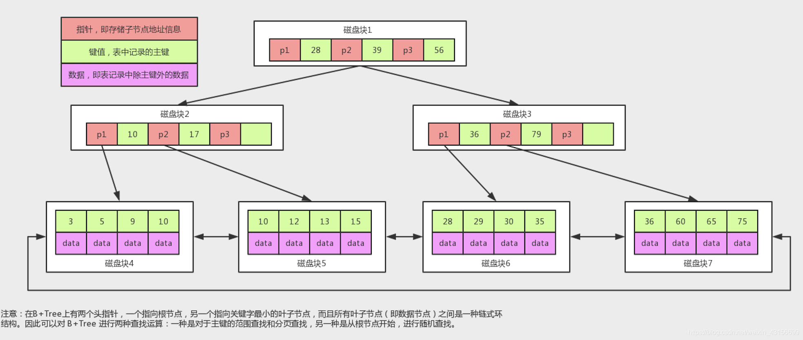
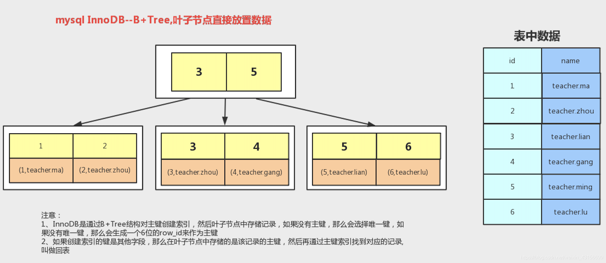
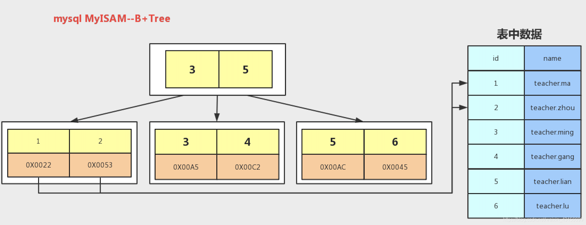
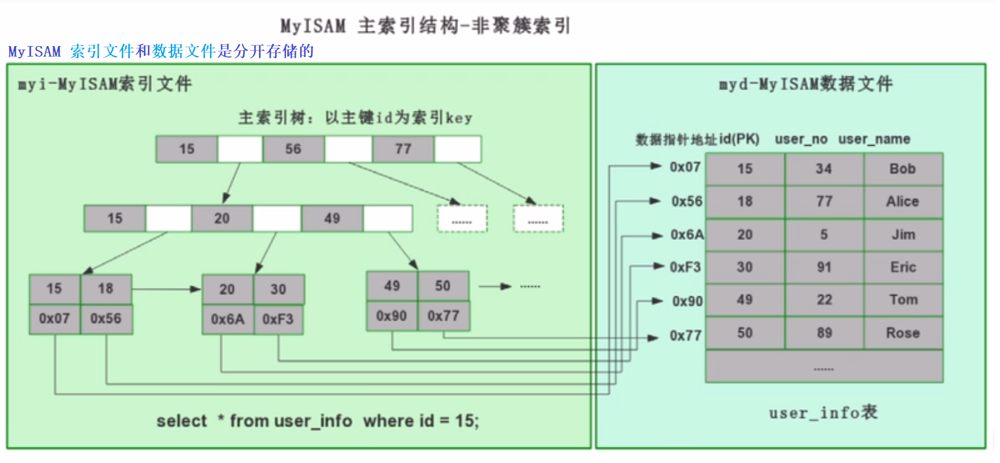

## B树

## B+树

## InnoDB

>什么是覆盖索引
>
>创建一个索引，该索引包含查询中用到的所有字段，称为“覆盖索引”。
>
>使用覆盖索引，MySQL 只需要通过索引就可以查找和返回查询所需要的数据，而不必在使用索引处理数据之后再进行回表操作。
>
>覆盖索引可以一次性完成查询工作，有效减少IO，提高查询效率。
>
> 覆盖索引：select id, user_name from user_info where user_name = 'Jim'';

## MyISAM

## B+ 树比B树更适合索引？

**1）B+树的磁盘读写代价更低**
>B+树的内部结点并没有指向关键字具体信息的指针。因此其内部结点相对B 树更小。如果把所有同一内部结点的关键字存放在同一盘块中，那么盘块所能容纳的关键字数量也越多。一次性读入内存中的需要查找的关键字也就越多。相对来说IO读写次数也就降低了；

**2）B+树查询效率更加稳定**
>由于非终结点并不是最终指向文件内容的结点，而只是叶子结点中关键字的索引。所以任何关键字的查找必须走一条从根结点到叶子结点的路。所有关键字查询的路径长度相同，导致每一个数据的查询效率相当；

**3）B+树便于范围查询（最重要的原因，范围查找是数据库的常态）**
>B树在提高了IO性能的同时并没有解决元素遍历的效率低下的问题，正是为了解决这个问题，B+树应用而生。B+树只需要去遍历叶子节点就可以实现整棵树的遍历。而且在数据库中基于范围的查询是非常频繁的，而B树不支持这样的操作或者说效率太低。

**补充：B树的范围查找用的是中序遍历，而B+树用的是在链表上遍历。**

**从磁盘中读 1B，与读写 1KB 的时间成本几乎一样**
>索引查询的数据主要受限于硬盘的I/O速度，查询I/O次数越少，速度越快，所以B树的结构才应需求而生；B树的每个节点的元素可以视为一次I/O读取，树的高度表示最多的I/O次数，在相同数量的总元素个数下，每个节点的元素个数越多，高度越低，查询所需的I/O次数越少；假设，一次硬盘一次I/O数据为8K，索引用int(4字节)类型数据建立，理论上一个节点最多可以为2000个元素，200020002000=8000000000，80亿条的数据只需3次I/O（理论值），可想而知，B树做为索引的查询效率有多高；另外也可以看出同样的总元素个数，查询效率和树的高度密切相关。

**每一次IO读取的数据我们称之为一页(page)**
>具体一页有多大数据跟操作系统有关，一般为4k或8k，也就是我们读取一页内的数据时候，实际上才发生了一次IO，这个理论对于索引的数据结构设计非常有帮助。

## 索引的优点
>建立索引的目的是加快对表中记录的查找或排序！
> 
>① 建立索引的列可以保证行的唯一性，生成唯一的rowId
>
>② 建立索引可以有效缩短数据的检索时间
>
>③ 建立索引可以加快表与表之间的连接
>
>④ 为用来排序或者是分组的字段添加索引可以加快分组和排序顺序

## 索引的缺点
>① 创建索引和维护索引需要时间成本，这个成本随着数据量的增加而加大
>
>② 创建索引和维护索引需要空间成本，每一条索引都要占据数据库的物理存储空间，数据量越大，占用空间也越大（数据表占据的是数据库的数据空间）
>
>③ 会降低表的增删改的效率，因为每次增删改索引需要进行动态维护，导致时间变长

## 基本索引类型
>① 普通索引（单列索引）
>
>② 复合索引（组合索引）
>
>③ 唯一索引（UNIQUE INDEX）
>
>④ 主键索引（PRIMARY）
>
>⑤ 全文索引（FULLTEXT INDEX）