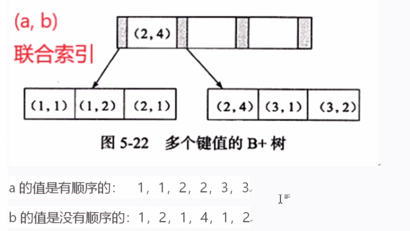

## 索引失效
> **索引失效：模型数空运最快**
>
>**模**  ：like的模糊查询以%开头，如：'%AAA''，索引失效
```sql
select * from tab where name like '%AAA';
```
>**型**  ：代表数据类型。类型错误，如字段类型为varchar，where条件用number，索引也会失效
```sql
select * from tab where height = 180;
-- height为varchar类型导致索引失效
```
>**数**  ：函数，对索引的字段使用内部函数，索引也会失效。这种情况下应该建立基于函数的索引
```sql
select * from tab where date(create_time) = '2022-08-04';
-- create_time字段设置索引，那就无法使用函数，否则索引失效
```
>**空** ：是null的意思。索引不存储空值，如果不限制索引列是not null，数据库会认为索引列有可能存在空值，所以不会按照索引进行计算
```sql
select * from tab where address is null;--不走索引。
select * from tab where address is not null;--走索引。
-- 如果没有要求必须为NULL，那么最好给个默认值空字符串，这可以解决很多后续的麻烦
```
>**运** ：是运算的意思。对索引列进行（+，-，*，/，!, !=, <>）等运算，会导致索引失效
```sql
select * from tab where age - 1 = 20;
```
>**最** ：是最左原则。在复合索引中索引列的顺序至关重要。如果不是按照索引的最左列开始查找，则无法使用索引
>
>**快** ：全表扫描更快的意思。如果数据库预计使用全表扫描要比使用索引快，则不使用索引

## 联合索引

>**这个联合索引一个节点上有两个键值对**
> 
>跟order by的排序逻辑是一样的，遵循最佳左前缀法，先按a排序，再按b排序
>
>例：where a > 1 and b = 2，a索引有效，b索引失效（a大于1的数多个，b此时是无序的）
>
>a  like '1%' 索引有效
>
>a  ike '%1' 或 ‘%1%’ 索引无效，因为字符串也是按照从左到右对比大小排序的

