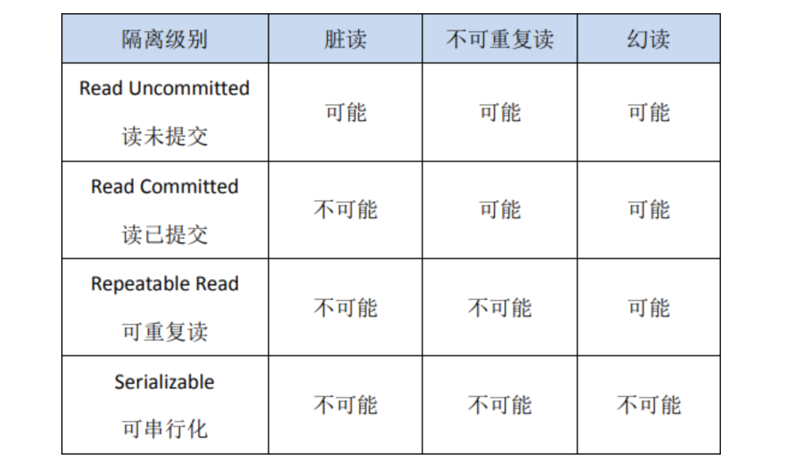
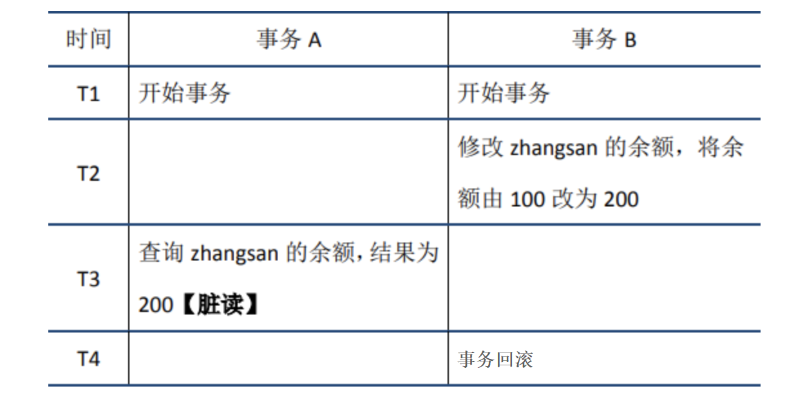
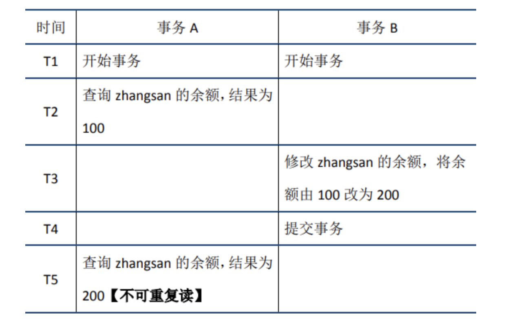
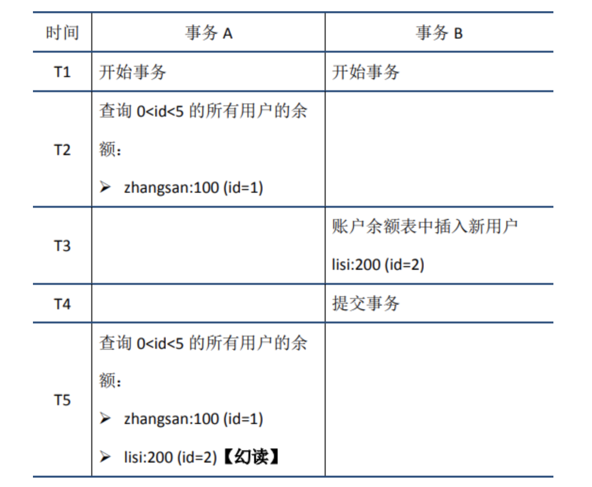

## 1. ACID特性
>原子性（Atomicity）、一致性（Consistency）、隔离性（Isolation）、持久性（Durability）
### 1.1原子性 - A
>原子性是指事务是一个不可再分割的工作单元，事务中的操作要么都发生，要么都不发生。
> 
> 如：对数据的修改要么全部执行成功，要么全部失败。

**实现方式**：事务的原子性由 redolog（重做日志）实现。事务提交的时候，必须先将事务的所有日志写入 redo log 持久化，到事务的提交操作才算完成。
### 1.2一致性 - C
>一致性是指在事务开始之前和事务结束以后，数据库的完整性约束没有被破坏。
> 这是说数据库事务不能破坏关系数据的完整性以及业务逻辑上的一致性。
> 
> 如：A给B转账，不论转账的事务操作是否成功，其两者的存款总额不变，不可能A扣了钱，B却没收到。

**实现方式**：事务的一致性由 undo log（逻辑日志）来实现。记录了事务的 insert、update、deltete 操作。
### 1.3隔离性 - I
>多个事务并发访问时，事务之间是隔离的，一个事务不应该影响其它事务运行效果。
> 
> 在并发环境中，当不同的事务同时操纵相同的数据时，每个事务都有各自的完整数据空间。
> 
>由并发事务所做的修改必须与任何其他并发事务所做的修改隔离。
> 
>事务查看数据更新时，数据所处的状态要么是另一事务修改它之前的状态，要么是另一事务修改它之后的状态，事务不会查看到中间状态的数据。

**实现方式**：事务的隔离性是通过数据库锁的机制实现的。
### 1.4持久性 - D
>持久性，意味着在事务完成以后，该事务所对数据库所作的更改持久的保存在数据库之中，并不会被回滚。

**实现方式**：事务的原子性由redolog（重做日志）实现。事务提交的时候，必须先将事务的所有日志写入 redo log 持久化，到事务的提交操作才算完成。
### 1.5关系
**A、I、D 是手段，C 是目的。只有保证了事务的持久性、原子性、隔离性之后，一致性才能得到保障。**

原子性，隔离性和持久性是数据库的属性；一致性（在 ACID 意义上）是应用程序的属性。

## 2. 事务隔离级别
>读未提交（READ UNCOMMITTED）、读提交 （READ COMMITTED）、可重复读 （REPEATABLE READ）、串行化 （SERIALIZABLE）

### 2.1 读未提交
>定义：允许读取尚未提交的数据变更。
> 
>读未提交会读到另一个事务的未提交的数据，产生脏读问题
> 
>**脏读:** 当前事务（A）中可以读到其他事务（B）未提交的数据（脏数据），然后B回滚，那么A读到的就是脏数据，这种现象是脏读。
> 
### 2.2 读已提交
>定义：允许读取并发事务已经提交的数据。
> 
>读已提交则解决了脏读的，出现了不可重复读，即在一个事务任意时刻读到的数据可能不一样，可能会受到其它事务对数据修改提交后的影响，一般是对于update的操作。
> 
> **不可重复读：** 在事务A中先后两次读取同一个数据，两次读取的结果不一样，这种现象称为不可重复读。
> 
> **脏读与不可重复读的区别在于：** 前者读到的是其他事务未提交的数据，后者读到的是其他事务已提交的数据。
> 
> 
_Oracle默认系统事务隔离级别是读提交_
### 2.3 可重复读
>定义：对同一字段的多次读取结果都是一致的。
> 
>可重复读解决了之前不可重复读和脏读的问题，但是由带来了幻读的问题，幻读一般是针对inser操作
> 
> **幻读：** 在事务A中按照某个条件先后两次查询数据库，两次查询结果的条数不同，这种现象称为幻读。
> 
> **不可重复读与幻读的区别可以通俗的理解为：** 前者是数据变了，后者是数据的行数变了。
> 

_MySQL InnoDB 存储引擎的默认支持的隔离级别是可重复读。_
### 2.4 串行化/可序化
> 解决了更新丢失、脏读、不可重复读、幻读(虚读)
> 
> 提供严格的事务隔离，它要求事务序列化执行，事务只能一个接着一个地执行，但不能并发执行
> 
> 序列化是最高的事务隔离级别，同时代价也是最高的，性能很低，一般很少使用，在该级别下，事务顺序执行，不仅可以避免脏读、不可重复读，还避免了幻读
### 2.5 总结
> 不可重复读的和幻读很容易混淆，不可重复读侧重于修改，幻读侧重于新增或删除。
> 
> 解决不可重复读的问题只需锁住满足条件的行，解决幻读需要锁表。

### 2.6 MVCC

