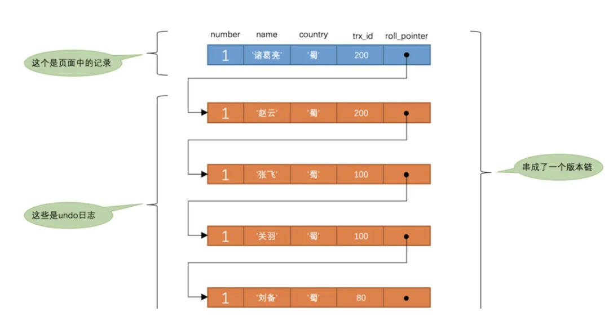

## 1. ACID特性
>原子性（Atomicity）、一致性（Consistency）、隔离性（Isolation）、持久性（Durability）
### 1.1原子性 - A
>原子性是指事务是一个不可再分割的工作单元，事务中的操作要么都发生，要么都不发生。
> 
> 如：对数据的修改要么全部执行成功，要么全部失败。

**实现方式**：事务的原子性由 redolog（重做日志）实现。事务提交的时候，必须先将事务的所有日志写入 redo log 持久化，到事务的提交操作才算完成。
### 1.2一致性 - C
>一致性是指在事务开始之前和事务结束以后，数据库的完整性约束没有被破坏。
> 这是说数据库事务不能破坏关系数据的完整性以及业务逻辑上的一致性。
> 
> 如：A给B转账，不论转账的事务操作是否成功，其两者的存款总额不变，不可能A扣了钱，B却没收到。

**实现方式**：事务的一致性由 undo log（逻辑日志）来实现。记录了事务的 insert、update、deltete 操作。
### 1.3隔离性 - I
>多个事务并发访问时，事务之间是隔离的，一个事务不应该影响其它事务运行效果。
> 
> 在并发环境中，当不同的事务同时操纵相同的数据时，每个事务都有各自的完整数据空间。
> 
>由并发事务所做的修改必须与任何其他并发事务所做的修改隔离。
> 
>事务查看数据更新时，数据所处的状态要么是另一事务修改它之前的状态，要么是另一事务修改它之后的状态，事务不会查看到中间状态的数据。

**实现方式**：事务的隔离性是通过数据库锁的机制实现的。
### 1.4持久性 - D
>持久性，意味着在事务完成以后，该事务所对数据库所作的更改持久的保存在数据库之中，并不会被回滚。

**实现方式**：事务的原子性由redolog（重做日志）实现。事务提交的时候，必须先将事务的所有日志写入 redo log 持久化，到事务的提交操作才算完成。
### 1.5关系
**A、I、D 是手段，C 是目的。只有保证了事务的持久性、原子性、隔离性之后，一致性才能得到保障。**

原子性，隔离性和持久性是数据库的属性；一致性（在 ACID 意义上）是应用程序的属性。

## 2. 事务隔离级别
>读未提交（READ UNCOMMITTED）、读提交 （READ COMMITTED）、可重复读 （REPEATABLE READ）、串行化 （SERIALIZABLE）

### 2.1 读未提交
>定义：允许读取尚未提交的数据变更。
> 
>读未提交会读到另一个事务的未提交的数据，产生脏读问题
> 
>**脏读:** 当前事务（A）中可以读到其他事务（B）未提交的数据（脏数据），然后B回滚，那么A读到的就是脏数据，这种现象是脏读。
> 
### 2.2 读已提交
>定义：允许读取并发事务已经提交的数据。
> 
>读已提交则解决了脏读的，出现了不可重复读，即在一个事务任意时刻读到的数据可能不一样，可能会受到其它事务对数据修改提交后的影响，一般是对于update的操作。
> 
> **不可重复读：** 在事务A中先后两次读取同一个数据，两次读取的结果不一样，这种现象称为不可重复读。
> 
> **脏读与不可重复读的区别在于：** 前者读到的是其他事务未提交的数据，后者读到的是其他事务已提交的数据。
> 
> 
_Oracle默认系统事务隔离级别是读提交_
### 2.3 可重复读
>定义：对同一字段的多次读取结果都是一致的。
> 
>可重复读解决了之前不可重复读和脏读的问题，但是由带来了幻读的问题，幻读一般是针对inser操作
> 
> **幻读：** 在事务A中按照某个条件先后两次查询数据库，两次查询结果的条数不同，这种现象称为幻读。
> 
> **不可重复读与幻读的区别可以通俗的理解为：** 前者是数据变了，后者是数据的行数变了。
> 

_MySQL InnoDB 存储引擎的默认支持的隔离级别是可重复读。_
### 2.4 串行化/可序化
> 解决了更新丢失、脏读、不可重复读、幻读(虚读)
> 
> 提供严格的事务隔离，它要求事务序列化执行，事务只能一个接着一个地执行，但不能并发执行
> 
> 序列化是最高的事务隔离级别，同时代价也是最高的，性能很低，一般很少使用，在该级别下，事务顺序执行，不仅可以避免脏读、不可重复读，还避免了幻读
### 2.5 总结
> 不可重复读的和幻读很容易混淆，不可重复读侧重于修改，幻读侧重于新增或删除。
> 
> 解决不可重复读的问题只需锁住满足条件的行，解决幻读需要锁表。

### 2.6 MVCC
>MVCC（Multi-Version Concurrency Control ，多版本并发控制）指的就是在使用READ COMMITTD、REPEATABLE READ这两种隔离级别的事务在执行普通的SELECT操作时访问记录的版本链的过程，这样子可以使不同事务的读-写、写-读操作并发执行，从而提升系统性能。
> 
> READ COMMITTD、REPEATABLE READ这两个隔离级别的一个很大不同就是：生成ReadView的时机不同。
> 
> READ COMMITTD在每一次进行普通SELECT操作前都会生成一个ReadView
> 
> REPEATABLE READ只在第一次进行普通SELECT操作前生成一个ReadView，之后的查询操作都重复使用这个ReadView就好了。

#### 2.6.1 ReadView
>**ReadView**中主要包含4个比较重要的内容：
>
>**m_ids：** 表示在生成ReadView时当前系统中活跃的读写事务的事务id列表。
>
>**min_trx_id：** 表示在生成ReadView时当前系统中活跃的读写事务中最小的事务id，也就是m_ids中的最小值。
>
>**max_trx_id：** 表示生成ReadView时系统中应该分配给下一个事务的id值。
>
>**creator_trx_id：** 表示生成该ReadView的事务的事务id。
```sql
-- Transaction 100
BEGIN;

UPDATE hero SET name = '关羽' WHERE number = 1;

UPDATE hero SET name = '张飞' WHERE number = 1;

COMMIT;

-- Transaction 200
BEGIN;

-- 更新了一些别的表的记录
-- ...

UPDATE hero SET name = '赵云' WHERE number = 1;

UPDATE hero SET name = '诸葛亮' WHERE number = 1;
```

>**READ COMMITTD**
> 
>Transaction 100已提交，Transaction 200未提交
> 
>此时一个新的事务300读取数据：select * from hero where number = 1;
> 
>当前活跃事务m_ids[200, 300],min_trx_id为200，max_trx_id为301
> 
> 1.从版本链中挑选可见的记录，最新版本的列name的内容是'诸葛亮'，该版本的trx_id值为200，在m_ids列表内，所以不符合可见性要求，根据roll_pointer跳到下一个版本。
> 
> 2.下一个版本的列name的内容是'赵云'，该版本的trx_id值为200，也在m_ids列表内，所以也不符合要求，继续跳到下一个版本。
> 
> 3.下一个版本的列name的内容是'张飞'，该版本的trx_id值为100，小于ReadView中的min_trx_id值200，所以这个版本是符合要求的，最后返回给用户的版本就是这条列name为'张飞'的记录。
> 
> 4.此时Transaction 200提交，Transaction 300再查询时，重新生成快照，此时m_ids[300]，所以结果为name为诸葛亮的这条记录。

>**READ COMMITTD**
> 前三步同上...
> 
> 4.此时Transaction 200提交，Transaction 300再查询时，当前事务不再重新生成快照，m_ids[200, 300]，所以结果还是name为张飞的这条记录。避免了不可重复读。

#### 2.6.2 总结
>1) 如果被访问版本的trx_id属性值与ReadView中的creator_trx_id值相同，意味着当前事务在访问它自己修改过的记录，所以该版本可以被当前事务访问。
> 
> 
>2) 如果被访问版本的trx_id属性值小于ReadView中的min_trx_id值，表明生成该版本的事务在当前事务生成ReadView前已经提交，所以该版本可以被当前事务访问。
> 
> 
>3) 如果被访问版本的trx_id属性值大于或等于ReadView中的max_trx_id值，表明生成该版本的事务在当前事务生成ReadView后才开启，所以该版本不可以被当前事务访问。
>
> 
>4) 如果被访问版本的trx_id属性值在ReadView的min_trx_id和max_trx_id之间，那就需要判断一下trx_id属性值是不是在m_ids列表中，如果在，说明创建ReadView时生成该版本的事务还是活跃的，该版本不可以被访问；如果不在，说明创建ReadView时生成该版本的事务已经被提交，该版本可以被访问。
