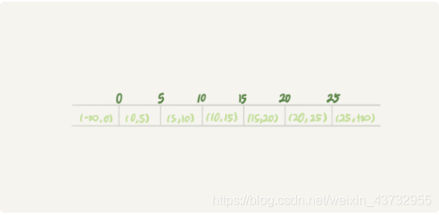

##1. 什么是 next-key lock?
>next-key lock是间隙锁+行锁的组合
> 
### 1.1 间隙锁（Gap Lock）
>间隙锁是行锁key之前的那个间隙。
> 
> 
> 
> 如图：0，5，10，15，20，25这些数据之间的间隔就是他们的间隙，而间隙锁就是对他们这一部分空间进行加锁。
> 
> 上面的数据也就形成了7个间隙锁。(-∞,0)、(0,5)、(5,10)、(10,15)、(15,20)、(20, 25)、(25, +supremum)。
> 
> next-key lock就是(-∞,0]、(0,5]、(5,10]、(10,15]、(15,20]、(20, 25]、(25, +supremum]，前开后闭。

> 比如行锁要锁住id=5的行，前一个值是id=1的行，那么该行锁对应的间隙就是(1,5)，next-key lock就是(1,5]。
> 
> 在rr级别下，默认的加锁类型就是next-key lock。这样可以防止新插入的数据导致的幻读问题。因为加的是next-key lock，所以锁定的范围变大了，相应得，并发性能也会降低，这需要权衡。

### 1.2 Next-Key Lock的规则
>**原则 1：** 加锁的基本单位是 next-key lock。next-key lock 是前开后闭区间。
> 
>**原则 2：** 只有访问到的对象才会加锁。
> 
>**优化 1：** 索引上的等值查询
> 1. 命中唯一索，退化为行锁。
> 2. 命中普通索引，左右两边的GAP Lock + Record Lock。
> 
>**优化 2：** 索引上的等值查询，未命中，所在的Net-Key Lock，退化为GAP Lock 。
> 
>**索引在范围查询：**
> 1. 等值和范围分开判断。
> 2. 索引在范围查询的时候都会访问到所在区间不满足条件的第一个值为止。
> 3. 如果使用了倒叙排序，按照倒叙排序后，检索范围的右边多加一个GAP。哪个方向还有命中的等值判断，再向同方向拓展外开里闭的区间。
> 
> 注：**范围查询**加锁的时候7.0版本加的是next-key lock。8.0版本范围查询加锁加的是GAP Lock。
