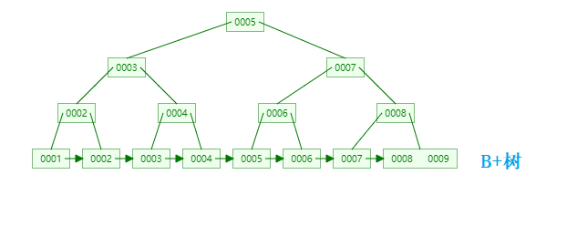

# 数据库
## 数据库三范式
### 1NF(第一范式)
> 属性（对应于表中的字段）不能再被分割，也就是这个字段只能是一个值，不能再分为多个其他的字段了。1NF 是所有关系型数据库的最基本要求 ，也就是说关系型数据库中创建的表一定满足第一范式。

### 2NF(第二范式)
> 2NF 在 1NF 的基础之上，消除了非主属性对于码的部分函数依赖。如下图所示，展示了第一范式到第二范式的过渡。第二范式在第一范式的基础上增加了一个列，这个列称为主键，非主属性都依赖于主键。

### 3NF(第三范式)
> 3NF 在 2NF 的基础之上，消除了非主属性对于码的传递函数依赖 。

## DML 语句和 DDL 语句

### DML（Data Manipulation Language）
> DML是数据库操作语言，指对数据库中表记录的操作，主要包括表记录的插入（insert）、更新（update）、删除（delete）和查询（select），是开发人员日常使用最频繁的操作。

### DDL（Data Definition Language）
> DDL是数据定义语言，就是对数据库内部的对象进行创建、删除、修改的操作语言。
### 删除语句
#### drop
>将表都删除，DDL语句。操作会放到 rollback segement 中，事务提交之后才生效。

eg:drop table 表名

#### truncate
>清空表数据，DDL语句。 操作立即生效，原数据不放到 rollback segment 中，不能回滚，操作不触发 trigger。

eg:truncate table 表名

#### delete
>根据条件删除表数据，DML语句。

eg:delete from 表名 where 列名=值
#### 执行速度
>drop > truncate > delete

## MVCC
定义：MVCC(Multi Version Concurrency Control)，多版本并发控制。

作用：数据库操作主要有读-写，写-读，写-写三种，如果都阻塞则性能较差。

    1.MVCC可以使不同事务的读-写、写-读操作并发执行**，从而提升系统性能。
    2.MVCC在尽量减少锁使用的情况下高效解决脏读、不可重复读、幻读。
      2.1.InnoDB存储引擎在 RR 级别下通过快照生成时机的不同解决不可重复读问题
      2.2.InnoDB存储引擎在 RR 级别下可以通过 MVCC和 Next-key Lock 来解决幻读问题
### InnoDB 对 MVCC 的实现
MVCC 的实现主要关注几个概念：隐式字段、Read View、undo log、版本链、快照读&当前读。

#### 1.一致性非锁定读（Consistent Nonlocking Reads）-快照读
为数据加一个版本号，在更新数据时版本号+1。当有查询时，将当前可见的版本号与对应记录的版本号进行比对，如果记录的版本小于可见版本，则表示该记录可见。

多版本控制就是对这种非锁定读的实现，当有数据更新时，读取不会等待其更新完成释放锁，会读取其一个快照数据（即历史版本），也称快照读。
#### 2. 锁定读（Locking Reads）-当前读
下列的语句是锁定读。在锁定读下，读取的是数据的最新版本，这种读也被称为当前读（current read）。
* SELECT ... LOCK IN SHARE MODE

  对记录加 S 锁，其它事务也可以加读（S）锁，如果加写（x）锁则会被阻塞
* SELECT ... FOR UPDATE

#### 3.隐藏字段
InnoDB 存储引擎为每行数据添加了三个隐藏字段。

>**DB_TRX_ID（6字节）**：事务 ID，每次更新时，都会把该事务 ID 复制给DB_TRX_ID。
> 
>**DB_ROLL_PTR（7字节）**：回滚指针，指向回滚段的 undo 日志。
> 
>**DB_ROW_ID（6字节）**：如果没有设置主键且该表没有唯一非空索引时，InnoDB 会使用该 id 来生成聚簇索引。

#### 4.ReadView
Read View 是事务执行快照读时，产生的读视图。

    class ReadView {
    /* ... */
    private:
    trx_id_t m_low_limit_id;      /* 大于等于这个 ID 的事务均不可见 */
    
    trx_id_t m_up_limit_id;       /* 小于这个 ID 的事务均可见 */
    
    trx_id_t m_creator_trx_id;    /* 创建该 Read View 的事务ID */
    
    trx_id_t m_low_limit_no;      /* 事务 Number, 小于该 Number 的 Undo Logs 均可以被 Purge */
    
    ids_t m_ids;                  /* 创建 Read View 时的活跃事务列表 */
    
    m_closed;                     /* 标记 Read View 是否 close */
    }

* **m_low_limit_id**：目前出现过的最大的事务 ID+1，即下一个将被分配的事务 ID。大于等于这个 ID 的数据版本均不可见。
* **m_up_limit_id**：活跃事务列表 m_ids 中最小的事务 ID，如果 m_ids 为空，则 m_up_limit_id 为 m_low_limit_id。小于这个 ID 的数据版本均可见。
* **m_ids**：Read View 创建时其他未提交的活跃事务 ID 列表。创建 Read View时，将当前未提交事务 ID 记录下来，后续即使它们修改了记录行的值，对于当前事务也是不可见的。m_ids 不包括当前事务自己和已提交的事务（正在内存中）。
* **m_creator_trx_id**：创建该 Read View 的事务 ID。
#### 5.undo-log（逻辑日志）
作用：

    1.当事务回滚时用于将数据恢复到修改前的样子
    2.当读取记录时，若该记录被其他事务占用或当前版本对该事务不可见，则可以通过 undo log 读取之前的版本数据，以此实现非锁定读。MVCC实现方式。

#### 6.版本链

## 数据库索引
索引是一种用于快速查询和检索数据的数据结构。

### 索引的优缺点
#### 优点
* 使用索引可以大大加快数据的检索速度。
* 通过创建唯一性索引，可以保证数据库表中每一行数据的唯一性。
#### 缺点
* 对数据进行增删改的时候，索引也需要动态的修改，会降低 SQL 执行效率。
* 索引需要使用物理文件存储，也会耗费一定空间。

### 数据库索引数据结构
大部分数据库系统及文件系统都采用 B-Tree 或其 B+Tree 作为索引结构。

* B树的所有节点既存放key也存放data。 B+树只有叶子节点存放key和data，其他内节点只存放key。
* B树的叶子节点都是独立的;B+树的叶子节点有一条引用链指向与它相邻的叶子节点。
* B树的检索的相当于对每个节点做二分查找，可能还没有到达叶子节点，检索就结束了。
B+树任何查找都是从根节点到叶子节点的过程。

### 索引的类型
#### 1.主键索引(Primary Key)
主键索引的叶子节点存的整行数据。
#### 2.二级索引
二级索引的叶子节点存储的数据是主键，又称为辅助索引。
#### 3.联合索引
使用表中的多个字段创建的索引，又称组合索引或复合索引。

在使用联合索引时，MySQL 会根据联合索引中的字段顺序，从左到右依次到查询条件中去匹配。
### 创建索引的依据
#### 1.选择合适的字段创建索引
* 不为 NULL 的字段
* 被频繁查询的字段
* 被作为条件查询的字段
* 频繁需要排序的字段
* 被经常频繁用于连接的字段
#### 2.尽可能的考虑建立联合索引而不是单列索引
索引是需要占用磁盘空间的，多个字段在一个索引上，将会节约很大磁盘空间，且修改数据的操作效率也会提升。
#### 3.避免冗余索引
如索引（a,b）和索引（a），索引（a）就是冗余索引。
#### 4.频繁更新的字段应该慎重建立索引
更新数据时，索引也需要维护，如果字段经常更新，维护索引的代价是巨大的。
#### 5.字符串类型的字段上使用前缀索引代替普通索引
前缀索引仅限于字符串类型，较普通索引会占用更小的空间。