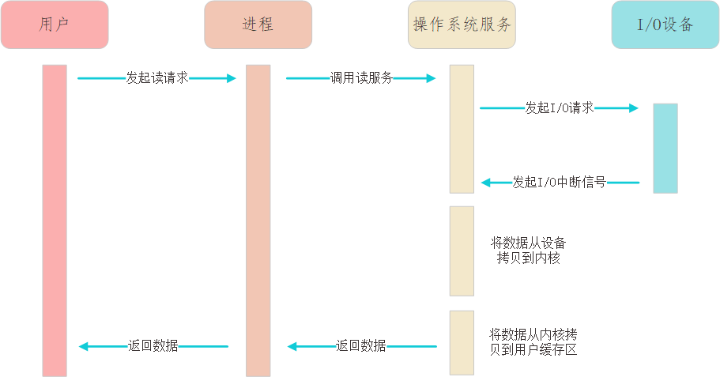
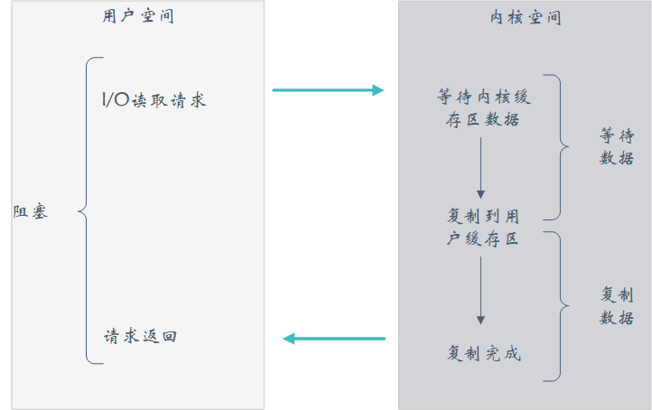
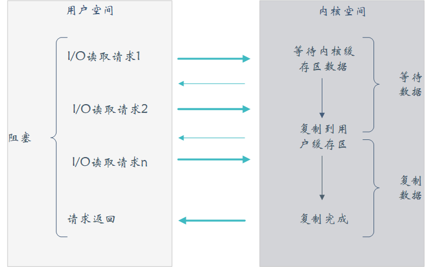
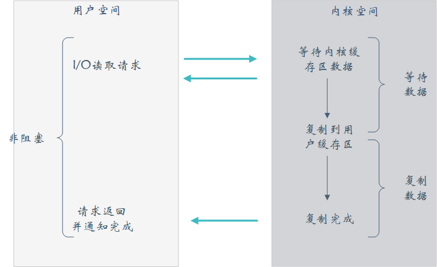

# java IO
IO，常写作 I/O，是 Input/Output 的简称，即输入/输出。例如从硬盘上读取数据到内存，是一次输入，将内存中的数据写入到硬盘就产生了输出。

## I/O 深入理解
### I/O读写原理
一次读写操作，比如将硬盘的内容读到内存中，必须通过操作系统来实现。因为为了确保操作系统的安全稳定运行，操作系统启动后，将会开启保护模式：将内存分为内核空间（内核对应进程所在内存空间）和用户空间，进行内存隔离。

**内核**：操作系统的核心是内核，独立于普通应用程序，可访问受保护的内存空间，也可访问底层硬件设备。

**用户空间**：即进程空间，可以理解为此进程使用的空间，但是此空间没有IO操作权限，需要调用系统服务来实现。

**理解**：你写了一个程序A，保存在磁盘里，当你点击run时加载到内存中，并分配了用户空间，当你使用read读取硬盘中内容时，你没有权限，你需要调用操作系统的API由内核来完成读操作。将内容返回到用户空间的进程缓存区中。

### 同步阻塞IO - BIO （Blocking I/O）
应用程序在从IO系统调用开始，一直到到系统调用返回，这段时间是阻塞的。

    优点：程序简单，在阻塞等待数据期间，用户线程挂起。用户线程基本不会占用 CPU 资源。
    缺点：每个连接配套一条独立的线程。高并发的场景下，内存、线程切换开销巨大。

### 同步非阻塞 - NIO （New I/O）
应用程序从IO系统调用，会判断内核缓冲区有没有数据，没有则代表还没读到，返回失败，有的话则阻塞复制数据。

    优点：每次发起的 IO 系统调用，在内核的等待数据过程中可以立即返回。用户线程不会阻塞，实时性较好。
    缺点：需要不断的重复发起IO系统调用，这种不断的轮询，将会不断地询问内核，这将占用大量的 CPU 时间，系统资源利用率较低。
### 异步非阻塞 I/O - AIO （Asynchronous I/O）
用户通过系统调用，告知内核启动某个I/O操作，用户线程返回。内核将整个I/O操作执行完后，通知应用程序。

    优点：在内核等待数据和复制数据的两个阶段，用户线程都不是阻塞的。
    缺点：需要完成事件的注册与传递，这里边需要底层操作系统提供大量的支持，去做大量的工作。
## 字符集
### ASCII
ASCII (American Standard Code for Information Interchange，美国信息交换标准代码) 是一套主要用于现代美国英语的字符集.

    ASCII由26个大小写字母，阿拉伯数字和英式标点符号以及33个特殊字符组成。

一个ASCII 码8个字节，一个字节有256（2^8）种组合。
但是最高位是0用来做校验位，所以ASCII字符集一共定义了128（2^7）个字符。

#### GB2312
GB2312 字符集是一种对汉字比较友好的字符集，共收录 6700 多个汉字。可以理解为ASCII的一种扩展。

**对于英语字符，GB2312 编码和 ASCII 码是相同的，1 字节编码即可。对于非英字符，需要 2 字节编码。**

#### GBK
GBK 字符集可以看作是 GB2312 字符集的扩展，兼容 GB2312 字符集，共收录了 20000 多个汉字。

#### GB18030
GB18030 完全兼容 GB2312 和 GBK 字符集，纳入中国国内少数民族的文字，且收录了日韩汉字，是目前为止最全面的汉字字符集，共收录汉字 70000 多个。

#### 总结
**可以将ASCII理解为一张字典表，其他编码扩展了这张字典表。**

### Unicode
Unicode 被称作万国码、国际码、统一码、单一码。它纳入了世界上所有已知的字符。

不过，Unicode 字符集并没有规定如何存储这些字符（没有定义其二进制数据）。

####  UTF
UTF（Unicode Transformation Formats，Unicode 的编码）有UTF-8， UTF-16， UTF-32等。
####  UTF-8
在 UTF-8 中，0-127 号的字符用 1 个字节来表示，使用和 ASCII 相同的编码。只有 128 号及以上的字符才用 2 个、3 个或者 4 个字节来表示。
    
    UTF-8 是一种可变长度的编码方式
####  UTF-16
UTF-16 使用 2 个或者 4 个字节来存储字符。

* 对于 Unicode 编号范围在 0 ~ FFFF 之间的字符，UTF-16 使用两个字节存储。

* 对于 Unicode 编号范围在 10000 ~ 10FFFF 之间的字符，UTF-16 使用四个字节存储。

### char 
char在java中是2个字节。java采用16位unicode字符集，2个字节（16位）来表示一个字符。
它的范围在（'\u0000'（0）- '\uffff'（65,535）），超过的都无法表示。

## IO流
### 字节流与字符流
字节（byte）是计算机中用来表示存储容量的一个计量单位，通常情况下，一个字节有 8 位（bit）。

字节流用来处理二进制文件。

_**IO结构如下图**_

使用方式查看- [IoTest](https://github.com/gavin9508/struggle/tree/master/struggle-note/src/main/java/com/struggle/io/test/IoTest.java)

### 字节流
#### InputStream 类
用于从源头（通常是文件）读取数据(字节信息)到内存中,是所有字节输入流的父类。
#### OutputStream 类
用于将数据(字节信息)写入到目的地（通常是文件）。
### 字符流
字符（char）可以是计算机中使用的字母、数字、和符号。

字符流用来处理文本文件。
#### Reader 类
用于从源头（通常是文件）读取数据（字符信息）到内存中。
#### Writer 类
用于将数据（字符信息）写入到目的地（通常是文件）。