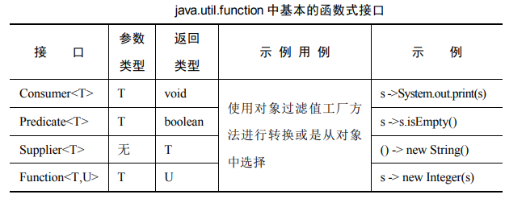

# 1. Java8新特性

## 1.1 lambda表达式

### 1.1.1 Lambda表达式的基本语法

> **->  箭头操作符将lambda表达式分成两部分**
>
> 左侧：lambda 表达式的参数列表
> 右侧：lambda 表达式中所需要执行的功能，即 lambda体

> **语法格式一：**
> 无参数，无返回值
>
> () -> System.out.println("Hello, lambda")

> **语法格式二：**
> 有一个参数，无返回值
>
> (c) -> System.out.println(c)

> **语法格式三：**
> 若只有一个参数，小括号可以省略不写
>
> (c) -> System.out.println(c)

> **语法格式四：**
> 有两个以上的参数，有返回值，并且lambda体中有多条语句

```
Comparator<Integer> com = (x,y) -> {
    System.out.println("函数式接口"+x+y);
    return Integer.compare(x, y);
};
```

> **语法格式五：**
> 若lambda体中只有一条语句，return 和 大括号 都可以省略不写
>
> Comparator<Integer> com1 =(x,y) -> Integer.compare(x,y);

> **语法格式六：**
> lambda 表达式的参数列表的数据类型可以省略不写，因为JVM编译器通过上下文推断出，数据类型，

### 1.1.2 Lambda表达式需要函数式接口的支持

> **函数式接口：**
> 接口中只有一个抽象方法的接口，称为函数式接口，可以使用@FunctionInterface修饰可以检查是否是函数式接口

## 1.2 函数式表达式

java8 内置的四大核心函数式接口
> 1. Consumer<T>：消费性接口
     void accept(T,t);
> 2. Supplier<T>:  供给型接口
     T get();
> 3. Function<T,R>：函数型接口
     R apply(T,t);
> 4. Predicate<T>：断言型接口
     boolean test(T t);


● 原生特化：这些接口使用原生类型替换掉类型参数。代码如下：

```java
interface LongFunction<R> {
    R apply(long value);
}

interface ToIntFunction<T> {
    intapplyAsInt(T value);
}

interface LongToIntFunction {
    intapplyAsInt(long value);
}
```

● Consumer、Predicate与Function的函数类型都接收单个参数。有接收两个参数的相应接口，代码如下：

```java
interface BiConsumer<T, U> {
    void accept(T t, U u);
}

interface BiFunction<T, U, R> {
    R apply(T t, U u);
}

interface ToIntBiFunction<T, U> {
    int apply(T t, U u);
}
```

● Function 的常见用法要求其参数与结果拥有相同的类型。之前在 List.replaceAll 的参数中已经看到了这一点。我们
可以通过将 Function 的变种特化为相应的 Operator 来达s实现，如下所示：

```java
interface UnaryOperator<T> extends Function<T, T> {
}

interface BinaryOperator<T> extends BiFunction<T, T, T> {
}

interface IntBinaryOperator {
    int applyAsInt(int left, int right);
}
```

## 1.3 方法引用与构造器引用

一般来说，任何 lambda 表达式都可以看作声明在函数式接口中的单个抽象方法的实现。不过，当 lambda 表达
式只是调用现有类中的具名方法的一种方式时，编写 lambda 的更好方式则是使用已有的名字。例如，考虑如下代码，它会向控制台输出列表中的每个元素：

```
pointList.forEach(s -> System.out.print(s));
```

这里的 lambda 表达式只是将参数传递给 print 调用。诸如此类的 lambda(其唯一目的就是将参数提供给一个具体方法)完全是由该方法类型定义的。
因此，假如可以通过某种方式确定出类型，那么只包含方法名的简短形式所提供的信息就与完整的lambda表达式一样，但可读性会更好。相比于上述代码，我们可以这样编写：

```
pointList.forEach(System.out::print);
```

它表示相同的含义。这种对现有类的具体方法的操作写法称为方法引用。有 4 种类型的方法引用，如下表所示。

| 名字    | 语法                    | 相应的lambda表达式                       |
|-------|:----------------------|------------------------------------|
| 静态    | RefType::staticMethod | （args)->RefType.staticMethod(args) |
| 绑定实例  | expr::instMethod      | (args)->  expr.instMethod(args)    |
| 未绑定实例 | RefType::instMethod   | (args)->RefType.instMethod(args)   |
| 构造器   | ClsName::new          | (args)->new ClsName(args)          |

### 1.3.1 静态方法的引用

静态方法引用的语法只需要类与静态方法名，中间通过两个冒号分隔。例如：

```
String::valueOf
Integer::compare
```

是对静态方法的引用。为假设我们想要根据大小对一个 Integer 数组排序，数组中的每个值都被看成无符号的。Integer 的自然顺序根据数字来排序(也就是考虑到值
的符号)，因此我们需要提供一个显式的 Comparator。我们可以使用静态方法 Integer.compareUnsigned：

```
(x,y) -> Integer.compareUnsigned(x, y);
```

这样，对数组 integerArray 排序就可以调用：

```
Arrays.sort(integerArray, (x,y) -> Integer.compareUnsigned(x,y));
```

这是合法的，不过这么做要比相应的静态方法引用冗长和重复：

```
Arrays.sort(integerArray, Integer::compareUnsigned);
```

> 这里要注意一点的是，你需要引入的方法的参数列表和返回值，
> 以及实现内容，必须和lambda将要实现的抽象方法的参数列表、返回值和实现内容一致；

### 1.3.2 实例方法引用

有两种方式可以引用实例方法。绑定方法引用类似于静态引
用，只不过是通过 ObjectReference::Identifier 替换 ReferenceType::
Identifier。forEach 方法用于将集
合中的每个元素传递给 PrintStream 对象 System.out 的实例方法
print 进行处理，如下 lambda 表达式：

```
pointList.forEach(p ->System.out.print(p));
```

可以替换为绑定方法引用：

```
pointList.forEach(System.out::print);
```

### 1.3.3 构造器引用

方法引用是对现有方法的句柄，与之类似，构造器引用是对
现有构造器的句柄。构造器引用的创建语法类似于方法引用，只
不过使用关键字 new 替换方法名。例如：

```
ArrayList::new
File::new
```

与方法引用一样，对于重载构造器的选择是通过上下文的目标类型实现的。
例如，在如下代码中，map 参数的目标类型是类型为 String -> File 的函数；为了与之匹配，编译器会选择带有单个String 参数的 File 构造器。

```
Stream<String> stringStream = Stream.of("a.txt", "b.txt","c.txt");
Stream<File> fileStream = stringStream.map(File::new);
```

## 1.4 Stream API

> **如果有一个需求，需要对数据库查询到的菜肴进行一个处理：**
> 1. 筛选出卡路里小于400的菜肴
> 2. 对筛选出的菜肴进行一个排序
> 3. 获取排序后菜肴的名字

```java
public class Dish {
    private String name;
    private boolean vegetarian;
    private int calories;
    private Type type;
}
```

```java
public class DishFilter {
     static List<Dish> dishes = Arrays.asList(
             new Dish("糖醋里脊", false, 9090, new Type("川菜")),
             new Dish("麻婆豆腐", true, 380, new Type("川菜")),
             new Dish("辣子鸡", false, 5700, new Type("川菜")),
             new Dish("剁椒鱼", false, 567, new Type("湘菜")),
             new Dish("糖油粑粑", false, 245, new Type("湘菜"))
     );

     public static void main(String[] args) {
          List<String> dishFilers = beforeJava7(dishes);
          dishFilers.forEach(System.out::println);
          System.out.println("=========");
          dishFilers = afterJava8(dishes);
          dishFilers.forEach(System.out::println);
     }

     private static List<String> afterJava8(List<Dish> dishList) {
          return dishList.stream()
                  .filter(dish -> dish.getCalories() < 1000)
                  .sorted(Comparator.comparing(Dish::getCalories))
                  .map(Dish::getName)
                  .collect(Collectors.toList());
     }

     private static List<String> beforeJava7(List<Dish> dishList) {
          List<Dish> lowCaloricDishes = new ArrayList<>();
          //1.筛选出卡路里小于400的菜肴
          for (Dish dish : dishList) {
               if (dish.getCalories() < 400) {
                    lowCaloricDishes.add(dish);
               }
          }
          //2.对筛选出的菜肴进行排序
          Collections.sort(lowCaloricDishes, new Comparator<Dish>() {
               @Override
               public int compare(Dish o1, Dish o2) {
                    return Integer.compare(o1.getCalories(), o2.getCalories());
               }
          });
          //3.获取排序后菜肴的名字
          List<String> lowCaloricDishesName = new ArrayList<>();
          for (Dish d : lowCaloricDishes) {
               lowCaloricDishesName.add(d.getName());
          }
          return lowCaloricDishesName;
     }
}
```
对数据库查询到的菜肴根据菜肴种类进行分类
```java
public class DishGroup {
     static List<Dish> dishes = Arrays.asList(
             new Dish("糖醋里脊", false, 9090, new Type("川菜")),
             new Dish("麻婆豆腐", true, 380, new Type("川菜")),
             new Dish("辣子鸡", false, 5700, new Type("川菜")),
             new Dish("剁椒鱼", false, 567, new Type("湘菜")),
             new Dish("糖油粑粑", false, 245, new Type("湘菜"))
     );

     public static void main(String[] args) {
          Map<Type, List<Dish>> typeListMap = beforeJdk8(dishes);
          Optional.of(typeListMap).ifPresent(System.out::println);
          System.out.println("===========");
          typeListMap = afterJdk8(dishes);
          Optional.of(typeListMap).ifPresent(System.out::println);
     }
     private static Map<Type, List<Dish>> beforeJdk8(List<Dish> dishList) {
          Map<Type, List<Dish>> result = new HashMap<>();
          for (Dish dish : dishList) {
               //不存在则初始化
               if (result.get(dish.getType())==null) {
                    List<Dish> dishes = new ArrayList<>();
                    dishes.add(dish);
                    result.put(dish.getType(), dishes);
               } else {
                    //存在则追加
                    result.get(dish.getType()).add(dish);
               }
          }
          return result;
     }

     private static Map<Type, List<Dish>> afterJdk8(List<Dish> dishList) {
          return dishList.stream().collect(groupingBy(Dish::getType));
     }
}
```

> **什么是流**
> 
> 流是从支持数据处理操作的源生成的元素序列，源可以是数组、文件、集合、函数。流不是集合元素，它不是数据结构并不保存数据，它的主要目的在于计算

### 1.4.1 如何生成流,生成流的方式主要有五种

> **1.通过集合生成，应用中最常用的一种**

```
List<Integer> integerList = Arrays.asList(1, 2, 3, 4, 5);
Stream<Integer> stream = integerList.stream();
```

> **2.通过数组生成**
```
int[] intArr = new int[]{1, 2, 3, 4, 5};
IntStream stream = Arrays.stream(intArr);
```

通过Arrays.stream方法生成流，并且该方法生成的流是数值流【即IntStream】而不是Stream<Integer>。补充一点使用数值流可以避免计算过程中拆箱装箱，提高性能。

Stream API提供了mapToInt、mapToDouble、mapToLong三种方式将对象流【即Stream转换成对应的数值流，同时提供了boxed方法将数值流转换为对象流

>**3.通过值生成**
```
Stream<Integer> stream = Stream.of(1, 2, 3, 4, 5);
```
通过Stream的of方法生成流，通过Stream的empty方法可以生成一个空流

>**4.通过文件生成**
```
Stream<String> lines = Files.lines(Paths.get("data.txt"), Charset.defaultCharset())
```
通过Files.line方法得到一个流，并且得到的每个流是给定文件中的一行

>**5.通过函数生成** 提供了iterate和generate两个静态方法从函数中生成流

 iterator
```
Stream<Integer> stream = Stream.iterate(0, n -> n + 2).limit(5);
```
iterate方法接受两个参数，第一个为初始化值，第二个为进行的函数操作，因为iterator生成的流为无限流，通过limit方法对流进行了截断，只生成5个偶数

generate
```
Stream<Double> stream = Stream.generate(Math::random).limit(5);
```
generate方法接受一个参数，方法参数类型为Supplier，由它为流提供值。generate生成的流也是无限流，因此通过limit对流进行了截断

### 1.4.2 流的操作类型
流的操作类型主要分为两种

> **1.中间操作**

>一个流可以后面跟随零个或多个中间操作。其目的主要是打开流，做出某种程度的数据映射/过滤，然后返回一个新的流，交给下一个操作使用。这类操作都是惰性化的，仅仅调用到这类方法，并没有真正开始流的遍历，真正的遍历需等到终端操作时，常见的中间操作有下面即将介绍的filter、map等

> **2.终端操作**

>一个流有且只能有一个终端操作，当这个操作执行后，流就被关闭了，无法再被操作，因此一个流只能被遍历一次，若想在遍历需要通过源数据在生成流。终端操作的执行，才会真正开始流的遍历。如下面即将介绍的count、collect等

### 1.4.3 中间操作
**filter筛选**：通过使用filter方法进行条件筛选，filter的方法参数为一个条件
```
List<Integer> integerList = Arrays.asList(1, 1, 2, 3, 4, 5);
Stream<Integer> stream = integerList.stream().filter(i -> i > 3);
```
**distinct去除重复元素**通：过distinct方法快速去除重复的元素
```
List<Integer> integerList = Arrays.asList(1, 1, 2, 3, 4, 5);
Stream<Integer> stream = integerList.stream().distinct();
```
**limit返回指定流个数**：通过limit方法指定返回流的个数，limit的参数值必须>=0，否则将会抛出异常
```
List<Integer> integerList = Arrays.asList(1, 1, 2, 3, 4, 5);
Stream<Integer> stream = integerList.stream().limit(3);
```
**skip跳过流中的元素**：通过skip方法跳过流中的元素，上述例子跳过前两个元素，所以打印结果为2,3,4,5，skip的参数值必须>=0，否则将会抛出异常
```
List<Integer> integerList = Arrays.asList(1, 1, 2, 3, 4, 5);
Stream<Integer> stream = integerList.stream().skip(2);
```
**map流映射**：
所谓流映射就是将接受的元素映射成另外一个元素，通过map方法可以完成映射，该例子完成中String -> Integer的映射，之前上面的例子通过map方法完成了Dish->String的映射
```
List<String> stringList = Arrays.asList("Java 8", "Lambdas",  "In", "Action");
Stream<Integer> stream = stringList.stream().map(String::length);
```
**flatMap流转换**：将一个流中的每个值都转换为另一个流，map(w -> w.split(" "))的返回值为Stream<String[]>，我们想获取Stream<String>，可以通过flatMap方法完成Stream->Stream的转换
```
List<String> wordList = Arrays.asList("Hello", "World","Java 8 lambdas in action");
List<String> strList = wordList.stream()       
     .map(w -> w.split(" "))        
     .flatMap(Arrays::stream)        
     .distinct()        
     .collect(Collectors.toList());
```

**元素匹配**：提供了三种匹配方式

**1.allMatch匹配所有**：通过allMatch方法实现
```
List<Integer> integerList = Arrays.asList(1, 2, 3, 4, 5);
if (integerList.stream().allMatch(i -> i > 3)) {    
     System.out.println("值都大于3");
}
```
**2.anyMatch匹配其中一个**：存在大于3的值则打印，java8中通过anyMatch方法实现这个功能
```
List<Integer> integerList = Arrays.asList(1, 2, 3, 4, 5);
if (integerList.stream().anyMatch(i -> i > 3)) {    
     System.out.println("存在大于3的值");
}
```

等同于
```
for (Integer i : integerList) {   
     if (i > 3) {        
          System.out.println("存在大于3的值");        
          break;    
     }
}
```

**3.noneMatch全部不匹配**：通过noneMatch方法实现
```
List<Integer> integerList = Arrays.asList(1, 2, 3, 4, 5);
if (integerList.stream().noneMatch(i -> i > 3)) {    
     System.out.println("值都小于3");
}
```

## 1.5 接口中的默认方法与静态方法

## 1.6 新实践日期API

## 1.7 其他新特性