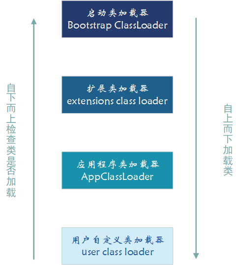
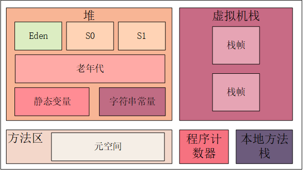
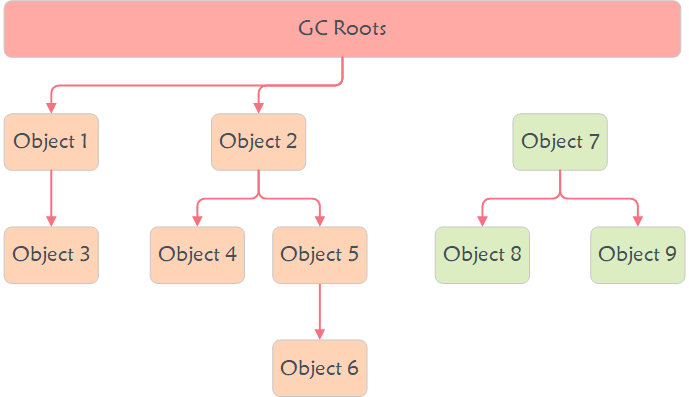
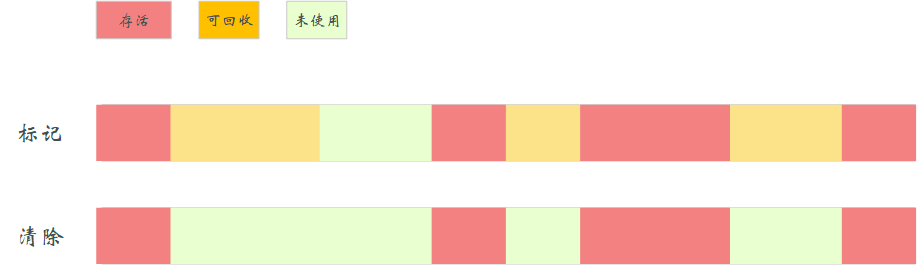
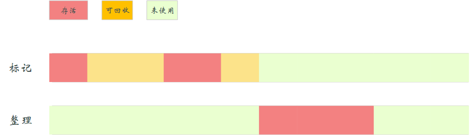
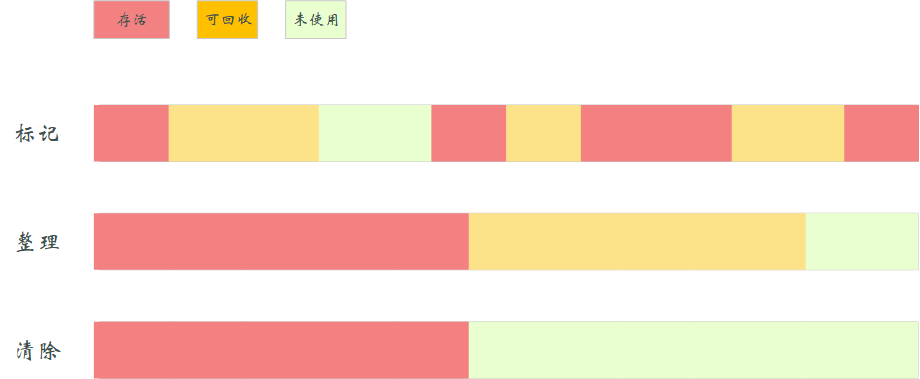

# JVM
**定义**

    Java 虚拟机（Java Virtual Machine，简称 JVM） 负责把字节码转换成机器码。转换的时候，可以做一些压缩或者优化。

**作用**
>1. 实现跨平台。
>2. 优化机器码。

**组成**
>1. 类加载器（Class Loader）:加载类文件。
>2. 运行时数据区（Runtime Data Areas）：JAVA内存区域。
>3. 执行引擎（Excution Engine）：
>   1. 解释器：读取字节码流，然后执行指令（一行一行执行）。
>   2. 即时（Just-In-Time，JIT）编译器：即时编译器在恰当的时候把整段字节码编译成本地代码，放到缓存，供解释器执行，提高性能。

## 一、类加载
类加载是指将.class文件从磁盘加载到内存的过程，**类的加载都是在程序运行期间完成的。**

**加载步骤**：
    加载->连接（验证->准备->解析）->初始化->使用->卸载 
### 1 加载
    1.通过全类名获取定义此类的二进制字节流
    2.将字节流所代表的静态存储结构转换为方法区的运行时数据结构
    3.在内存中生成一个代表该类的 Class对象，作为方法区这些数据的访问入口
### 2 连接
#### 2.1 验证
文件格式验证->元数据验证->字节码验证->符号引用验证
#### 2.2 准备
准备阶段是正式为类变量（即静态变量）分配内存并设置类变量初始值的阶段，**这些内存都将在方法区中分配。**
#### 2.3 解析
解析阶段是虚拟机将常量池内的符号引用替换为直接引用的过程。解析动作主要针对类或接口、字段、类方法、接口方法、方法类型、方法句柄和调用限定符 7 类符号引用进行。（简单来说就是确定要用的方法是哪块内存）
### 3 初始化
初始化阶段是执行初始化方法 <clinit> ()方法的过程，是类加载的最后一步，这一步 JVM 才开始真正执行类中定义的 Java 程序代码(字节码)
### 4 使用
### 5 卸载
卸载类即该类的 Class 对象被 GC。

## 二、 类加载器
对于任意一个类，都需要由它的类加载器和这个类本身一同确定其在 JVM 中的唯一性。
JVM 中内置了三个重要的 ClassLoader。

>1. BootstrapClassLoader(启动类加载器) ：最顶层的加载类，由 C++实现，负责加载 %JAVA_HOME%/lib目录下的 jar 包和类或者被 -Xbootclasspath参数指定的路径中的所有类。
>2. ExtensionClassLoader(扩展类加载器) ：主要负责加载 %JRE_HOME%/lib/ext 目录下的 jar 包和类，或被 java.ext.dirs 系统变量所指定的路径下的 jar 包。
>3. AppClassLoader(应用程序类加载器) ：面向我们用户的加载器，负责加载当前应用 classpath 下的所有 jar 包和类。

### 双亲委派
**定义**：类加载的时候，首先会把该请求委派给父类加载器的 loadClass() 处理，因此所有的请求最终都应该传送到顶层的启动类加载器 BootstrapClassLoader 中。当父类加载器无法处理时，才由自己来处理。当父类加载器为 null 时，会使用启动类加载器 BootstrapClassLoader 作为父类加载器。

**作用**：
>1. 可以避免类的重复加载。
>2. 保证了 Java 的核心 API 不被篡改。

[每个类加载都有一个父类加载器](https://github.com/gavin9508/struggle/blob/master/struggle-note/src/main/java/com/struggle/jvm/classLoad/ClassLoadTest.java)

## 三、 JAVA内存区域

### 线程共享的
### 1. 堆
存放对象实例，几乎所有的对象实例以及数组都在这里分配内存。
> 1.新生代：（Eden 区、两个 Survivor 区 S0 和 S1 ）对象在Eden区出生，之后在S0和S1区，每转换一次长一岁
> 
> 2.老年代：大对象和年龄达到15岁的对象

#### 字符串常量池
字符串常量池 是 JVM 为了提升性能和减少内存消耗针对字符串（String 类）专门开辟的一块区域，主要目的是为了避免字符串的重复创建。

> JDK1.7 之前，字符串常量池存放在永久代。JDK1.7 字符串常量池和静态变量从永久代移动了 Java 堆中。
> 
> ?移到堆区有什么好处？
### 2.方法区
方法区属于是 JVM 运行时数据区域的一块**逻辑区域**

方法区会存储已被虚拟机加载的 类信息、字段信息、方法信息、常量、静态变量、即时编译器编译后的代码缓存等数据。
JDK1.8时元空间完全替代永久代，元空间使用的是直接内存。

### 线程私有
### 3. 程序计数器
程序计数器记录着当前代码执行的行数。
> 1.字节码解释器通过改变程序计数器来依次读取指令
> 2.在多线程的情况下，程序计数器用于记录当前线程执行的位置

### 4. 栈
所有的 Java 方法调用都是通过栈来实现。

方法调用的数据需要通过栈进行传递，每一次方法调用都会有一个对应的栈帧被压入栈中，每一个方法调用结束后，都会有一个栈帧被弹出。

### 5. 本地方法栈
虚拟机使用到的 Native 方法服务。

## 四、 GC-垃圾回收
垃圾回收（Garbage Collection，GC）是对内存堆中已经死亡的或者长时间没有使用的对象进行清除和回收。
### 垃圾判断
####  1.引用计数法
引用计数算法（Reachability Counting）是通过在对象头中分配一个空间来保存该对象被引用的次数（Reference Count）。
 
>每当有一个地方引用它，计数器就加 1。
> 
>当引用失效，计数器就减 1。
> 
>计数器为 0 的对象就是不可能再被使用的。

**_主流算法并不采用：它很难解决对象之间相互循环引用的问题。_**
####  2. 可达性分析算法
可达性分析算法通过一系列的称为 “GC Roots” 的对象作为起点，从这些节点开始向下搜索，节点所走过的路径称为引用链，当一个对象到 GC Roots 没有任何引用链相连的话，则证明此对象是不可用的，需要被回收。

可以作为GC Roots 的对象:
>* 虚拟机栈(栈帧中的本地变量表)中引用的对象
>* 本地方法栈(Native 方法)中引用的对象
>* 方法区中类静态属性引用的对象
>* 方法区中常量引用的对象
>* 所有被同步锁持有的对象

####  3.老年代
1. 大对象：大对象就是需要大量连续内存空间的对象（比如：字符串、数组）。
2. 长期存活对象：年龄增加到15岁的对象。有时不是必须要到达15岁。

### 垃圾回收
#### 1.标记 - 清除算法
先标记出所有不需要回收的对象，在标记完成后统一回收掉所有没有被标记的对象。

缺点：标记清除后会产生大量不连续的碎片。
#### 2.复制算法
将内存分为大小相同的两块，每次使用其中的一块。当这一块的内存使用完后，就将还存活的对象复制到另一块去，然后再把使用的空间一次清理掉。

缺点：一块内存只能用一半。
#### 3.标记整理算法
标记完成后让所有存活的对象向一端移动，然后直接清理掉端边界以外的内存。

#### 4.分代收集算法
此算法将 java 堆分为新生代和老年代，在新生代中，每次收集都会有大量对象死去，所以可以选择”标记-复制“算法。
老年代的对象存活几率较高，选择“标记-清除”或“标记-整理”算法进行垃圾收集。

### 垃圾收集器
#### 1.Serial 收集器
描述：新生代收集器；它是最基础、历史最悠久的收集器，是一个单线程收集器。
算法：复制算法。

优点：单线程避免了多线程复杂的上下文切换，在单线程环境下收集效率非常高。

缺点：在进行垃圾回收时，必须暂停其他所有的工作线程。

适用场景：单CPU环境下的Client模式。
#### 2.Serial Old 收集器
描述：老年代收集器；单线程收集器。Serial的老年代版本。

    吞吐量 = 运行用户代码时间 \ (运行用户代码时间 + 运行垃圾收集时间)
算法：标记-整理 算法。

适用场景：单CPU环境下的Client模式。
#### 3.ParNew 收集器
描述：新生代收集器；它是 Serial 收集器的多线程版本，可以使用多条线程进行垃圾回收。

算法：标记-整理算法。
#### 4.Parallel Scavenge 收集器
描述：新生代收集器；它的目标是达到一个可控的吞吐量。
**JDK8默认垃圾收集器**。

    吞吐量 = 运行用户代码时间 \ (运行用户代码时间 + 运行垃圾收集时间)
算法：标记-复制算法。

适用场景：在后台运算，不需要太多交互的任务。
#### 5.Paralled Old 收集器
描述：年代收集器；Parallel Scavenge 收集器的老年代版本。
**JDK8默认垃圾收集器**。

算法：标记-整理算法。

适用场景：在后台运算，不需要太多交互的任务。
#### 6.CMS 收集器
描述：老年代收集器；它是一种以获取最短回收停顿时间为目标的收集器。

算法：标记-清除算法。

适用场景：互联网或B/S系统端的Java应用。

#### 7.Garbage First（G1） 收集器
描述：特殊垃圾收集器；是一款面向服务端的垃圾收集器，它开创了局部收集的设计思路和基于 Region 的内存布局形式。
**JDK9默认垃圾收集器**

**G1 把连续的 Java 堆划分为多个大小相等的独立区域（Region），每一个 Region 都可以根据需要，扮演新生代的 Eden 空间、Survivor 空间，或者老年代空间。收集器能够对扮演不同角色的 Region 采用不同的策略去处理。**

算法：标记-整理+复制算法。

适用场景：互联网或B/S系统端的Java应用。
