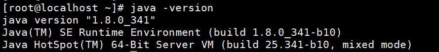

# 1 linux下安装jdk
## 1.1 Linux系列--安装jdk压缩版
### 1.1.1 下载方式
```text
两种下载方式：  
(1)百度网盘下载地址 : https://pan.baidu.com/s/1JJ7_ooZ3UABZifJTxEqEeg 	
	提取码：tfwk  
(2)官网下载地址：https://www.oracle.com/java/technologies/javase/javase8u211-later-archive-downloads.html
```

### 1.1.2 将下载的压缩包放到linux某个文件夹目录下
```text
这里我放到了/opt/java目录下 
```

### 1.3.4 解压java文件到当前目录
```text
tar -zxvf jdk-8u341-linux-x64.tar.gz
```
### 1.3.5 配置jdk环境变量
```text
输入命令
vim /etc/profile
```
> 在文件末尾加入
```text
# java environment
export JAVA_HOME=/otp/java/jdk1.8.0_341
export JRE_HOME=${JAVA_HOME}/jre
export CLASSPATH=.:${JAVA_HOME}/lib:${JRE_HOME}/lib
export PATH=.:${JAVA_HOME}/bin:$PATH
```

> 保存退出，刷新文件使其生效：source /etc/profile
### 1.3.6 编辑 ~/.bashrc文件
> 这个是用来解决一些jar开机自启脚本每次都要 source /etc/profile使jdk生效的情况
```text
vim ~/.bashrc
```
> 在文件末尾加上如下代码
```text
if [ -f /etc/profile ]; then
. /etc/profile
fi
```

### 1.3.7 测试jdk是否配置成功
>输入命令
```text
java -version
```

>到此，jdk安装配置完成。
