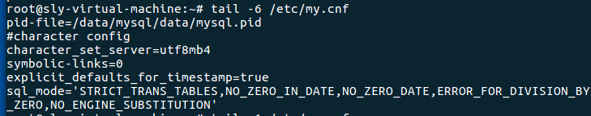

# 1. linux命令
> Linux 服务器端一般是命令行界面，通过命令和 linux 系统交互。通过命令进行各种操作。
## 1.1 磁盘管理
### 1.1.1  切换目录：cd 目录名
```text
① 由当前目录切换到 /usr/local
例如：cd /usr/local
② 回到根目录（类似于我的电脑）
例如：cd /
```
### 1.1.2 列出当前目录下的文件：ll、ls
```text
① 列出目录下的详细内容（相当于 Windows 的列表查看）
例如：在当前目录下执行 ll
```

```text
② 使用 ll 目录名 查看指定目录下的文件和目录列表
-rw-rw-rw - 表示文件
drw-rw-rw d 表示目录文件夹
```

```text
③ 只列出文件/目录名
例如：在当前目录执行 ls
```

### 1.1.3 显示当前所在目录位置： pwd
```text
例如：在当前目录下执行 pwd
```

## 1.2 文件管理
### 1.2.1 创建目录：mkdir 目录名
例如：mkdir test

查看创建的目录 ls

### 1.2.2 删除文件或目录 rm , rm –r
> 在 home 目录下测试  cd /hom
```text
① 使用 rm 删除文件
新建空文件
touch my.txt
例如：rm my.txt
在 test01 目录执行 echo “ok” > my.txt 创建一个 my.txt 的文件
查看 cat my.txt
在执行 rm my.txt 回车后， 系统会提示是否删除确认
在提示位置输入 y ,表示同意，文件删除。 输入 n 取消删除操作。
```

```text
② 不用确认的直接删除
例如： rm -f my.txt
```

```text
③ 删除目录
rm 目录
例如：rm -rf test01
rm 不加参数，不能删除目录
rm -rf test01 删除文件夹 r 表示递归删除， f不做确认提示
```

### 1.2.3 复制文件命令 cp ，cp -rf
```text
① 复制文件：aa.txt 是新的文件名
语法：cp 被复制的文件名 新文件名
例如：cp anaconda-ks.cfg aa.txt
重复执行名，询问是否覆盖
输入“y”同意覆盖， 输入“n”取消操作
```

```text
② 复制文件夹
语法：cp -rf 文件夹 新的文件夹名
例如 cp -rf myfolder newfolder
```

### 1.2.4 查看文件全部内容： cat 文件路径
> 例如：cat /root/anaconda-ks.cfg

### 1.2.5 分页查看文件内容：more 文件路径
>例如：more /root/anaconda-ks.cfg （命令输入完按 Enter）
屏幕底下，显示当前屏幕展示总内容的百分比


>按 Enter 之后

> 
>按空格之后


### 1.2.6 查看文件开头的 n 行数据: head -n 数字
```text
① 例如：head /root/anaconda-ks.cfg (默认是 10 行)
② 例如显示文件开始的指定行数
```

### 1.2.7 显示文件尾部的 n 行数据 tail -n 数字 ，默认是 10 行
```text
① 例如：tail /root/anaconda-ks.cfg
② 例如：显示文件尾部指定的 n 行
```

### 1.2.8 文件内搜索: grep
```text
在文件中(可以多个文件同时)搜索字符串，可以使用正则表达式
语法： grep [参数] 搜索的字符串内容 文件名 1 [文件 n]
准备一个文件 my.txt ,内容如下。 test.txt 内容同 my.txt
1 搜索文本”java”：grep java my.txt
没有大写的“JAVA ”,默认是区分大小写的搜索
```

>2 搜索文本”java” 区分大小写：grep -i java my.txt -i：不区分大小写

```text
3 搜索的文本中有空格，使用引号括起来
例如 grep “java is” my.txt
4 搜索整个单词，是其他字符串的一部分的不符合条件
-w ：搜索单词
搜索单词 java : grep -w java my.txt
5 使用正则， 以 java 开头的行
例如 grep “^java” my.txt
6 在多个文件搜索
例如 grep java my.txt test.txt
7 使用管道 “|”
例如： cat my.txt | grep java
```
## 1.3 系统设置
## 1.4 压缩/解压
## 1.5 网络通讯
## 1.6 网络访问
## 1.7 权限管理
## 1.8 管道和重定向
## 1.9 vi 编辑命令
## 1.10 安装软件命令