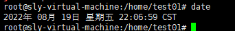
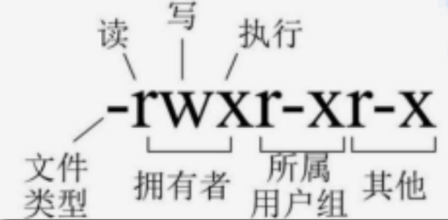

# 1. linux命令
> Linux 服务器端一般是命令行界面，通过命令和 linux 系统交互。通过命令进行各种操作。
## 1.1 磁盘管理
### 1.1.1  切换目录：cd 目录名
```text
1. 由当前目录切换到 /usr/local
例如：cd /usr/local
2. 回到根目录（类似于我的电脑）
例如：cd /
```
### 1.1.2 列出当前目录下的文件：ll、ls
```text
1. 列出目录下的详细内容（相当于 Windows 的列表查看）
例如：在当前目录下执行 ll
```

```text
2. 使用 ll 目录名 查看指定目录下的文件和目录列表
-rw-rw-rw - 表示文件
drw-rw-rw d 表示目录文件夹
```

```text
③ 只列出文件/目录名
例如：在当前目录执行 ls
```

### 1.1.3 显示当前所在目录位置： pwd
```text
例如：在当前目录下执行 pwd
```

## 1.2 文件管理
### 1.2.1 创建目录：mkdir 目录名
>例如：mkdir test


>查看创建的目录 ls


### 1.2.2 删除文件或目录 rm , rm –r
> 在 home 目录下测试  cd /hom
```text
1. 使用 rm 删除文件
新建空文件
touch my.txt
例如：rm my.txt
在 test01 目录执行 echo “ok” > my.txt 创建一个 my.txt 的文件
查看 cat my.txt
在执行 rm my.txt 回车后， 系统会提示是否删除确认
在提示位置输入 y ,表示同意，文件删除。 输入 n 取消删除操作。
```

```text
2. 不用确认的直接删除
例如： rm -f my.txt
```

```text
③ 删除目录
rm 目录
例如：rm -rf test01
rm 不加参数，不能删除目录
rm -rf test01 删除文件夹 r 表示递归删除， f不做确认提示
```

### 1.2.3 复制文件命令 cp ，cp -rf
```text
1. 复制文件：aa.txt 是新的文件名
语法：cp 被复制的文件名 新文件名
例如：cp anaconda-ks.cfg aa.txt
重复执行名，询问是否覆盖
输入“y”同意覆盖， 输入“n”取消操作
```

```text
2. 复制文件夹
语法：cp -rf 文件夹 新的文件夹名
例如 cp -rf myfolder newfolder
```

### 1.2.4 查看文件全部内容： cat 文件路径
> 例如：cat /root/anaconda-ks.cfg

### 1.2.5 分页查看文件内容：more 文件路径
>例如：more /root/anaconda-ks.cfg （命令输入完按 Enter）
屏幕底下，显示当前屏幕展示总内容的百分比


>按 Enter 之后


>按空格之后


### 1.2.6 查看文件开头的 n 行数据: head -n 数字
```text
1. 例如：head /root/anaconda-ks.cfg (默认是 10 行)
2. 例如显示文件开始的指定行数
```

### 1.2.7 显示文件尾部的 n 行数据 tail -n 数字 ，默认是 10 行
```text
1. 例如：tail /root/anaconda-ks.cfg
2. 例如：显示文件尾部指定的 n 行
```

### 1.2.8 文件内搜索: grep
```text
在文件中(可以多个文件同时)搜索字符串，可以使用正则表达式
语法： grep [参数] 搜索的字符串内容 文件名 1 [文件 n]
```
>1 搜索文本”java”：grep java my.txt
没有大写的“JAVA ”,默认是区分大小写的搜索


>2 搜索文本”java” 区分大小写：grep -i java my.txt -i：不区分大小写


>3 搜索的文本中有空格，使用引号括起来
例如 grep “java is” my.txt


>4 搜索整个单词，是其他字符串的一部分的不符合条件  -w ：搜索单词
搜索单词 java : grep -w java my.txt


>5 使用正则， 以 java 开头的行
例如 grep “^java” my.txt


> 6 在多个文件搜索
例如 grep java my.txt test.txt


>7 使用管道 “|”
例如： cat my.txt | grep java


## 1.3 系统设置
### 1.3.1 显示系统日期和时间：date
>显示系统当前时间


### 1.3.2 切换用户：su 用户名
**以其他用户身份使用系统，（类似 windows10 系统，有些程序以管理员身份执行）**
```text
1. 从 root 用户切换到普通用户
例如：以 root 用户登录系统，执行 su sly
注意命令提示符“#”变为“$” , root@sly-virtual-machine 变为
sly@sly-virtual-machine
```

```text
2. 从普通用户切换到 root 用户，需要输入 root 用户密码
例如 su root
Password 输入密码，linux 不显示输入的字符， 输入密码后直
接按“Enter”.
```
 
### 1.3.3 清除屏幕：clear
例如：clear
### 1.3.4 重启系统：reboot
例如：reboot
### 1.3.5 关机：shutdown -h now
例如：shutdown -h no
### 1.3.6 查看系统进程： ps -ef
```text
ps [命令参数]
常用参数：
-e :显示当前所有进程
-f :显示 UID,PPID,C 与 STIME 栏位信息
UID:拥有改程序的用户
PID:程序的进程 id
PPID:父进程的 id
C: CPU 使用的资源百分比
STIME :系统启动时间
TTY：登录系统的终端位置（客户端的标识）
TIME:使用掉的 CPU 时间
CMD:进程是有哪些程序启动的
```
```text
查看系统当前运行的进程（程序）
例如：在任意位置执行 ps -ef
```

```text
组合常用命令：ps -ef |grep 进程名称
例如：ps -ef | grep mysql
```

### 1.3.7 kill 进程：kill
```text
例如：
kill pid：杀掉进程
kill -9 pid 强制杀掉进程
不能随意使用，会被系统进程杀掉，程序不能使用
```

## 1.4 压缩/解压
### 1.4.1 tar 压缩（归档） 
```text
tar 用来压缩和解压文件, tar 压缩后的文件也叫归档文件。
语法: tar 参数 要压缩或解压的文件或目录
```
```text
常用参数：
z：使用压缩，生成的文件名是xxx.tar.gz这是linux中常用的压缩格式
c：创建压缩文档
v：显示压缩，解压过程中处理的文件名
f：指定归档的文件名，tar参数后面是归档的文件名
x：从归档文件中释放文件，就是解压
t：列出归档文件内容，查看文件内容
C：解压到指定目录，使用方式 -C 目录，C是大写
```
#### 1.4.1.1 创建归档文件（压缩）
```text
语法：tar -zcvf 归档文件名 要归档的文件列表
例如：tar -zcvf myfile.tar.gz my.txt
```

#### 1.4.1.2 归档多个文档
```text
例如：tar -zcvf myfile01.tar.gz my.txt my01.txt
```

```text
也可以使用通配符 * 表示要压缩的文件名的一部分
例如：tar -zcvf myfile02.tar.gz *.tx
```

#### 1.4.1.3 归档目录（即压缩目录）
```text
语法：tar -zcvf 归档文件名 归档目录
例如：tar -zcvf mypackge.tar.gz text01
```

### 1.4.2 查看归档（压缩）文件
```text
显示压缩文件的内容。
语法：tar -tf 归档文件名
t : 列出归档（压缩）文件的内容
f : 归档文件名
例如：tar -tf mypackge.tar.gz
```

### 1.4.3 tar解压
```text
解压：释放压缩的文件内容

语法：tar -zxvf 已归档的文件名
参数：x:解压，从归档文件中释放文件
    解压 mypackge.tar.gz
    语法：tar -zxvf mypagcke.tar.gz
```

## 1.5 网络通讯
### 1.5.1 查看 ip 信息： ifconfig或者ip addr
```text
语法 ifconfig
例如：在任意位置输入 ifconfig
```

```text
语法 ip addr
例如：在任意位置输入 ip addr
```

### 1.5.2 测试网络连通： ping
```text
语法： ping ip或者域名
例如：ping www.baidu.com
查看之后，ctrl+C，退出查看，回到 Linux 命令
```


## 1.6 网络访问
### 1.6.1 curl ：使用 url 访问网络的文件传输工具。
```text
curl 是利用 URL 语法在命令行方式下工作的开源文件传输工具
常用来①：测试网络访问；②：模拟用户访问
抓取百度的首页内容
例如：curl www.baidu.com
```

```text
模拟用户访问
例如：查询 studentId=5 的学生
```

### 1.6.2 wget :下载
```text
wget linux 上下载资源的工具，比如下载软件的安装包。一般软件都会给出一个下载地址
先安装 wget 命令：yum -y install wget
语法：wget 下载的资源的地址
例如：下载一个 tomcat 软件。
首先要得到 tomcat 的下载地址，同浏览器下载 tomcat，得到下载地址
```

>点击左侧 Download“Tomcat 9”


>不同的浏览器操作方式可能不同，选择复制下载地址


```text
tomcat 9的下载地址为：https://dlcdn.apache.org/tomcat/tomcat-9/v9.0.65/bin/apache-tomcat-9.0.65.tar.gz
在Linux中使用wget tomcat下载地址
粘贴地址提示：右键有 copy 按钮或者使用 shift + insert 快捷键   
```
## 1.7 权限管理
### 1.7.1 介绍
```text
权限指用户或程序能够对目录，文件执行的操作。
执行 ll 或 ls -l 显示文件和目录详细信
```

```text
- : 表示文件
l : 软链接文件（windows 快捷方式）
d: 目录
c: 字符设备文件，一次传输一个字节的设备被称为字符设备。例如键盘，鼠标

linux权限机制采用UGO模式。其中 u(user)表示所属用户、g(group)
表示所属组、o(other)表示除了所属用户、所属组之外的情况。
```

```text
A、 读权限：读取文件内容，对文件执行 cat ,more ,less 这样的查看命令，对目录来说可以读取目录中文件列表
r--read 读权限 4
B、 写权限：编辑、新增、修改文件内容
w--write 写权限 2
C、 执行权限：进入目录，访问目录中的文件内容。
x--execute 执行权限 1
D、 常见权限设置
rwx= 4 + 2 + 1 = 7
常见 644、755、777 三种权限
创建文件用户就是文件的拥有者，用户所在的组就是文件的所在组。除了创建文件的用户都是其他用户。root有最高的权限。
E、 权限的尝试
以 root 身份登录系统 ，执行 cd / 切换到根目录，再执行 ls -l , 查看 root 目录的权限如下
```

```text
表明其他用户对 root 目录没有任何权限，查看目录内容都不行。
实验：切换到 centos 普通用户，查看 root目录的内容
```

### 1.7.2 权限设置
#### 1.7.2.1 修改文件权限 chmod
```text
语法 chmod UGO 权限 文件/目录
例如: 先以 root 用户创建文件 aa.txt ,查看文件的权限，其他用户只
要 r 读的权限。centos 对 aa.txt 来说就是其他用户。
```

```text
adduser 时，创建用户的过程更像是一种人机对话，系统会提示你输入各种信息，然后会根据这些信息帮你创建新用户
adduser centos
passwd centos12345
锁定用户 centos 账号(重开一个 session 测试)
usermod -L centos 锁定后账号不可使用
解锁用户 centos 账号
usermod -U centos
切换到 centos 用户执行， cat aa.txt是没有问题的
```

```text
修改 aa.txt 内容，执行 vi aa.txt ,在保存文件后报错
```

```text
使用 root 用户给 centos 分配 w 权限。切换回 root 用户（root 用
户是 aa.txt 的拥有者）。分配权限方式：拥有者的不变 rw=6, 所在组
设置 0 没有权限，主要给其他用户设置 rw=6
```

> 切换到 centos


```text
注意要给 centos 分配对 aa.txt 的读（r）权限。否则不能查看文件内容
```

#### 1.7.2.2 修改文件拥有者 chown
```text
语法：chown 新的拥有者用户 被修改的文件
例如：修改原来 root 拥有的文件 aa.txt 改为 centos, 拥有者有操作的读写权限。
chown centos aa.txt
```

## 1.8 管道和重定向
### 1.8.1 重定向输出覆盖：>
```text
向文件输出内容，文件不存在则新建文件再输出；文件存在先清
空文件，再写入内容。
例如： echo “write some” > t1.txt
```

### 1.8.2 重定向输出追加
```text
向文件输出内容，文件不存在则新建文件再输出；文件存在先清 空文件，再写入内容。
例如： echo “write some” > t1.txt
```

```text
存在文件 t1.txt , 在原来内容的后面加入新的内容“hello new word”
```
### 1.8.3 管道 |
```text
管道就是用“|”连接两个命令，以前面一个命令的输出作为后面命令的输入，用于把管道左边的输出作为右边的输入。
例如：echo “hello linux” | grep “linux”
```

```text
查看某个进程是否存在
例如：ps -ef | grep "java"
```

## 1.9 vi和vim编辑器
```text
vi 是 linux 下标配的一个纯字符界面的文本编辑器，由于不是图形界面，相关的操作都要通过键盘输入命令来完成，需要记住一些常用的操作命令
vim 是 vi 的升级版本，完全兼容 vi，vim 也可以完全当成 vi 使用，vim 是在 vi 的基础上增加一些功能，比如语法着色等
```
### 1.9.1 启动vi编辑器
```text
语法：vi 文件名
说明：如果文件存在，则打开该文件，如果参文件不存在，则会新建该文件（不是立即创建，而是在保存的时候创建）
```
### 1.9.2 vi常用操作
> vi 操作分为**命令模式和编辑模式**
```text
命令模式：按 Esc 键，进入命令模式，命令模式下无法编辑
编辑模式：按 a 或者 i 字母键，进入编辑模式（此时，底部会出现insert）。
在命令模式下按 :wq (冒号键 w 键 q 键)保存退出，按 :q! 不保存退出。
从命令模式进入编辑模式按 a 或者 i 字母键。
从编辑模式进入命令模式按 Esc 键。
编辑文件命令
1) dd：删除光标所在行
2) yy：复制光标所在行到缓冲区
3) p：粘贴缓冲区中的内容
4) gg：光标回到文件第一行
5) GG：光标回到文件最后一行
6) ^ ：光标移动至当前行的行首
7) $ ：光标移动至当前行的行尾
8) /关键字：按斜杠/键，可以输入想搜索的字符，然后确定进行搜索，如果第一次查找的关键字不是想要的，可以一直按 n 键往后查找到想要的关键字为止
```
## 1.10 安装软件命令