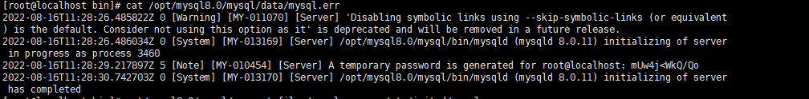

# 1 linux下安装mysql
## 1.1 Linux系列--安装mysql8.0压缩版
### 1.1.1 下载方式
```text
两种下载方式：  
(1)百度网盘下载地址 : https://pan.baidu.com/s/1tIVzHutWJBk06mytO8rtJQ 	
	提取码：j67l  
(2)官网下载地址：https://dev.mysql.com/downloads/mysql/
```

### 1.1.2 将下载的压缩包放到linux某个文件夹目录下
```text
这里我放到了/opt/mysql8.0 目录下 
```

### 1.1.3 然后cd 切换到存放mysql的路径下
```text
cd /opt/mysql8.0/
```
### 1.3.4 解压mysql文件到当前目录
```text
tar -zxvf mysql-8.0.11-linux-glibc2.12-x86_64.tar.gz
```
### 1.3.5 重命名解压缩文件名
```text
mv mysql-8.0.11-linux-glibc2.12-x86_64/opt/mysql8.0/mysql 
```
### 1.3.6 创建mysql用户组和用户并修改权限
```text
groupadd mysql 
useradd -r -g mysql mysql 
```
### 1.3.7 创建数据目录并赋予权限
```text
mkdir -p /opt/mysql8.0/mysql/data #创建目录 
chown mysql:mysql -R /opt/mysql8.0/mysql/data/ #赋予权限 
```
### 1.3.8 配置my.cnf
```text
vim /etc/my.cnf 
```
```text
[mysqld]
bind-address=0.0.0.0
port=3306
user=mysql
basedir=/opt/mysql8.0/mysql
datadir=/opt/mysql8.0/mysql/data
socket=/tmp/mysql.sock
log-error=/opt/mysql8.0/mysql/data/mysql.err
pid-file=/opt/mysql8.0/mysql/data/mysql.pid
#character config
character_set_server=utf8mb4
symbolic-links=0
explicit_defaults_for_timestamp=true

sql_mode='STRICT_TRANS_TABLES,NO_ZERO_IN_DATE,NO_ZERO_DATE,ERROR_FOR_DIVISION_BY_ZERO,NO_ENGINE_SUBSTITUTION'
```
```text
按Esc键 然后输入:wq 保存后退出 
```
### 1.3.9 初始化数据库
#### 1.3.9.1 进入mysql的bin目录
```text
cd /opt/mysql8.0/mysql/bin/ 
```
#### 1.3.9.2 初始化mysql
```text
./mysqld --defaults-file=/etc/my.cnf --basedir=/opt/mysql8.0/mysql/ --datadir=/opt/mysql8.0/mysql/data/ --user=mysql --initialize 
```
#### 1.3.9.3 查看密码
```text
cat /opt/mysql8.0/mysql/data/mysql.err 
```

#### 1.3.9.4 linux 上设置mysql开机自启
##### 1.3.9.4.1 将mysql.server放置到/etc/init.d/mysql中
```text
cp /opt/mysql8.0/mysql/support-files/mysql.server /etc/init.d/mysql
```
##### 1.3.9.4.2 复制成功后我们需要给赋予权限
```text
chmod +x /etc/init.d/mysql
```
##### 1.3.9.4.3 添加为服务
```text
chkconfig --add mysql
```
##### 1.3.9.4.4 查看服务列表
```text
chkconfig --list
```
##### 1.3.9.4.5 看到3、4、5状态为开或者为 on 则表示成功。 如果是 关或者 off 则执行一下
```text
chkconfig --level 345 mysqld on
```
##### 1.3.9.4.6 重启计算机:reboot
> 再次查看服务列表或者查看3306端口号
#### 1.3.9.5 启动mysql
```text
service mysql start 
```
#### 1.3.9.6 修改密码（必须先启动mysql才能修改）
> 首先登录mysql，前面的那个是随机生成的。在mysql的bin目录下执行
```text
./mysql -u root -p #bin目录下 
```
> 这里的密码是上面获取的密码
#### 1.3.9.7 登录成功后

#### 1.3.9.8 执行修改密码操作
```text
alter user user() identified by 'root'; 
(或者alter user 'root'@'localhost' identified by 'root';)
FLUSH PRIVILEGES; #刷新mysql 
```
### 1.3.10 到这一步后，用navicat链接会发现无法连接

### 1.3.11 出现这个问题是因为host没有对完开放
```text
use mysql 										#访问mysql库 
update user set host = '%' where user = 'root'; #使root能再任何host访问 
FLUSH PRIVILEGES; 								#刷新 
```
> mysql 8.0以上
```text
GRANT ALL PRIVILEGES ON *.* TO 'root'@'%';
ALTER USER 'root'@'%' IDENTIFIED WITH mysql_native_password BY 'root';
```

### 1.3.12 到这一步就能正常连接了在这里插入图片描述
### 1.3.13 如果不希望每次都到bin目录下使用mysql命令则执行以下命令
```text
ln -s /home/local/mysql/bin/mysql /usr/bin 
```
### 1.3.14 如navicat连接依旧报错

>此时是因为linux防火墙未关，需要关闭linux的防火墙,关闭后连接成功
```text
# 启动防火墙
service iptables start
# 停止防火墙
service iptables stop
# 重启防火墙
service iptables restart
# 查看防火墙状态
service iptables status
# 开机自动启动
chkconfig iptables on
# 关闭开机启动
chkconfig iptables off
# 保存
service iptables save
# 重新加载
service iptables reload
# 规则列表
chkconfig --list iptables
```

## 1.2 Linux系列--yum安装mysql8.0