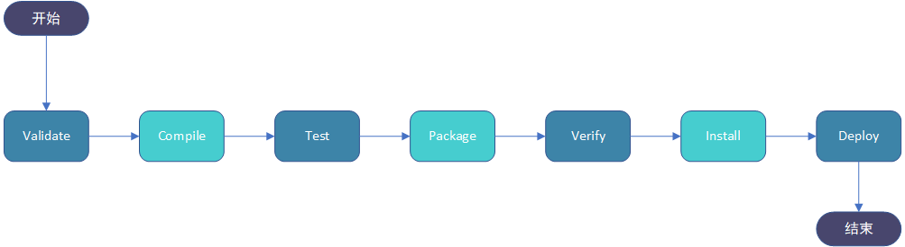

## Maven
### 本地仓库
运行 Maven 的时候，Maven 所需要的任何构件都是直接从本地仓库获取的。如果本地仓库没有，它会首先尝试从远程仓库下载构件至本地仓库，然后再使用本地仓库的构件。

### 远程仓库
如果 Maven 在中央仓库中也找不到依赖的文件，它会停止构建过程并输出错误信息到控制台。为避免这种情况，Maven 提供了远程仓库的概念，它是开发人员自己定制仓库，包含了所需要的代码库或者其他工程中用到的 jar 文件。

### Maven 依赖搜索顺序

当我们执行 Maven 构建命令时，Maven 开始按照以下顺序查找依赖的库：
>步骤 1 － 在本地仓库中搜索，如果找不到，执行步骤 2，如果找到了则执行其他操作。
> 
>步骤 2 － 在中央仓库中搜索，如果找不到，并且有一个或多个远程仓库已经设置，则执行步骤 4，如果找到了则下载到本地仓库中以备将来引用。
> 
>步骤 3 － 如果远程仓库没有被设置，Maven 将简单的停滞处理并抛出错误（无法找到依赖的文件）。
> 
>步骤 4 － 在一个或多个远程仓库中搜索依赖的文件，如果找到则下载到本地仓库以备将来引用，否则 Maven 将停止处理并抛出错误（无法找到依赖的文件）。

### Maven 阿里云(Aliyun)仓库
Maven 仓库默认在国外， 国内使用难免很慢，我们可以更换为阿里云的仓库。

    <mirror>
      <id>aliyunmaven</id>
      <mirrorOf>*</mirrorOf>
      <name>阿里云公共仓库</name>
      <url>https://maven.aliyun.com/repository/public</url>
    </mirror>

### 代理仓库
代理可在 <repositories></repositories> 节点中加入对应的仓库使用地址。
spring 代理仓如下：

    <repository>
      <id>spring</id>
      <url>https://maven.aliyun.com/repository/spring</url>
      <releases>
        <enabled>true</enabled>
      </releases>
      <snapshots>
        <enabled>true</enabled>
      </snapshots>
    </repository>

### Maven 构建生命周期

| 阶段           | 处理     | 描述                            |
|--------------|:-------|-------------------------------|
| 验证 validate  | 验证项目   | 验证项目是否正确且所有必须信息是可用的。          |
| 编译 compile   | 执行编译   | 源代码编译在此阶段完成。                  |
| 测试 Test      | 测试     | 使用适当的单元测试框架（例如JUnit）运行测试。     |
| 包装 package   | 打包     | 创建JAR/WAR包如在 pom.xml 中定义提及的包。 |
| 检查 verify    | 检查象    | 对集成测试的结果进行检查，以保证质量达标。         |
| 安装 install   | 安装     | 对集成测试的结果进行检查，以保证质量达标。         |
| 部署 deploy    | 部署     | 拷贝最终的工程包到远程仓库中，以共享给其他开发人员和工程。 |
