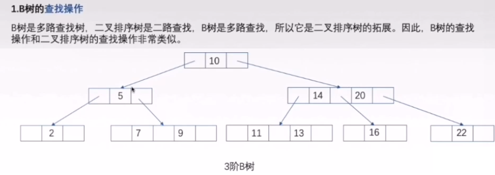
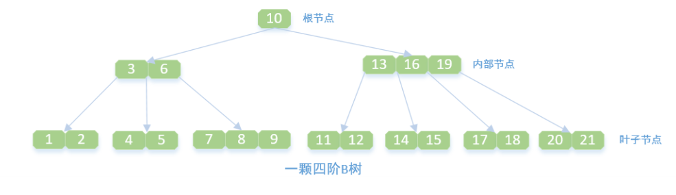

# 1. 索引的本质

> 为什么不使用hash表？
>
> 哈希值是散列分布的，无序的，不能进行范围查找

> 为什么不用二叉树或红黑树？
>
>第一 随着数据量的增大，层级越多，查询速度越慢
>
>第二 等于查询速度影响不大，但是范围查询比如大于或小于某数据时，如果数据量比较多，那么回旋去查询这些数据的效率就会很慢

> 高度明显比二叉树少，查询速度是很快的
>
>b树解决了树高度的问题，树越矮他的查找速度就越快，但回旋查找的问题还是存在的

> b+树解决了回旋查找问题
>
>非叶子节点只存储key，叶子节点既存key也存value（数据地址）
>
>由于父节点的元素都出现在子节点中，因此所有的叶子节点包含了全部元素信息，并且每一个叶子节点都带有指向下一个节点的指针，形成了一个有序链表

## B树

> 一棵m阶B树是一棵平衡的m路搜索树，它或者是空树，或者是满足下列性质的树：
>
>树中每个结点至多有m棵子树。(即至多含有m-1个关键字，两颗子树指针夹着一个关键字)；
>
>若根结点不是终端结点（非叶子节点的根节点），则至少有两颗子树。(至少一个关键字)；
>
>除根结点外的所有非叶子结点至少有[m/2]棵子树。(即至少含有[m/2]-1个关键字)；
>
>所有的叶子结点出现在同一个层次上，不带信息。(就像是折半查找判断树中查找失败的结点)。
>
>每一个结点中的关键字满足从左到右依次增大的规则。

> B+树是B树的一个修改或者改版：
>
>n棵子树的节点包含n个关键字，不用来保存数据而是保存数据的索引。
>
>所有的叶子结点中包含了全部关键字的信息，及指向含这些关键字记录的指针，且叶子结点本身依关键字的大小自小而大顺序链接。
>
>所有的非终端结点可以看成是索引部分，结点中仅含其子树中的大（或小）关键字。
>
>B+树中，数据对象的插入和删除仅在叶节点上进行。
>
>B+树有2个头指针，一个是树的根节点，一个是小关键码的叶节点。