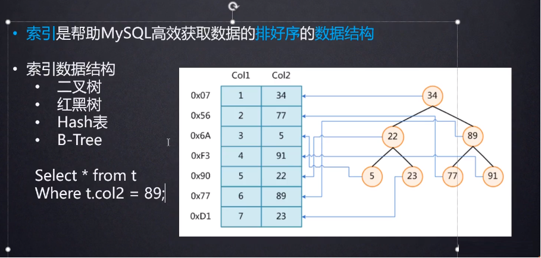
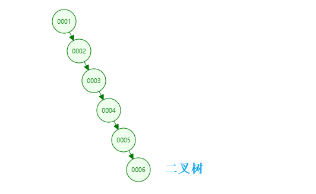
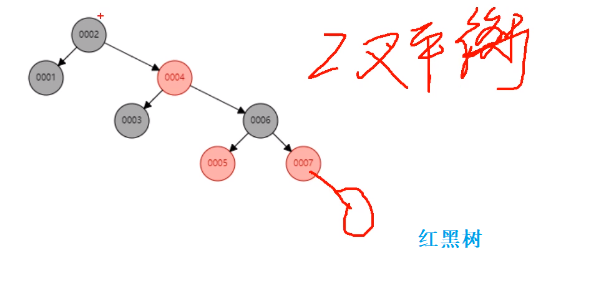
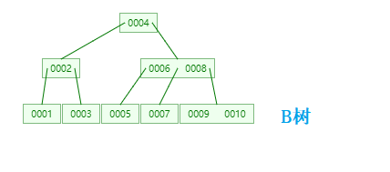
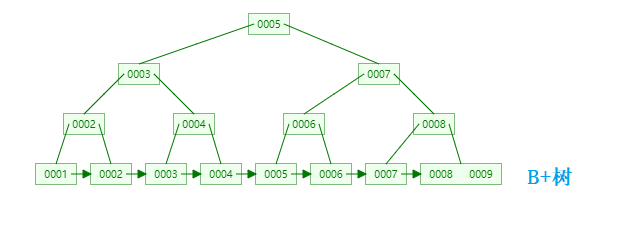

# 1. 索引的本质

>为什么不用二叉树或红黑树？
>
>第一 随着数据量的增大，层级越多，查询速度越慢
>
>第二 等于查询速度影响不大，但是范围查询比如大于或小于某数据时，如果数据量比较多，那么回旋去查询这些数据的效率就会很慢

>高度明显比二叉树少，查询速度是很快的
> 
>b树解决了树高度的问题，树越矮他的查找速度就越快，但回旋查找的问题还是存在的

>b+树解决了回旋查找问题
>
>非叶子节点只存储key，叶子节点既存key也存value（数据地址）
>
>由于父节点的元素都出现在子节点中，因此所有的叶子节点包含了全部元素信息，并且每一个叶子节点都带有指向下一个节点的指针，形成了一个有序链表