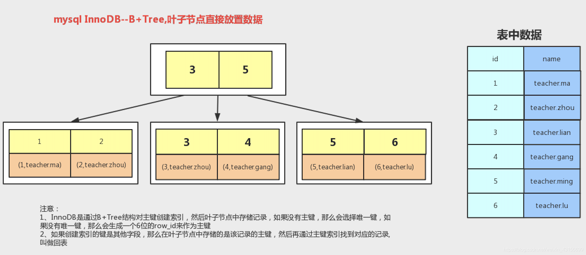
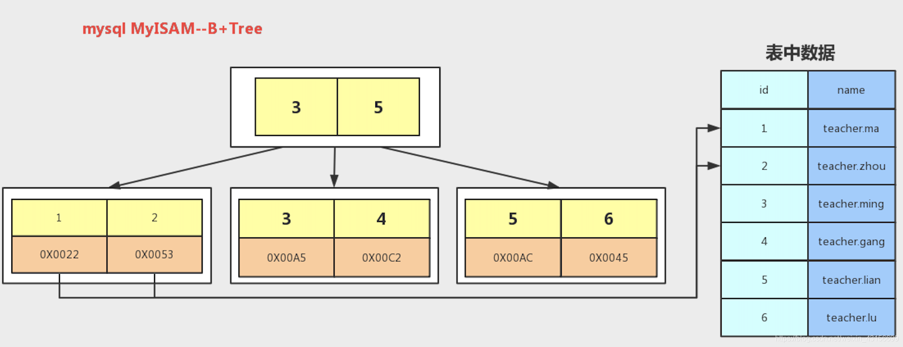

## B树

## B+树

## InnoDB

## MyISAM

## B+ 树比B树更适合索引？

**1）B+树的磁盘读写代价更低**
>B+树的内部结点并没有指向关键字具体信息的指针。因此其内部结点相对B 树更小。如果把所有同一内部结点的关键字存放在同一盘块中，那么盘块所能容纳的关键字数量也越多。一次性读入内存中的需要查找的关键字也就越多。相对来说IO读写次数也就降低了；

**2）B+树查询效率更加稳定**
>由于非终结点并不是最终指向文件内容的结点，而只是叶子结点中关键字的索引。所以任何关键字的查找必须走一条从根结点到叶子结点的路。所有关键字查询的路径长度相同，导致每一个数据的查询效率相当；

**3）B+树便于范围查询（最重要的原因，范围查找是数据库的常态）**
>B树在提高了IO性能的同时并没有解决元素遍历的我效率低下的问题，正是为了解决这个问题，B+树应用而生。B+树只需要去遍历叶子节点就可以实现整棵树的遍历。而且在数据库中基于范围的查询是非常频繁的，而B树不支持这样的操作或者说效率太低。

**补充：B树的范围查找用的是中序遍历，而B+树用的是在链表上遍历。**

