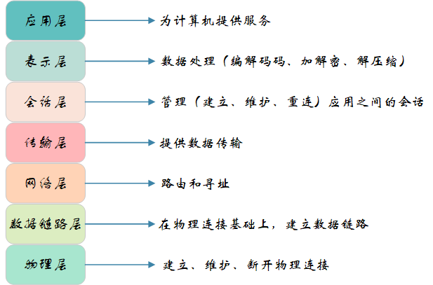
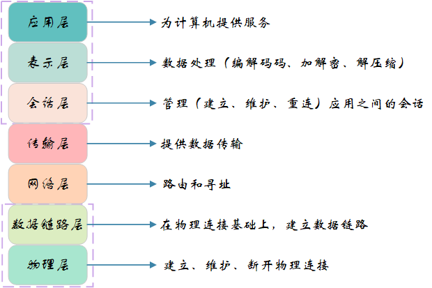
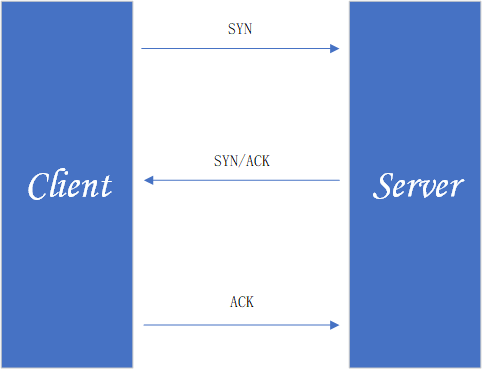

# 网络编程

## 计算机网络体系架构

### OSI七层模型

OSI七层模型是国际标准化组织提出一个网络分层模型。

    应用层：通过应用进程之间的交互来完成特定网络应用，应用层协议定义的是应用进程间通信和交互的规则，常见的协议有：HTTP FTP  SMTP SNMP DNS.
    表示层：数据的表示、安全、压缩。确保一个系统的应用层所发送的信息可以被另一个系统的应用层读取。
    会话层：建立、管理、终止会话，是用户应用程序和网络之间的接口。
    传输层：提供源端与目的端之间提供可靠的透明数据传输，传输层协议为不同主机上运行的进程提供逻辑通信。
    网络层：将网络地址翻译成对应的物理地址，实现不同网络之间的路径选择, 协议有 ICMP IGMP IP 等.
    数据链路层：在物理层提供比特流服务的基础上，建立相邻结点之间的数据链路。
    物理层：建立、维护、断开物理连接。

### TCP/IP 四层模型

TCP/IP 是实际上的网络通信模型。

    应用层：对应于 OSI 参考模型的（应用层、表示层、会话层）。主要提供两个终端设备上的应用程序之间信息交换的服务
    传输层: 对应 OSI 的传输层，为应用层实体提供端到端的通信功能，保证了数据包的顺序传送及数据的完整性。
           主要任务就是负责向两台终端设备进程之间的通信提供通用的数据传输服务
    网际层：对应于 OSI 参考模型的网络层，主要解决主机到主机的通信问题。
    网络接口层：与 OSI 参考模型的数据链路层、物理层对应。

### 网络协议

<table>
    <tr>
        <td>OSI七层模型</td> 
        <td>TCP/IP 四层模型</td> 
        <td>对应的网络协议</td> 
    </tr>
    <tr>
        <td>应用层</td> 
        <td  rowspan="3">应用层</td> 
        <td>HTTP、DNS、FTP、Telnet</td> 
    </tr>
    <tr>
         <td>表示层</td>
         <td>TIFF、GIF、JPEG、PICT</td>   
    </tr>
    <tr>
         <td>会话层</td>
         <td>RPC、SQL、NFS、NetBIOS</td>   
    </tr>
    <tr>
        <td>传输层</td>
        <td>传输层</td>
        <td>TCP、UDP</td>   
    </tr>
    <tr>
        <td>网络层</td>
        <td>网络层</td>
        <td> IP、ICMP、ARP、RAPP、RIP</td>   
    </tr>
    <tr>
        <td>数据链路层</td>
        <td rowspan="2">网络接口层</td>
        <td> FDDI、HDLC</td>   
    </tr>
    <tr>
        <td>物理层</td>
        <td> EIA/TIA-232、EIA/TIA-499</td>   
    </tr>
</table>

### TCP三次握手和四次挥手
三次握手的目的是建立可靠的通信信道，简单来说就是数据的发送与接收，而三次握手最主要的目的就是双方确认自己与对方的发送与接收是正常的。

    第一次握手：Client 什么都不能确认；Server 确认了对方发送正常，自己接收正常
    
    第二次握手：Client 确认了：自己发送、接收正常，对方发送、接收正常；Server 确认了：对方发送正常，自己接收正常
    
    第三次握手：Client 确认了：自己发送、接收正常，对方发送、接收正常；Server 确认了：自己发送、接收正常，对方发送、接收正常

