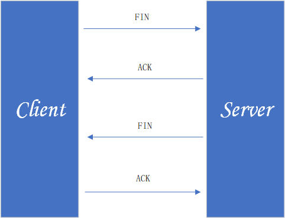
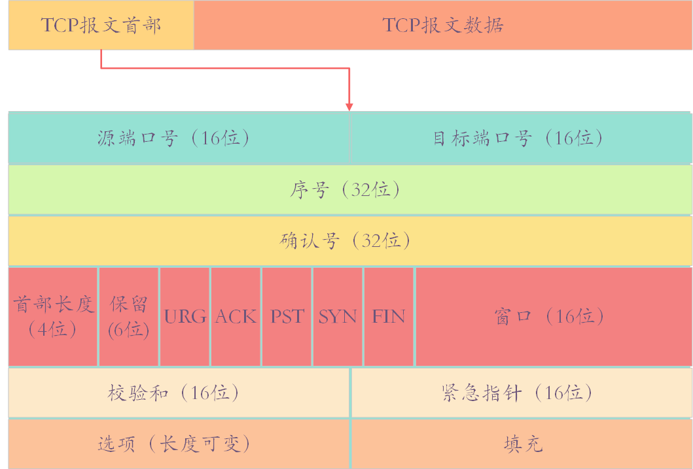

# 网络编程

## 计算机网络体系架构

### OSI七层模型

OSI七层模型是国际标准化组织提出一个网络分层模型。

    应用层：通过应用进程之间的交互来完成特定网络应用，应用层协议定义的是应用进程间通信和交互的规则，常见的协议有：HTTP FTP  SMTP SNMP DNS.
    表示层：数据的表示、安全、压缩。确保一个系统的应用层所发送的信息可以被另一个系统的应用层读取。
    会话层：建立、管理、终止会话，是用户应用程序和网络之间的接口。
    传输层：提供源端与目的端之间提供可靠的透明数据传输，传输层协议为不同主机上运行的进程提供逻辑通信。
    网络层：将网络地址翻译成对应的物理地址，实现不同网络之间的路径选择, 协议有 ICMP IGMP IP 等.
    数据链路层：在物理层提供比特流服务的基础上，建立相邻结点之间的数据链路。
    物理层：建立、维护、断开物理连接。

### TCP/IP 四层模型

TCP/IP 是实际上的网络通信模型。

    应用层：对应于 OSI 参考模型的（应用层、表示层、会话层）。主要提供两个终端设备上的应用程序之间信息交换的服务
    传输层: 对应 OSI 的传输层，为应用层实体提供端到端的通信功能，保证了数据包的顺序传送及数据的完整性。
           主要任务就是负责向两台终端设备进程之间的通信提供通用的数据传输服务
    网际层：对应于 OSI 参考模型的网络层，主要解决主机到主机的通信问题。
    网络接口层：与 OSI 参考模型的数据链路层、物理层对应。

### 网络协议

<table>
    <tr>
        <td>OSI七层模型</td> 
        <td>TCP/IP 四层模型</td> 
        <td>对应的网络协议</td> 
    </tr>
    <tr>
        <td>应用层</td> 
        <td  rowspan="3">应用层</td> 
        <td>HTTP、DNS、FTP、Telnet</td> 
    </tr>
    <tr>
         <td>表示层</td>
         <td>TIFF、GIF、JPEG、PICT</td>   
    </tr>
    <tr>
         <td>会话层</td>
         <td>RPC、SQL、NFS、NetBIOS</td>   
    </tr>
    <tr>
        <td>传输层</td>
        <td>传输层</td>
        <td>TCP、UDP</td>   
    </tr>
    <tr>
        <td>网络层</td>
        <td>网络层</td>
        <td> IP、ICMP、ARP、RAPP、RIP</td>   
    </tr>
    <tr>
        <td>数据链路层</td>
        <td rowspan="2">网络接口层</td>
        <td> FDDI、HDLC</td>   
    </tr>
    <tr>
        <td>物理层</td>
        <td> EIA/TIA-232、EIA/TIA-499</td>   
    </tr>
</table>

### TCP三次握手和四次挥手
#### 三次握手
三次握手的目的是建立可靠的通信信道，简单来说就是数据的发送与接收，而三次握手最主要的目的就是双方确认自己与对方的发送与接收是正常的。

    第一次握手：Client 什么都不能确认；Server 确认了对方发送正常，自己接收正常
    
    第二次握手：Client 确认了：自己发送、接收正常，对方发送、接收正常；Server 确认了：对方发送正常，自己接收正常
    
    第三次握手：Client 确认了：自己发送、接收正常，对方发送、接收正常；Server 确认了：自己发送、接收正常，对方发送、接收正常

#### 四次挥手

数据传输完毕后，双方需要释放连接，通过四次挥手断开。 

    第一次挥手：Client 发送断开连接请求 FIN，进入FIN-WAIT状态。
    第二次挥手：Server 收到请求，发回一个ACK告诉client收到。
    第三次挥手：Server 发送断开连接请求 FIN，进入FIN-WAIT状态。
    第四次挥手：Client 收到请求，发回一个ACK告诉Server收到。client关闭，server 收到确认，server 关闭。

### TCP报文组成

TCP报文主要由TCP报文首部和TCP报文数据组成。

>**16 位端口号**：源端口号，主机该报文段是来自哪里；目标端口号，要传给哪个上层协议或应用程序
> 
>**32 位序号**：一次 TCP 通信（从 TCP 连接建立到断开）过程中某一个传输方向上的字节流的每个字节的编号。
>
>**32 位确认号**：用作对另一方发送的 tcp 报文段的响应。其值是收到的 TCP 报文段的序号值加 1。
>
>**4 位首部长度**：表示 tcp 头部有多少个 32bit 字（4 字节）。因为 4 位最大能标识 15，所以 TCP 头部最长是 60 字节。
>
>**6 位标志位**：URG(紧急指针是否有效)，ACk（表示确认号是否有效），PST（缓冲区尚未填满），RST（表示要求对方重新建立连接），SYN（建立连接消息标志接），FIN（表示告知对方本端要关闭连接了）
>
>**16 位窗口大小**：是 TCP 流量控制的一个手段。这里说的窗口，指的是接收通告窗口。它告诉对方本端的 TCP 接收缓冲区还能容纳多少字节的数据，这样对方就可以控制发送数据的速度。
>
>**16 位校验和**：由发送端填充，接收端对 TCP 报文段执行 CRC 算法以检验 TCP 报文段在传输过程中是否损坏。注意，这个校验不仅包括 TCP 头部，也包括数据部分。这也是 TCP 可靠传输的一个重要保障。
>
>**16 位紧急指针**：一个正的偏移量。它和序号字段的值相加表示最后一个紧急数据的下一字节的序号。因此，确切地说，这个字段是紧急指针相对当前序号的偏移，不妨称之为紧急偏移。TCP 的紧急指针是发送端向接收端发送紧急数据的方法。

###  TCP 和 UDP 的区别
**TCP 是面向连接，而 UDP 是无连接。**
<table>
    <tr>
        <td rowspan="2">类型</td> 
        <td colspan="3">特点</td> 
        <td colspan="2">性能</td> 
        <td rowspan="2">应用场景</td> 
        <td rowspan="2">首部字节</td> 
    </tr>
    <tr>
        <td>是否面向连接</td> 
        <td>传输可靠性</td> 
        <td>传输形式</td> 
        <td>传输效率</td> 
        <td>所需资源</td> 
    </tr>
    <tr>
        <td>TCP</td>
        <td>面向连接</td>   
        <td>可靠</td>  
        <td>字节流</td>   
        <td>慢</td>   
        <td>多</td>   
        <td>文件传输、邮件传输</td>  
        <td>20-60</td>  
    </tr>
    <tr>
        <td>UDP</td>
        <td>无连接</td>   
        <td>不可靠</td>  
        <td>数据报文段</td>   
        <td>快</td>   
        <td>少</td>   
        <td>即时通讯、域名转换</td>  
        <td>8</td>  
    </tr>
</table>

### 一个HTTP请求经历的过程
1.DNS 解析：获取域名对应的Ip

2.TCP 连接：与服务器建立TCP连接

3.发送 HTTP 请求

4.服务器处理请求并返回 HTTP 报文

5.浏览器解析渲染页面

6.连接结束

### Cookie 和 Session
Cookie 和 Session 都是用来跟踪浏览器用户身份的会话方式。
#### Cookie 
Cookie 是保存在客户端的一小块文本串的数据。
一般用来保存用户信息，如网站的保持登录，就是将token存储到cookie里，每次请求携带此token就可识别出用户的状态。

#### Session
Session 是服务器和客户端一次会话的过程，通过服务端记录用户的状态。
如商品到购物车的时候，会为此用户创建特定的session，之后就可以标识此用户了。

#### Cookie 和 Session 的区别

>**存储位置不一样**，Cookie 保存在客户端，Session 保存在服务器端。
>
>**存储数据类型不一样**，Cookie 只能保存 ASCII，Session 可以存任意数据类型，一般情况下我们可以在 Session 中保持一些常用变量信息，比如说 UserId 等。
>
>**有效期不同**，Cookie 可设置为长时间保持，比如我们经常使用的默认登录功能，Session 一般有效时间较短，客户端关闭或者 Session 超时都会失效。
>
>**隐私策略不同**，Cookie 存储在客户端，比较容易遭到不法获取，早期有人将用户的登录名和密码存储在 Cookie 中导致信息被窃取；Session 存储在服务端，安全性相对 Cookie 要好一些。
>
>**存储大小不同**，单个 Cookie 保存的数据不能超过 4K，Session 可存储数据远高于 Cookie。

#### Session分布式下处理
分布式环境下，如客户端请求经过负载均衡，一般使用 Redis 等分布式缓存来存储 Session，在多台服务器之间共享。

