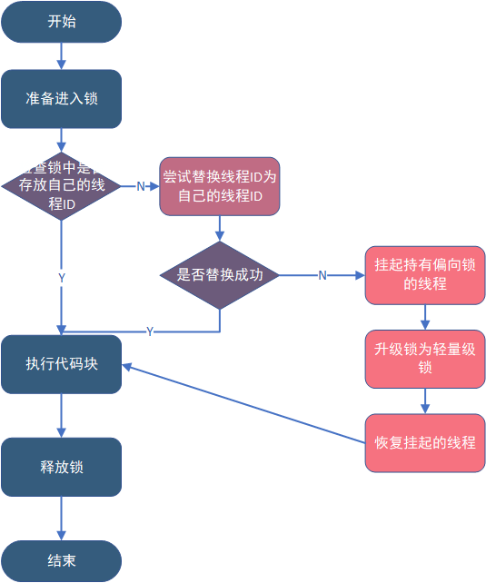

# 锁
Java多线程的锁都是基于对象的。

## 四种锁状态
根据锁的等级，由低到高分为四种状态。
### 无锁
无锁就是没有对资源进行锁定，任何线程都可以尝试去修改它。
### 偏向锁
偏向锁会偏向于第一个访问锁的线程，如果在接下来的运行过程中，该锁没有被其他的线程访问，则持有偏向锁的线程将永远不需要触发同步。
简单说就是一个while(true)。
#### 实现
一个线程在第一次进入同步块时，会在对象头和栈帧中的锁记录里存储锁的偏向线程ID。当下次该线程进入这个同步块时，会去检查锁的Mark Word里面是不是放的自己的线程ID。

**if(是)**{

该线程已经获得了锁，以后该线程在进入和退出同步块时不需要花费CAS操作来加锁和解锁。

}

**if(否)**{

就代表有另一个线程来竞争这个偏向锁。这个时候会尝试使用CAS来替换Mark Word里面的线程ID为新线程的ID。

    if(成功){
    
        表示之前的线程不存在了， Mark Word里面的线程ID为新线程的ID，锁不会升级，仍然为偏向锁；
    }else{
        表示之前的线程仍然存在，那么暂停之前的线程，设置偏向锁标识为0，并设置锁标志位为00，升级为轻量级锁，会按照轻量级锁的方式进行竞争锁。
    }
}

偏向锁竞争过程如下

    偏向锁升级成轻量级锁时，会暂停拥有偏向锁的线程，重置偏向锁标识
### 轻量级锁

多个线程在不同时段获取同一把锁，即不存在锁竞争的情况，也就没有线程阻塞。
JVM采用轻量级锁来避免线程的阻塞与唤醒。

#### 实现
JVM会为每个线程在当前线程的栈帧中创建用于存储锁记录的空间，我们称为Displaced Mark Word。如果一个线程获得锁的时候发现是轻量级锁，会把锁的Mark Word复制到自己的Displaced Mark Word里面。
然后线程尝试用CAS将锁的Mark Word替换为指向锁记录的指针。如果成功，当前线程获得锁，如果失败，表示Mark Word已经被替换成了其他线程的锁记录，说明在与其它线程竞争锁，当前线程就尝试使用自旋来获取锁。

    简单说就是一个线程获得锁会尝试用一根线把锁和线程栓到一起。成功则获得，失败则表示有其他线程抢。 有线程抢他会不断尝试。（使用适应性自旋）
如果自旋到一定程度（和JVM、操作系统相关），依然没有获取到锁，称为自旋失败，那么这个线程会阻塞。同时这个锁就会升级成重量级锁。
#### 轻量级锁的释放
在释放锁时，当前线程会使用CAS操作将Displaced Mark Word的内容复制回锁的Mark Word里面。如果没有发生竞争，那么这个复制的操作会成功。如果有其他线程因为自旋多次导致轻量级锁升级成了重量级锁，那么CAS操作会失败，此时会释放锁并唤醒被阻塞的线程。
### 重量级锁

重量级锁依赖于操作系统的互斥量（mutex） 实现的，而操作系统中线程间状态的转换需要相对比较长的时间，所以重量级锁效率很低，但被阻塞的线程不会消耗CPU。

当多个线程同时请求某个对象锁时，对象锁会设置几种状态用来区分请求的线程：

    Contention List：所有请求锁的线程将被首先放置到该竞争队列
    Entry List：Contention List中那些有资格成为候选人的线程被移到Entry List
    Wait Set：那些调用wait方法被阻塞的线程被放置到Wait Set
    OnDeck：任何时刻最多只能有一个线程正在竞争锁，该线程称为OnDeck
    Owner：获得锁的线程称为Owner
    !Owner：释放锁的线程
当一个线程尝试获得锁时，如果该锁已经被占用，则会将该线程封装成一个ObjectWaiter对象插入到Contention List的队列的队首，然后调用park函数挂起当前线程。

当线程释放锁时，会从Contention List或EntryList中挑选一个线程唤醒，被选中的线程叫做Heir presumptive即假定继承人，假定继承人被唤醒后会尝试获得锁。

### 锁升级流程
>1.检查MarkWord里面是不是放的自己的ThreadId ,如果是，表示当前线程是处于 “偏向锁” 。
>
>2.如果MarkWord不是自己的ThreadId，锁升级，这时候，用CAS来执行切换，新的线程根据MarkWord里面现有的ThreadId，通知之前线程暂停，之前线程将Markword的内容置为空。
>
>3.两个线程都把锁对象的HashCode复制到自己新建的用于存储锁的记录空间，接着开始通过CAS操作， 把锁对象的MarKword的内容修改为自己新建的记录空间的地址的方式竞争MarkWord。
>
>4.第三步中成功执行CAS的获得资源，失败的则进入自旋 。
>
>5.自旋的线程在自旋过程中，成功获得资源(即之前获的资源的线程执行完成并释放了共享资源)，则整个状态依然处于 轻量级锁的状态，如果自旋失败 。
>
>6.进入重量级锁的状态，这个时候，自旋的线程进行阻塞，等待之前线程执行完成并唤醒自己。

### 锁对比
| 锁名称| 优点   | 缺点                   | 适用场景 |
|------------|:-----|----------------------|------|
|偏向锁 |加锁和解锁不需要额外的消耗，和执行非同步方法比仅存在纳秒级的差距。| 如果线程间存在锁竞争，会带来额外的锁撤销的消耗。 |适用于只有一个线程访问同步块场景。|
|轻量级锁|竞争的线程不会阻塞，提高了程序的响应速度。|如果始终得不到锁竞争的线程使用自旋会消耗CPU。|追求响应时间。同步块执行速度非常快。|
|重量级锁|线程竞争不使用自旋，不会消耗CPU。|	线程竞争不使用自旋，不会消耗CPU。|追求吞吐量。同步块执行时间较长。|
