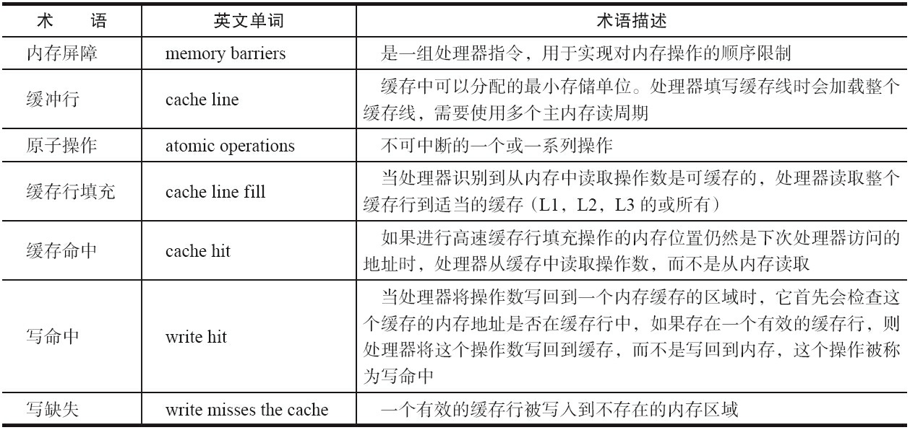
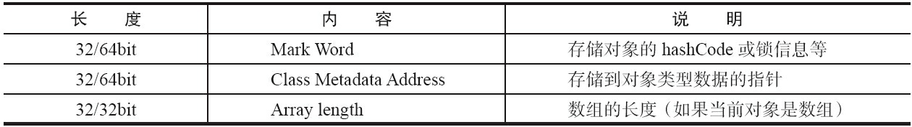

# 1.并发编程的问题
 
## 1.1 多线程一定快吗
>**不一定**
>
> 线程有创建和上下文切换的开销
>  
## 1.2 上下文切换
>即使是单核处理器也支持多线程执行代码，CPU通过给每个线程分配CPU时间片来实现
这个机制。
> 
> 时间片是CPU分配给各个线程的时间，因为时间片非常短，所以CPU通过不停地切
换线程执行，让我们感觉多个线程是同时执行的，时间片一般是几十毫秒（ms）。
> 
> CPU通过时间片分配算法来循环执行任务，当前任务执行一个时间片后会切换到下一个
任务。但是，在切换前会保存上一个任务的状态，以便下次切换回这个任务时，可以再加载这
个任务的状态。
> 
> > 所以任务从保存到再加载的过程就是一次**上下文切换**。 

## 1.3 如何减少上下文切换
>**无锁并发编程、CAS算法、使用最少线程和使用协程**
### 1.3.1 无锁并发编程
>**无锁并发编程。** 多线程竞争锁时，会引起上下文切换，所以多线程处理数据时，可以用一
些办法来避免使用锁，如将数据的ID按照Hash算法取模分段，不同的线程处理不同段的数据。
### 1.3.2 CAS算法 
>**CAS算法。** Java的Atomic包使用CAS算法来更新数据，而不需要加锁。
### 1.3.3 使用最少线程 
>**使用最少线程。** 避免创建不需要的线程，比如任务很少，但是创建了很多线程来处理，这
样会造成大量线程都处于等待状态。
### 1.3.4 使用协程 
>**协程。** 在单线程里实现多任务的调度，并在单线程里维持多个任务间的切换。

# 2. Java并发机制的底层实现原理
>Java代码在编译后会变成Java字节码，字节码被类加载器加载到JVM里，JVM执行字节
码，最终需要转化为汇编指令在CPU上执行，Java中所使用的并发机制依赖于JVM的实现和
CPU的指令。

## 2.1 volatile的应用
>在多线程并发编程中synchronized和volatile都扮演着重要的角色，volatile是轻量级的synchronized，
> 它在多处理器开发中保证了共享变量的“可见性”。
> 
> 可见性的意思是当一个线程修改一个共享变量时，另外一个线程能读到这个修改的值。
> 
>如果volatile变量修饰符使用恰当的话，它比synchronized的使用和执行成本更低，因为它不会引起线程上下文的切换和调度。

### 2.1.1 CPU的术语定义

### 2.1.2 volatile是如何保证可见性的？
>有volatile变量修饰的共享变量进行写操作的时候会多出第二行汇编代码，带有LOCK前缀的指令。
>  
> 如果对声明了volatile的变量进行写操作，JVM就会向处理器发送一条Lock前缀的指令。
>
>**Lock前缀的指令在多核处理器下会引发了两件事情:**
>1) 将当前处理器缓存行（变量所在缓存行）的数据写回到系统内存。
>2) 这个写回内存的操作会使在其他CPU里缓存了该内存地址的数据无效。

>**注：** 为了提高处理速度，处理器不直接和内存进行通信，而是先将系统内存的数据读到内部缓存（L1，L2或其他）后再进行操作，但操作完不知道何时会写到内存。
 
## 2.2 synchronized的实现原理与应用
>利Java中的每一个对象都可以作为锁，用synchronized实现同步，具体表现为以下3种形式。
> 
> 对于普通同步方法，锁是当前实例对象。
> 
> 对于静态同步方法，锁是当前类的Class对象。
> 
> 对于同步方法块，锁是Synchonized括号里配置的对象。 

> 从JVM规范中可以看到Synchonized在JVM里的实现原理
> 
> JVM基于进入和退出Monitor对象来实现方法同步和代码块同步，但两者的实现细节不一样。
> 
> **代码块同步**是使用monitorenter和monitorexit指令实现的，而方法同步是使用另外一种方式实现的，细节在JVM规范里并没有详细说明。
>  
> 但是，**方法的同步**同样可以使用这两个指令来实现。
>  
> monitorenter指令是在编译后插入到同步代码块的开始位置，而monitorexit是插入到方法结束处和异常处，JVM要保证每个monitorenter必须有对应的monitorexit与之配对。
>  
> 任何对象都有一个monitor与之关联，当且一个monitor被持有后，它将处于锁定状态。线程执行到monitorenter
指令时，将会尝试获取对象所对应的monitor的所有权，即尝试获得对象的锁。 

### 2.2.1 Java对象头
>**synchronized用的锁是存在Java对象头里的。**
>  
> 如果对象是**数组类型**，则虚拟机用3个字宽（Word）存储对象头
>  
> 如果对象是**非数组类型**，则用2字宽存储对象头。

>  在32位虚拟机中，1字宽等于4字节，即32bit。
 

> Java对象头里的Mark Word里默认存储**对象的HashCode、分代年龄和锁标记位**。32位JVM的Mark Word的默认存储结构如下：
> 

 